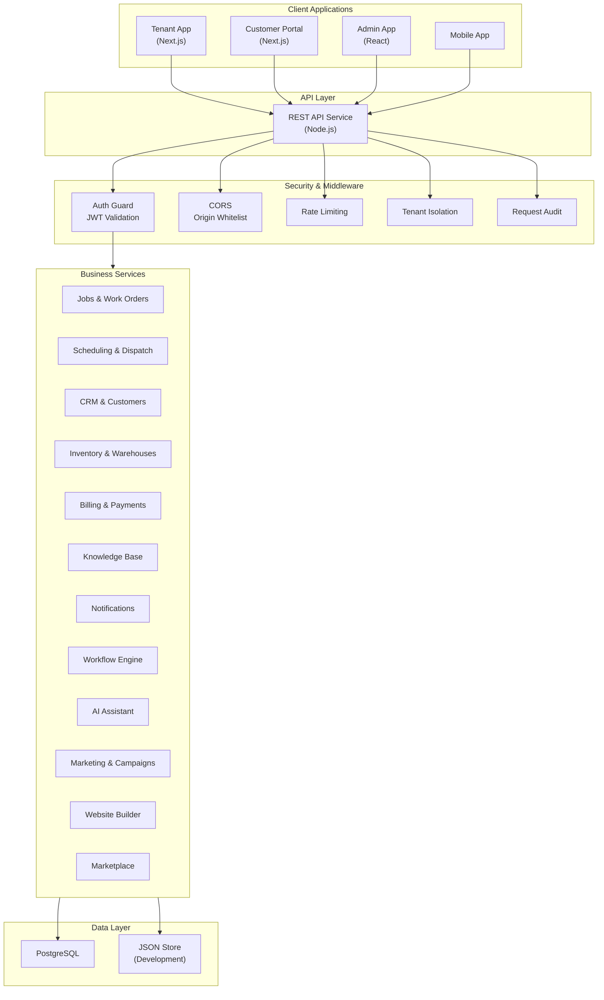

# ServicePro Enterprise Platform

> **Platform overview**
> Unified Field Service, Business Operations, Customer Experience, and Digital Growth

## Document Control

| Field | Detail |
|---|---|
| Purpose | Enterprise platform overview and buyer evaluation reference |
| Audience | Business leaders, platform administrators, evaluators, partners, and technical stakeholders |
| Scope | Capabilities, architecture, security, deployment, adoption, outcomes, and terminology |
| Source | ServicePro repository documentation; technical meaning preserved |

> [!NOTE]
> This publication edition improves navigation, document metadata, and cross-format consistency. Product and technical claims remain those of the source document.

---

## Table of Contents

1. [Executive Summary](#1-executive-summary)
2. [Business Challenges ServicePro Addresses](#2-business-challenges-servicepro-addresses)
3. [Product Overview](#3-product-overview)
4. [Capabilities Summary](#4-capabilities-summary)
5. [Feature-by-Feature Breakdown](#5-feature-by-feature-breakdown)
6. [Role-Based Value](#6-role-based-value)
7. [Industry Applications](#7-industry-applications)
8. [Pricing and Packaging](#8-pricing-and-packaging)
9. [Enterprise Technical Capabilities](#9-enterprise-technical-capabilities)
10. [Deployment Options](#10-deployment-options)
11. [Security and Governance](#11-security-and-governance)
12. [Implementation and Adoption](#12-implementation-and-adoption)
13. [Business Outcomes](#13-business-outcomes)
14. [Competitive Differentiators](#14-competitive-differentiators)
15. [Buyer Evaluation Checklist](#15-buyer-evaluation-checklist)
16. [FAQ](#16-faq)
17. [Next Steps and Call to Action](#17-next-steps-and-call-to-action)
18. [Glossary](#18-glossary)

---

## 1. Executive Summary

ServicePro is a unified, multi-tenant SaaS platform purpose-built for field service businesses. It consolidates operations, scheduling, customer management, billing, inventory, AI assistance, marketing, and digital presence into a single system accessible from any device.

Rather than stitching together point solutions for dispatching, invoicing, CRM, and website management, service businesses operate from one platform where data flows between modules without manual re-entry. A plumber dispatched to a job sees the customer's equipment history, completes the work order, triggers an invoice, and updates inventory — all in the same session.

ServicePro serves the entire ecosystem around a service business: office staff manage operations, technicians work in the field, customers self-serve through a dedicated portal, and business owners track performance through real-time analytics.

The platform is deployed as a cloud-native application with subdomain-isolated services, JWT-based authentication, role-driven authorization, and tenant-level data isolation. It supports both JSON-based lightweight deployments and PostgreSQL-backed production environments.

### Why ServicePro

- **Single platform, complete operations** — CRM, scheduling, dispatch, work orders, invoicing, inventory, customer portal, website, and AI in one login
- **Multi-tenant architecture** — each business operates in an isolated data space with configurable branding, features, and settings
- **Role-aware interface** — technicians, dispatchers, office staff, managers, and customers each see purpose-built views
- **30+ industry service packs** — pre-configured templates, checklists, and pricing for specific trades from HVAC to solar
- **AI-powered assistance** — knowledge base chat, workflow recommendations, and predictive capabilities
- **Customer self-service portal** — branded portal where customers book, pay, and communicate without phone calls
- **API-first design** — RESTful API with JWT authentication enabling integrations and custom development
- **Progressive deployment** — start on a free Render tier and scale to enterprise PostgreSQL-backed production

---

## 2. Business Challenges ServicePro Addresses

| Business Challenge | Operational Impact | ServicePro Response | Expected Benefit |
|---|---|---|---|
| Fragmented software stack | Data silos between scheduling, billing, and CRM systems; manual data re-entry | Unified platform with shared data model across all operational modules | Single source of truth; reduced duplicate entry |
| Paper-based field operations | Delayed job updates, lost paperwork, unbilled labor | Digital work orders with mobile-first technician interface | Real-time job status, faster invoicing |
| No customer self-service | High call volume for scheduling, payment, and status inquiries | Dedicated customer portal with booking, payments, and messaging | Reduced inbound calls; improved customer experience |
| Scheduling inefficiency | Double-bookings, drive-time waste, unbalanced technician loads | Dispatch board with technician calendars and territory management | Higher daily job completion; lower fuel costs |
| Slow estimate-to-invoice cycle | Revenue leakage from unapproved estimates and delayed invoicing | Estimates convert to invoices in one click; online payment links | Faster collections; fewer lost opportunities |
| Inventory visibility gaps | Truck stock-outs, over-ordering, unknown part locations | Warehouse and truck inventory with transfers, alerts, and purchase orders | Reduced stock-outs; lower carrying costs |
| No digital presence | Reliance on word-of-mouth; no online booking capability | Built-in website builder with public storefront and SEO tools | New customer acquisition channel |
| Limited reporting | Decisions based on intuition rather than data | Pre-built and custom report builder with scheduled delivery | Data-informed operational decisions |
| Compliance and audit risk | No centralized audit trail; manual compliance tracking | Automated audit logging, compliance controls, and evidence collection | Audit readiness; reduced compliance effort |
| Team communication gaps | Missed handoffs between office and field; customer left uninformed | Integrated notifications, message templates, and real-time updates | Fewer missed communications; better coordination |

---

## 3. Product Overview

ServicePro is structured as a monorepo containing multiple deployable applications and shared packages. Each application serves a distinct audience and can be deployed independently.

### Application Ecosystem

| Application | Audience | Purpose |
|---|---|---|
| Tenant App (`apps/web`) | Business staff | Primary workspace for all operational modules |
| API Service (`apps/api`) | All clients | RESTful backend handling business logic and data |
| Customer Portal (`apps/customer-portal`) | End customers | Self-service booking, payments, messages, and documents |
| Admin App (`apps/admin`) | Platform operators | Tenant management, monitoring, security, and deployment |
| Mobile App (`apps/mobile`) | Field technicians | Field-optimized interface for job execution |

### Shared Packages

| Package | Function |
|---|---|
| `packages/auth` | Authentication utilities, JWT handling, session management |
| `packages/ui` | Design system components shared across frontends |
| `packages/types` | TypeScript type definitions for cross-application consistency |
| `packages/shared` | Validation, constants, and utility functions |
| `packages/database` | Database connection and query utilities |
| `packages/scheduling` | Scheduling logic and calendar operations |
| `packages/dispatch` | Dispatch algorithms and assignment logic |
| `packages/crm` | Customer relationship management utilities |
| `packages/invoices` | Invoice generation and calculation logic |
| `packages/estimates` | Estimate creation and pricing logic |
| `packages/inventory` | Stock management and transfer logic |
| `packages/jobs` | Work order lifecycle management |
| `packages/reporting` | Report generation and data aggregation |
| `packages/workflows` | Automation rules and event processing |
| `packages/integrations` | Third-party connector framework |
| `packages/pricing` | Price book and service pricing engine |
| `packages/customers` | Customer data management utilities |
| `packages/workforce` | Technician and team management |
| `packages/audit` | Audit trail and compliance logging |
| `packages/config` | Runtime configuration management |

### Architecture Diagram

---

## 4. Capabilities Summary

| Capability Area | Primary Users | Core Functions | Business Value | Availability |
|---|---|---|---|---|
| Platform Administration | Platform admins | Tenant lifecycle, feature gates, monitoring, deployments | Centralized control of multi-tenant operations | Available |
| Tenant Management | Business owners, admins | Company settings, branding, user management, modules | Self-service business configuration | Available |
| CRM & Sales | Sales reps, managers | Leads, opportunities, customer profiles, pipeline | Revenue pipeline visibility and growth | Available |
| Scheduling & Dispatch | Dispatchers, managers | Calendar, technician assignment, territory management | Optimized field resource utilization | Available |
| Customer Portal | End customers | Booking, invoices, payments, messages, documents | Self-service reduces support volume | Available |
| Inventory & Procurement | Inventory managers | Stock levels, transfers, purchase orders, warehouses | Reduced stock-outs and carrying costs | Available |
| Billing & Financial Operations | Finance, office staff | Estimates, invoices, payments, price books | Faster revenue collection | Available |
| Reporting & Analytics | Managers, executives | Dashboards, report builder, scheduled reports, exports | Data-driven decision making | Available |
| AI Capabilities | All users | Chat assistant, knowledge base, recommendations | Faster resolution, reduced training time | Available |
| Website Builder & Digital Growth | Marketing, admins | Page builder, themes, SEO, public storefront | Online customer acquisition | Available |
| Marketplace | Admins, business owners | Industry packs, connectors, themes, extensions | Tailored workflows per trade | Available |
| Notifications & Communications | All internal users | Templates, alerts, real-time updates, reminders | Coordinated team and customer communication | Available |
| Files, Documents & Media | Technicians, office staff | Attachments, media uploads, document management | Digital record keeping | Available |
| Authentication & Security | IT admins, security | JWT auth, MFA, RBAC, audit trails, rate limiting | Enterprise-grade access control | Available |
| Automation & Workflows | Managers, admins | Rule engine, triggers, conditions, job transitions | Eliminated manual repetitive tasks | Available |
| APIs & Integrations | Developers, partners | REST API, webhooks, marketplace connectors | Extensibility and ecosystem connectivity | Available |

---

## 5. Feature-by-Feature Breakdown

### 5.1 Platform Administration

**What it does:** Provides platform operators with centralized management of the entire multi-tenant SaaS environment including tenant lifecycle, feature configuration, monitoring, and security oversight.

**Key functions:**
- Platform dashboard with tenant health metrics and system status
- Tenant creation, archiving, restoration, and soft-deletion
- Feature gates and module access control per tenant
- Subscription and entitlement management
- Platform audit logs and security event monitoring
- Deployment configuration and release management
- Health monitoring and performance metrics
- API key management and OAuth configuration
- Session management and impersonation for support
- Recovery operations for archived tenants and deleted owners

**Customer benefits:** Platform operators maintain full control over the SaaS environment from a single administrative interface. Tenant isolation is enforced at the platform level, and operators can respond to issues without accessing production databases directly.

**Primary users:** Platform administrators, DevOps engineers, support escalation teams

**Enterprise considerations:** Platform administration is protected behind additional access controls. The admin interface supports role-based access so platform operations teams can be segmented by responsibility (billing vs. security vs. tenant support).

**Availability:** Available

---

### 5.2 Tenant Management

**What it does:** Enables each business (tenant) to configure their operational environment, branding, features, users, and settings without affecting other tenants on the platform.

**Key functions:**
- Company profile and branding configuration (logos, colors, contact details)
- Feature toggle management (enable/disable modules per business needs)
- User invitation and team member management
- Role assignment and permission configuration
- API key generation for programmatic access
- Custom domain configuration
- Tenant settings for business hours, service areas, and operational preferences

**Customer benefits:** Each business customizes ServicePro to match their brand, industry, and operational needs without IT involvement. New team members are onboarded with appropriate role-based access in minutes.

**Primary users:** Business owners, company administrators

**Enterprise considerations:** Multi-workspace support allows organizations managing multiple brands or locations to maintain separate tenant configurations while sharing platform administration.

**Availability:** Available

---

### 5.3 CRM and Sales

**What it does:** Manages the customer lifecycle from initial lead through to ongoing service relationship. Tracks contacts, sales opportunities, pipeline stages, and customer communication history.

**Key functions:**
- Customer database with contact details, service history, and notes
- Lead management with source tracking and pipeline stages
- CRM pipeline visualization for opportunity tracking
- Customer search and filtering with advanced queries
- Organization and account hierarchy management
- Marketing campaign tracking and attribution
- Customer asset records linked to service history
- Territory-based customer assignment

**Customer benefits:** Sales and office teams track every lead and customer interaction in context. No more lost sticky notes or forgotten callbacks — the pipeline provides visibility into revenue opportunities at every stage.

**Primary users:** Sales representatives, office managers, business owners

**Enterprise considerations:** Territory management enables geographic or team-based customer segmentation. Organization hierarchy supports B2B relationships where one account manages multiple service locations.

**Availability:** Available

---

### 5.4 Scheduling and Dispatch

**What it does:** Provides a visual dispatch board and scheduling system for assigning technicians to jobs based on availability, skills, location, and priority.

**Key functions:**
- Interactive dispatch board with drag-and-drop assignment
- Technician calendar with daily, weekly, and monthly views
- Appointment scheduling with time-window preferences
- Territory management for geographic routing
- Route planning for optimized drive sequences
- Technician availability and skill-based matching
- Real-time status tracking (en route, on-site, completed)
- Emergency and priority job escalation
- Capacity utilization reporting

**Customer benefits:** Dispatchers fill schedules efficiently, reduce windshield time between jobs, and respond to emergencies without disrupting the rest of the day's appointments. Technicians see their day clearly and navigate directly to each site.

**Primary users:** Dispatchers, operations managers, technicians

**Enterprise considerations:** Multi-territory dispatch supports organizations operating across regions. Route optimization reduces fuel costs and increases daily job capacity. AI-powered dispatch recommendations are available as an enterprise option.

**Availability:** Available (core dispatch), Preview (AI-assisted dispatch optimization)

---

### 5.5 Customer Portal

**What it does:** Provides a branded, self-service web application where end customers can manage their service relationship without phone calls or emails.

**Key functions:**
- Customer login with secure authentication
- Appointment booking with service type selection and preferred dates
- Invoice viewing and online payment
- Estimate review, approval, and decline
- Service history and completed job details
- Equipment/asset records with maintenance history
- Secure messaging with the service team
- Document access (contracts, warranties, inspection reports)
- Profile management and contact preferences

**Customer benefits:** Customers interact with the business on their own schedule. A homeowner can book a maintenance visit at 10 PM, pay an invoice from their phone, and check their equipment warranty — all without a single phone call. This reduces inbound call volume and improves customer satisfaction.

**Primary users:** Residential and commercial customers

**Enterprise considerations:** The portal is deployed as an independent application at a dedicated subdomain, allowing it to scale independently from internal operations. Portal authentication uses dedicated tokens (Customer JWT) scoped exclusively to customer-audience routes.

**Availability:** Available

---

### 5.6 Inventory and Procurement

**What it does:** Tracks parts, materials, and equipment across warehouses and service vehicles. Manages purchasing workflows from requisition through receiving.

**Key functions:**
- Multi-warehouse inventory with location-level stock tracking
- Truck/vehicle inventory for field technician stock
- Stock transfers between locations with approval workflows
- Purchase order creation, submission, and receiving
- Low-stock alerts and reorder point configuration
- Material usage tracking linked to work orders
- Stock adjustment and count management
- Vendor management with pricing and lead time data
- Inventory valuation and cost reporting

**Customer benefits:** Technicians arrive at jobs with the right parts. Office staff stop emergency parts runs. Purchase decisions are based on actual usage data rather than estimates, reducing both stock-outs and over-ordering.

**Primary users:** Inventory managers, purchasing coordinators, technicians, warehouse staff

**Enterprise considerations:** Multi-warehouse support accommodates organizations with central distribution and satellite locations. Integration connectors enable synchronization with external procurement systems.

**Availability:** Available

---

### 5.7 Billing and Financial Operations

**What it does:** Manages the revenue lifecycle from service pricing through estimate creation, invoice generation, payment collection, and financial reporting.

**Key functions:**
- Price book management with service, labor, and material rates
- Estimate creation with line items, taxes, and discounts
- Estimate-to-invoice conversion in a single action
- Invoice generation with configurable templates
- Online payment processing (integration dependent)
- Payment recording and receipt generation
- Recurring billing and service agreement invoicing
- Tax calculation and financial categorization
- Financial dashboards with revenue, outstanding, and collected metrics
- Accounts receivable aging and collection status

**Customer benefits:** The estimate-to-invoice-to-payment flow eliminates manual re-entry. Customers receive professional estimates and invoices with online payment links, accelerating collections and reducing days-sales-outstanding.

**Primary users:** Finance staff, billing coordinators, office managers, business owners

**Enterprise considerations:** Price book supports tiered pricing (residential vs. commercial rates). Service agreements enable recurring revenue management. Payment processing requires connector configuration with a supported payment provider.

**Availability:** Available (invoicing, estimates, price books), Integration Dependent (online payment processing)

---

### 5.8 Reporting and Analytics

**What it does:** Provides pre-built operational reports, custom report creation, scheduled report delivery, and data export capabilities for business intelligence.

**Key functions:**
- Pre-built report catalog (revenue, jobs, technician performance, customer metrics)
- Report dashboard with KPI cards and trend visualization
- Scheduled report delivery (email delivery on defined cadences)
- CSV and data export for external analysis
- Report filtering by date range, status, technician, customer, and territory
- Custom report builder with field selection and aggregation
- Financial reporting (P&L-style revenue and expense views)

**Customer benefits:** Managers make decisions based on current data rather than gut feel. Owners receive weekly performance summaries without logging in. The export capability enables integration with external BI tools when deeper analysis is needed.

**Primary users:** Business owners, operations managers, financial managers

**Enterprise considerations:** Report scheduling enables automated delivery to stakeholders. Data export supports integration with data warehouse and BI platforms. Enterprise analytics with embedded BI dashboards are available as an advanced option.

**Availability:** Available (reports, exports, schedules), Enterprise Option (embedded BI, predictive analytics)

---

### 5.9 AI Capabilities

**What it does:** Provides an AI-powered assistant that helps users find information, get recommendations, and interact with the platform through natural language. Backed by a configurable knowledge base.

**Key functions:**
- AI chat assistant accessible from within the application workspace
- Knowledge base management with searchable articles
- AI-powered knowledge retrieval and contextual suggestions
- Knowledge article creation, editing, categorization, and tagging
- Article attachments and media support
- Role-based knowledge access (internal articles vs. customer-facing)
- AI governance and model management (platform admin level)

**Customer benefits:** New employees get answers instantly without interrupting colleagues. Technicians in the field look up repair procedures from their mobile device. The knowledge base compounds in value as the team documents solutions to recurring issues.

**Primary users:** All internal users (AI assistant), knowledge managers (content authoring), platform admins (AI governance)

**Enterprise considerations:** AI governance controls enable platform administrators to manage model configurations, usage policies, and cost controls. Enterprise RAG (retrieval-augmented generation), embeddings, and forecasting services are designed as part of the planned multi-app architecture.

**Availability:** Available (AI assistant, knowledge base), Preview (AI governance, model management), Planned (dedicated AI microservice with RAG and embeddings)

---

### 5.10 Website Builder and Digital Growth

**What it does:** Enables service businesses to build, customize, and publish a professional website and public-facing storefront without external tools or web developers.

**Key functions:**
- Visual website editor with page creation and layout tools
- Storefront builder for public service presentation
- Theme selection and customization
- SEO configuration for search engine visibility
- Public-facing service catalog with booking capability
- Media management for images and marketing assets
- Starter service templates for quick launch
- Mobile-responsive design output
- Integration with the booking and inquiry system

**Customer benefits:** A service business gets a professional web presence that directly feeds into their operational system. A customer browsing the website can request service, which flows directly into the dispatch queue — no manual re-entry, no lost leads from contact forms.

**Primary users:** Marketing managers, business owners, website administrators

**Enterprise considerations:** Multi-site businesses can configure separate storefronts per location or brand. Custom domain support is available for professional branding.

**Availability:** Available

---

### 5.11 Marketplace

**What it does:** Provides a catalog of industry-specific service packs, integration connectors, themes, and extensions that businesses can install to tailor ServicePro to their trade.

**Key functions:**
- 30+ industry service packs (plumbing, HVAC, electrical, landscaping, etc.)
- Each pack includes: pricebook categories, equipment types, checklists, and job templates
- Integration connectors (accounting, payments)
- Workspace themes for UI customization
- Extension modules (customer communications templates)
- One-click installation and uninstallation
- Installation tracking and management

**Customer benefits:** Instead of spending weeks configuring the platform for their trade, a pest control company installs the Pest Control Pack and immediately has industry-specific terminology, checklists, and workflows. Time-to-value drops from weeks to minutes.

**Primary users:** Business owners, company administrators

**Enterprise considerations:** The marketplace architecture supports third-party extension publishing and partner ecosystem development. Custom service packs can be developed for unique industry requirements.

**Availability:** Available

---

### 5.12 Notifications and Communications

**What it does:** Manages internal notifications, customer communications, and automated messaging across the platform with configurable templates and delivery channels.

**Key functions:**
- Real-time in-app notifications for assignments, updates, and alerts
- Message template management (appointment confirmations, arrival alerts, review requests)
- Communication center for centralized message tracking
- Reminder system for follow-ups, payments, and appointments
- Notification preferences and channel configuration
- Communication history linked to customer and job records

**Customer benefits:** The right people get the right information at the right time. Technicians receive assignment notifications instantly. Customers get automated appointment confirmations and arrival alerts without manual effort from office staff.

**Primary users:** All internal users (receive notifications), office staff and managers (configure templates), customers (receive communications)

**Enterprise considerations:** Template-driven communications enable brand-consistent messaging at scale. Communication audit trails support compliance requirements.

**Availability:** Available

---

### 5.13 Files, Documents, and Media

**What it does:** Provides file upload, attachment, and document management capabilities across the platform, enabling digital record keeping for jobs, assets, and customers.

**Key functions:**
- File upload and attachment to jobs, assets, customers, and knowledge articles
- Media attachment management with metadata
- Document access through the customer portal
- Photo documentation for job sites (before/after)
- Configurable upload size limits via body limit middleware
- Asset attachment records for equipment documentation

**Customer benefits:** Technicians photograph issues on-site and attach them directly to the work order. Customers access their inspection reports and warranties through the portal. Paper files are replaced with searchable digital records.

**Primary users:** Technicians (field documentation), office staff (record keeping), customers (document access)

**Enterprise considerations:** File storage is managed through the API service with configurable payload limits. A dedicated files microservice is designed for enterprise deployments to isolate large upload processing from API response times.

**Availability:** Available (API-managed uploads), Planned (dedicated files microservice)

---

### 5.14 Authentication, Authorization, and Security

**What it does:** Provides a comprehensive security framework including authentication, role-based access control, audit trails, and security monitoring.

**Key functions:**
- JWT-based authentication with configurable token lifetimes
- Multi-factor authentication (MFA) support
- Role-based access control with six preset roles (owner, admin, manager, technician, billing, read-only)
- Granular permission system with module-level access control
- Tenant-scoped data isolation (every query filtered by tenant context)
- Audience-separated tokens (portal tokens vs. platform tokens)
- Rate limiting (configurable per endpoint category)
- Security headers (applied to all responses)
- Audit trail with request logging and security event capture
- Session management and forced logout
- Password reset with token-based verification
- Invitation-based onboarding with activation links
- API key management for programmatic access

**Customer benefits:** Businesses have confidence that their data is isolated from other tenants, employees see only what their role allows, and the platform defends against common attack patterns (brute force, token theft, CORS bypass) out of the box.

**Primary users:** IT administrators (configuration), all users (consume), security reviewers (audit)

**Enterprise considerations:** Platform-level security includes Cloudflare Access integration for admin interfaces, CORS origin whitelisting with wildcard rejection, host-only cookies preventing cross-subdomain leakage, and environment variable isolation between services. Compliance automation features (SOC 2, ISO 27001 frameworks) are available at the enterprise tier.

**Availability:** Available (JWT auth, RBAC, MFA, audit, rate limiting), Configurable (token lifetimes, rate limits, CORS origins), Enterprise Option (compliance automation, advanced security monitoring)

---

### 5.15 Automation and Enterprise Operations

**What it does:** Provides a rule-based workflow engine that automates repetitive business processes, job state transitions, and notification triggers based on configurable conditions.

**Key functions:**
- Workflow rule engine with trigger-condition-action model
- Job state machine with configurable transitions
- Automated notifications on status changes
- Workflow event history and execution logging
- Automation builder interface for visual rule creation
- Business continuity and operational risk management
- Compliance control monitoring and evidence fulfillment
- Policy management and lifecycle tracking
- Data retention and privacy automation (DSAR, consent, breach notifications)
- SLA monitoring and alerting

**Customer benefits:** Repetitive tasks happen automatically. When a job is marked complete, the invoice generates, the customer gets a satisfaction survey, and the review request fires — all without manual intervention. Compliance workflows ensure regulatory requirements are met consistently.

**Primary users:** Operations managers (workflow design), all users (benefit from automation), compliance teams (governance)

**Enterprise considerations:** Enterprise operations extend into GRC (governance, risk, and compliance) with automated evidence collection, policy lifecycle management, and regulatory compliance tracking. Privacy operations support DSAR processing, consent management, and breach notification workflows.

**Availability:** Available (workflow engine, job transitions), Available (privacy operations, data retention), Enterprise Option (compliance automation, risk management frameworks)

---

### 5.16 APIs and Integrations

**What it does:** Exposes a comprehensive REST API enabling programmatic access to all platform functions, plus a marketplace of pre-built connectors for common external systems.

**Key functions:**
- RESTful API with versioned endpoints (`/api/v1/`)
- JWT Bearer token authentication for API access
- Per-tenant API key management for service integrations
- OpenAPI specification for developer documentation
- CORS configuration with explicit origin whitelisting
- Paginated list endpoints with filtering and sorting
- Webhook platform for event-driven integrations
- Marketplace connectors (accounting, payments)
- Rate limiting with configurable thresholds
- Request/response validation

**Customer benefits:** The API enables everything from simple Zapier-style automations to full custom application development on top of ServicePro data. Accounting connectors eliminate double-entry between field operations and bookkeeping software.

**Primary users:** Developers, integration partners, IT administrators

**Enterprise considerations:** The OpenAPI contract (`servicepro-openapi.yaml`) provides a machine-readable API specification. API versioning protects integrations from breaking changes. Developer portal and SDK are part of the platform roadmap.

**Availability:** Available (REST API, API keys, marketplace connectors), Configurable (rate limits, CORS), Planned (GraphQL API, developer portal)

---

## 6. Role-Based Value

### Business Owner

- Full visibility into revenue, job completion, and team performance from the executive dashboard
- Track leads through the pipeline and monitor conversion rates
- Review financial KPIs without waiting for monthly reports
- Configure services, pricing, and branding to match business identity
- Marketplace packs get the platform ready for their specific trade immediately

### Executive / Senior Manager

- Real-time operational KPIs: revenue, utilization, customer satisfaction
- Scheduled report delivery for weekly performance summaries
- Organization-wide view of multi-location or multi-team operations
- Strategic planning data from historical trends and pipeline forecasts

### Platform Administrator

- Complete tenant lifecycle management from a single admin interface
- Feature gate control to enable or restrict modules per tenant
- Security monitoring, audit log review, and incident response
- Deployment management including release tracking and health monitoring
- Subscription and entitlement administration

### Tenant Administrator (Company Admin)

- User management: invite, assign roles, configure permissions
- Branding and company profile customization
- Module activation and feature configuration
- API key management for integrations
- Workflow automation rules and business configuration

### Operations Manager

- Dispatch board oversight and team utilization metrics
- SLA monitoring and job priority management
- Workflow automation to reduce manual coordination
- Report access for team performance and operational efficiency
- Customer satisfaction tracking and follow-up management

### Dispatcher

- Visual dispatch board with real-time technician locations and status
- Drag-and-drop job assignment with skill and territory matching
- Emergency escalation and priority reassignment
- Schedule gap identification and backfill optimization
- Appointment confirmation and customer notification triggers

### Technician

- Mobile-first daily schedule with navigation-ready addresses
- Work order details, customer history, and asset records in the field
- Checklist-driven job completion for consistent quality
- Parts and material usage logging from truck inventory
- Time tracking with clock-in/clock-out and job-level time entries
- Photo documentation and note capture on site

### Sales Representative

- Lead management with source tracking and follow-up tasks
- Pipeline visualization with stage-based opportunity tracking
- Estimate creation with price book integration for accurate quoting
- Customer communication history for informed conversations
- Territory assignment for geographic focus

### Customer Service Representative

- Customer lookup with full service and communication history
- Appointment scheduling and rescheduling on behalf of customers
- Invoice and payment status for billing inquiries
- Knowledge base access for quick issue resolution
- Message templates for consistent customer communication

### Inventory Manager

- Multi-warehouse stock visibility with location-level detail
- Low-stock alerts and reorder point configuration
- Purchase order management from creation to receiving
- Transfer tracking between warehouses and trucks
- Usage reporting to identify consumption patterns and optimize ordering

### Finance User

- Invoice management with aging and collection tracking
- Payment recording and reconciliation
- Estimate review and approval workflows
- Financial report access and export capability
- Price book maintenance for service and material rates

### Marketing Manager

- Campaign management and execution tracking
- Website content management through the built-in editor
- Storefront configuration for online service presentation
- Review and reputation management
- Customer communication templates and sequence design

### Website Administrator

- Page builder for creating and editing website content
- Theme and branding configuration
- SEO settings and metadata management
- Public storefront service catalog management
- Media library for images and marketing assets

### Customer (Portal User)

- Self-service appointment booking at any time, from any device
- Invoice viewing with online payment capability
- Estimate review with approve/decline actions
- Service history and completed job records
- Equipment and asset records with maintenance history
- Secure messaging with the service team
- Document access (contracts, reports, warranties)

### IT Administrator

- Security configuration (MFA policies, token lifetimes, rate limits)
- Integration management (API keys, CORS origins, webhook configuration)
- Audit log review and security event investigation
- User access reviews and permission auditing
- System health monitoring and performance metrics

### Security Reviewer

- Audit trail access with comprehensive request logging
- Security event monitoring and alerting
- Compliance control status and evidence tracking
- Data privacy operation oversight (DSAR, consent, retention)
- Integrity checks and configuration validation

### Developer / Integration Partner

- REST API with JWT authentication for custom integrations
- OpenAPI specification for contract-first development
- API key management for service-to-service authentication
- Marketplace connector architecture for third-party development
- Rate limit awareness for responsible API consumption

---

## 7. Industry Applications

ServicePro supports over 30 industry verticals through its marketplace service packs. Each pack configures the platform with trade-specific terminology, checklists, equipment types, pricing structures, and job templates.

| Industry | Service Pack | Key Capabilities |
|---|---|---|
| Plumbing | Plumbing Operations Pack | Drain/sewer workflows, water heater tracking, fixture service templates |
| HVAC | HVAC Service Pack | Maintenance plans, diagnostic checklists, equipment lifecycle management |
| Electrical | Electrical Contractor Pack | Panel schedules, inspections, permit tracking workflows |
| Carpet & Upholstery Cleaning | Carpet & Upholstery Pack | Room measurements, treatment tracking, recurring service plans |
| Landscaping | Landscaping Operations Pack | Property zones, crew routing, seasonal work scheduling |
| Residential Cleaning | Residential Cleaning Pack | Room checklists, recurring visit plans, customer preferences |
| Commercial Janitorial | Commercial Janitorial Pack | Facility zones, quality inspections, supply controls |
| Pest Control | Pest Control Pack | Treatment records, device monitoring, compliance logs |
| Roofing | Roofing Contractor Pack | Roof diagrams, material takeoffs, claims documentation |
| Garage Door Service | Garage Door Service Pack | Door assets, safety checks, spring lifecycle tracking |
| Appliance Repair | Appliance Repair Pack | Model diagnostics, parts tracking, warranty service |
| Handyman | Handyman Services Pack | Multi-task jobs, project punch lists, flexible estimates |
| Painting | Painting Contractor Pack | Color schedules, surface measurements, paint usage tracking |
| Pressure Washing | Pressure Washing Pack | Area-based pricing, chemical tracking, photo documentation |
| Pool & Spa | Pool & Spa Service Pack | Chemistry logs, route service, seasonal care workflows |
| Locksmith & Security | Locksmith & Security Pack | Key records, access control, security hardware documentation |
| Tree Care | Tree Care & Arborist Pack | Tree inventory, risk assessments, treatment plans |
| Snow & Ice Management | Snow & Ice Management Pack | Storm dispatch, salt usage, proof of service |
| Irrigation | Irrigation Service Pack | Zone maps, controller records, winterization workflows |
| Septic & Wastewater | Septic & Wastewater Pack | System assets, pumping history, disposal records |
| Chimney & Fireplace | Chimney & Fireplace Pack | Inspection levels, sweeping records, safety findings |
| Solar | Solar Service Pack | System commissioning, production checks, battery service |
| Home Inspection | Home Inspection Pack | Structured findings, photo evidence, client reports |
| Restoration & Remediation | Restoration & Remediation Pack | Moisture mapping, equipment logs, loss documentation |
| Moving Services | Moving Services Pack | Inventory surveys, truck planning, delivery proof |
| Junk Removal | Junk Removal Pack | Volume pricing, load capacity, disposal tracking |
| Window & Gutter Cleaning | Window & Gutter Cleaning Pack | Measurement pricing, access notes, recurring routes |
| Flooring | Flooring Installation Pack | Room takeoffs, waste factors, installation milestones |
| Property Maintenance | Property Maintenance Pack | Multi-site assets, preventive plans, owner reporting |
| Fencing | Fence & Gate Pack | Linear estimates, material layouts, gate hardware |

> Additional industry solution frameworks (healthcare operations, manufacturing maintenance, government services, utilities, transportation, telecommunications, education, and retail) are in development as enterprise-tier offerings.

---

## 8. Pricing and Packaging

> **Notice:** Pricing tiers, feature allocations, and per-seat costs presented below represent the product packaging structure. Final pricing must be determined and approved by commercial leadership before publication to customers.

### Tier Overview

| Tier | Target Customer | Core Value Proposition |
|---|---|---|
| Essentials | Solo operators, small teams (1–3 users) | Core scheduling, invoicing, and customer management |
| Professional | Growing businesses (4–15 users) | Full dispatch, inventory, CRM, and customer portal |
| Business | Mid-market companies (16–50 users) | Automation, reporting, marketplace, and website builder |
| Enterprise | Large organizations (50+ users) | Advanced security, compliance, multi-location, AI, and dedicated support |
| Platform | SaaS operators, white-label partners | Full platform administration, multi-tenant management, and API access |

### Feature Comparison

| Feature | Essentials | Professional | Business | Enterprise | Platform |
|---|---|---|---|---|---|
| Work orders & jobs | ✓ | ✓ | ✓ | ✓ | ✓ |
| Customer management | ✓ | ✓ | ✓ | ✓ | ✓ |
| Scheduling & calendar | ✓ | ✓ | ✓ | ✓ | ✓ |
| Estimates & invoices | ✓ | ✓ | ✓ | ✓ | ✓ |
| Dispatch board | — | ✓ | ✓ | ✓ | ✓ |
| Customer portal | — | ✓ | ✓ | ✓ | ✓ |
| Inventory management | — | ✓ | ✓ | ✓ | ✓ |
| CRM & lead pipeline | — | ✓ | ✓ | ✓ | ✓ |
| Workflow automation | — | — | ✓ | ✓ | ✓ |
| Reporting & analytics | Basic | Standard | Advanced | Advanced | Advanced |
| Website builder | — | — | ✓ | ✓ | ✓ |
| Marketplace packs | 1 included | 3 included | Unlimited | Unlimited | Unlimited |
| AI assistant | — | — | ✓ | ✓ | ✓ |
| Knowledge base | — | ✓ | ✓ | ✓ | ✓ |
| API access | — | Read-only | Full | Full | Full |
| MFA enforcement | — | Optional | Optional | Required | Required |
| Audit trail | — | — | 90 days | Unlimited | Unlimited |
| Compliance controls | — | — | — | ✓ | ✓ |
| Platform administration | — | — | — | — | ✓ |
| Multi-tenant management | — | — | — | — | ✓ |
| Custom domain | — | — | ✓ | ✓ | ✓ |
| Dedicated support | — | — | — | ✓ | ✓ |
| SLA guarantees | — | — | — | ✓ | ✓ |

---

## 9. Enterprise Technical Capabilities

This section is intended for CIOs, CTOs, solution architects, and technical evaluators.

### Multi-Tenant Architecture

ServicePro implements tenant isolation at the application layer. Every API request is processed through tenant middleware that attaches the authenticated user's tenant context. All data queries are scoped to the active tenant, preventing cross-tenant data access regardless of API input.

- **Tenant resolution:** Extracted from authenticated JWT claims on every request
- **Data isolation:** All repository queries include tenant ID as a mandatory filter
- **Configuration isolation:** Each tenant maintains independent settings, branding, and module configurations
- **Environment isolation:** Platform administration operates with separate authentication tokens (Platform JWT) and elevated access controls

### Data Storage

| Storage Option | Use Case | Characteristics |
|---|---|---|
| JSON file store | Development, demos, small single-tenant deployments | Zero-dependency, file-backed, suitable for evaluation |
| PostgreSQL | Production, multi-tenant, enterprise deployments | Full ACID compliance, migration-managed schema, connection pooling |

The data layer is abstracted through a store provider pattern (`storeProvider.js`) that routes data operations to the configured backend. Schema evolution is managed through numbered SQL migrations in the `migrations/postgres/` directory.

### API Architecture

- **Protocol:** HTTP/HTTPS RESTful API
- **Authentication:** JWT Bearer tokens with configurable TTL
- **Authorization:** Permission-checked at route level before handler execution
- **Versioning:** Path-based (`/api/v1/`)
- **Pagination:** Offset-based with configurable page sizes
- **Validation:** Request body and query parameter validation middleware
- **Error handling:** Structured JSON error responses with error codes
- **Rate limiting:** Configurable per-window request limits with separate auth endpoint limits
- **CORS:** Explicit origin whitelist; wildcard origins rejected
- **Content limits:** Configurable maximum request body size

### Service Boundaries

The platform follows a modular monolith design where business domains are separated into distinct packages (`packages/*`) and route groups (`routes/*`). Module access is enforced through the `moduleAccessGuard` middleware, which verifies that the requesting tenant has been granted access to the target module.

Current module boundaries:
- Operations (jobs, appointments, dispatch, workflows)
- CRM (customers, organizations)
- Assets (customer assets, equipment)
- Inventory (stock, materials, warehouses, transfers, purchasing)
- Billing (estimates, invoices, payments, price books)
- Analytics (reports, exports)
- Knowledge (articles, search)
- Communications (notifications, messages, templates)
- Marketplace (service packs, connectors, themes)
- Administration (tenant settings, audit, security, team management)

### Build and Deployment Pipeline

- **Monorepo management:** Turborepo with workspace-level task dependencies
- **CI/CD:** GitHub Actions workflows for build, test, release, and deployment verification
- **Release process:** Multi-stage pipeline including evidence collection, policy gates, provenance attestation, and deployment authorization
- **Container support:** Dockerfile and docker-compose configurations for containerized deployments
- **Health checks:** Dedicated `/healthz` and `/readyz` endpoints for orchestrator integration

### Technology Stack

| Layer | Technology |
|---|---|
| Backend runtime | Node.js 20 |
| API framework | Native HTTP with custom routing |
| Frontend framework | Next.js (React) |
| Database | PostgreSQL (production), JSON file (development) |
| Authentication | JWT (jsonwebtoken / jose) |
| Build orchestration | Turborepo |
| CI/CD | GitHub Actions |
| Hosting | Render (web services) |
| CDN / DNS | Cloudflare (free plan) |
| Container | Docker |

---

## 10. Deployment Options

### Current Production Architecture

ServicePro is deployed using Render web services with Cloudflare DNS providing SSL termination, CDN caching, and DDoS protection.

| Component | Deployment Target | Purpose |
|---|---|---|
| API Service | Render Web Service (Node.js) | Business logic and data API |
| Tenant App | Render Web Service (Next.js) | Internal user workspace |
| Customer Portal | Render Web Service (Next.js) | Customer self-service application |

### Subdomain Model

Each application occupies its own subdomain for security isolation and independent scaling:

| Subdomain | Application |
|---|---|
| `app.<domain>` | Tenant workspace |
| `portal.<domain>` | Customer portal |
| `api.<domain>` | REST API |
| `admin.<domain>` | Platform administration (planned independent deployment) |

### Infrastructure Characteristics

- **SSL termination:** Handled by Cloudflare proxy (all traffic encrypted in transit)
- **CDN caching:** Static assets cached at Cloudflare edge
- **DDoS protection:** Cloudflare WAF on free plan provides baseline protection
- **Auto-deploy:** Triggered on CI passing for configured branches
- **Health checks:** Platform monitors `/readyz` endpoints for automatic rollback on failed deploys
- **Scaling:** Each service scales independently based on its resource profile

### Containerized Deployment

Docker and docker-compose configurations support:
- Local development with hot-reload
- Production builds with multi-stage Dockerfile
- PostgreSQL backing service in compose stack
- Environment-based configuration (development, production)

### Environment Configuration

Configuration is managed through environment variables with isolated envelopes per service:
- Database credentials isolated to API service
- JWT secrets shared only with services that validate tokens
- Third-party API keys restricted to services that consume them
- Feature flags and tenant configuration stored in the database

---

## 11. Security and Governance

### Authentication Framework

| Capability | Implementation | Status |
|---|---|---|
| User authentication | JWT Bearer tokens with configurable expiration | Available |
| Multi-factor authentication | TOTP-based MFA with authenticator app support | Available |
| Password security | Minimum requirements enforcement, reset via token | Available |
| Portal authentication | Separate token issuance for customer audience | Available |
| Platform authentication | Elevated tokens for admin operations | Available |
| Session management | Configurable TTL, forced logout capability | Available |
| Invitation-based onboarding | Token-gated account activation | Available |

### Authorization Model

ServicePro implements a layered authorization system:

1. **Role-based access control (RBAC):** Six preset roles (owner, admin, manager, technician, billing, read-only) with automatic permission assignment
2. **Permission-level enforcement:** Individual permissions checked at route level before handler execution
3. **Module access control:** Tenant-level module enablement controls which feature areas are accessible
4. **Owner access guard:** Ensures the authenticated user belongs to the target tenant
5. **Audience separation:** Portal tokens cannot access internal routes; platform tokens cannot access customer routes

### Tenant Data Isolation

- Every request passes through tenant middleware before reaching business logic
- Repository queries include tenant context as a mandatory parameter
- No cross-tenant data retrieval is possible through the API
- Platform administration uses dedicated endpoints with elevated permissions

### Security Middleware Stack

| Layer | Purpose |
|---|---|
| Security headers | Standard security response headers on all requests |
| CORS enforcement | Explicit origin whitelist; unrecognized origins receive no ACAO header |
| Rate limiting | Configurable request limits with stricter auth-endpoint limits |
| Body limit | Maximum payload size enforcement prevents resource exhaustion |
| Request ID | Unique identifier for request tracing and correlation |
| Request audit | Automatic audit trail entry for state-changing operations |
| Route validation | Input validation before business logic execution |

### Audit and Compliance

- Comprehensive audit logging for all state-changing operations
- Security event capture (failed logins, permission denials, suspicious patterns)
- Integrity checking for configuration and data consistency
- Data retention policies with configurable retention periods
- Privacy operations: DSAR processing, consent records, breach notifications
- Compliance evidence collection and control monitoring

### What ServicePro Does NOT Claim

ServicePro does not hold or claim the following certifications or guarantees at this time:
- SOC 2 Type I or Type II certification
- ISO 27001 certification
- HIPAA compliance attestation
- PCI DSS certification
- FedRAMP authorization
- Specific uptime SLA percentages

> The platform provides frameworks and tooling to support organizations pursuing these certifications. Actual certification requires independent audit and attestation.

---

## 12. Implementation and Adoption

### Implementation Phases

#### Phase 1: Discovery and Planning (Week 1–2)

- Requirements gathering and business process mapping
- Industry pack selection and configuration planning
- User role definition and permission matrix design
- Integration requirements and data migration scope
- Success criteria definition and timeline agreement

#### Phase 2: Configuration and Setup (Week 2–4)

- Tenant provisioning with company branding and settings
- Industry service pack installation and customization
- Price book configuration with services, rates, and materials
- User account creation and role assignment
- Customer portal setup and branding
- Workflow automation rule configuration

#### Phase 3: Data Migration (Week 3–5)

- Customer data import (contacts, addresses, equipment records)
- Service history migration for continuity
- Inventory baseline establishment
- Open estimate and invoice migration
- Knowledge base population with standard procedures

#### Phase 4: Training and Validation (Week 4–6)

- Role-specific training sessions (dispatchers, technicians, office staff, managers)
- Documentation volume access for self-service learning (16 volumes covering every role)
- Workflow testing with realistic scenarios
- Customer portal pilot with selected customers
- Integration testing with connected systems

#### Phase 5: Go-Live and Hypercare (Week 6–8)

- Production cutover with monitoring
- Daily check-ins during first week of live operations
- Issue resolution and adjustment
- User adoption tracking and coaching
- Performance baseline establishment

#### Phase 6: Optimization (Ongoing)

- Usage analytics review and feature adoption expansion
- Workflow automation refinement based on operational patterns
- Report and dashboard optimization
- Additional marketplace pack installation as needs evolve
- Periodic access review and security hardening

### Training Resources

ServicePro includes a comprehensive 16-volume documentation and learning center accessible within the platform:

| Volume | Title | Audience |
|---|---|---|
| 1 | Getting Started Guide | All users |
| 2 | Customer Portal Guide | Customers |
| 3 | Technician & Employee Field Guide | Technicians |
| 4 | Dispatcher Operations Manual | Dispatchers |
| 5 | CRM & Sales Pipeline Guide | Sales, managers |
| 6 | Inventory Management Guide | Inventory teams |
| 7 | Financial & Billing Guide | Finance, office staff |
| 8 | Marketing & Growth Guide | Marketing |
| 9 | Website Builder Guide | Website admins |
| 10 | AI Assistant & Knowledge Base Guide | All users |
| 11 | Workflow Automation Guide | Managers, admins |
| 12 | Company Administrator Guide | Company admins |
| 13 | Platform Administrator Guide | Platform admins |
| 14 | API Reference & Developer Guide | Developers |
| 15 | Troubleshooting Guide | All users |
| 16 | Keyboard Shortcuts & Quick Reference | All users |

---

## 13. Business Outcomes

Organizations adopting ServicePro can reasonably expect the following outcomes based on the platform's design and capability set. These are directional benefits, not guaranteed metrics.

### Operational Efficiency

- **Reduced scheduling gaps:** Dispatch board visibility and territory management help maximize technician utilization throughout the day
- **Faster invoicing:** Work-order-to-invoice conversion eliminates days of delay between job completion and billing
- **Lower administrative overhead:** Automation rules handle repetitive tasks (status updates, notifications, follow-ups) that previously required manual effort
- **Fewer data entry errors:** Single-platform design eliminates re-keying data between disconnected systems

### Revenue Impact

- **Shorter sales cycles:** Estimates created and sent from the field while the customer is present
- **Improved collection rates:** Online payment links reduce friction between invoice delivery and payment
- **Reduced revenue leakage:** Automated invoice generation ensures billable work is always captured
- **New customer acquisition:** Website builder and public storefront create an always-on lead generation channel

### Customer Experience

- **Self-service convenience:** Customers book, pay, and communicate without waiting for business hours
- **Proactive communication:** Automated appointment confirmations and technician-en-route notifications set expectations
- **Transparency:** Portal access to service history, estimates, and equipment records builds trust
- **Faster response times:** Streamlined intake reduces time from customer request to scheduled appointment

### Team Productivity

- **Technician empowerment:** Mobile-first field interface with customer history and checklists reduces callbacks and repeat visits
- **Dispatcher effectiveness:** Visual board with real-time status eliminates phone-tag coordination
- **Manager insight:** Real-time dashboards surface issues early rather than in end-of-month reviews
- **Onboarding speed:** Comprehensive documentation library reduces time for new employees to become productive

---

## 14. Competitive Differentiators

ServicePro differentiates through architectural and functional advantages that are difficult to replicate by assembling point solutions:

### Unified Data Model

All modules share the same underlying data. A customer record connects to their equipment, service history, invoices, communications, and portal access without integration middleware. This eliminates synchronization failures between disconnected systems.

### Multi-Tenant from Day One

The platform was designed for multi-tenancy from its foundation — not retrofitted. Tenant isolation, per-tenant configuration, and module access control are inherent to the architecture, not add-ons.

### Trade-Specific Configuration via Marketplace

Rather than generic "field service" workflows, ServicePro provides 30+ trade-specific packs that configure terminology, checklists, pricing structures, and job templates for each industry. A plumbing company and a solar installer use the same platform but with different operational vocabularies and workflows.

### Customer Portal as First-Class Application

The customer portal is not a stripped-down view of the main interface — it is a purpose-built application with its own authentication, UX, and deployment. This enables customer-facing interactions at the same quality level as internal operations.

### Full-Stack Ownership

From website (customer acquisition) through portal (customer self-service) through work orders (service delivery) through invoicing (revenue collection), ServicePro owns the entire service business value chain. This eliminates the integration tax of connecting separate systems for each stage.

### API-First Architecture

Every feature accessible through the UI is also accessible through the REST API. This enables automation, custom integrations, and partner development without workarounds or screen-scraping.

### Progressive Complexity

A three-person plumbing company uses the same platform as a 200-technician enterprise. The module access system, tier-based feature availability, and role-based views ensure each organization sees appropriate complexity for their size.

### Security as Architecture (Not Afterthought)

Tenant isolation, CORS whitelisting, audience-separated tokens, rate limiting, and audit logging are middleware-layer features that apply to every request — not optional features that must be enabled.

---

## 15. Buyer Evaluation Checklist

Use this checklist to evaluate ServicePro against your organization's requirements.

### Business Fit

- [ ] Does the platform support your specific trade/industry? (Check marketplace packs in Section 7)
- [ ] Does the pricing tier match your team size and feature needs? (Section 8)
- [ ] Can the platform support your current and projected job volume?
- [ ] Does the customer portal align with how your customers prefer to interact?

### Workflow Requirements

- [ ] Can your dispatch workflow be replicated on the dispatch board?
- [ ] Does the estimate-to-invoice flow match your billing process?
- [ ] Can your service agreements and recurring work be modeled?
- [ ] Does the inventory system support your warehouse and truck stock structure?
- [ ] Can workflow automation replace your manual notification and follow-up processes?

### User Roles and Access

- [ ] Do the six preset roles (owner, admin, manager, technician, billing, read-only) cover your team structure?
- [ ] Does module-level access control provide sufficient feature segmentation?
- [ ] Can your technicians use the mobile interface effectively in the field?
- [ ] Do your customers need portal features beyond booking, payments, and messaging?

### Technical and Security

- [ ] Does JWT-based authentication meet your security requirements?
- [ ] Is MFA support sufficient for your compliance needs?
- [ ] Does the audit trail provide the retention depth you require?
- [ ] Are the rate limiting and CORS configurations adequate for your security posture?
- [ ] Does the API architecture support your integration requirements?
- [ ] Is the deployment model (Render + Cloudflare) acceptable for your infrastructure policy?

### Data and Integration

- [ ] Can your existing customer data be migrated into ServicePro's data model?
- [ ] Do marketplace connectors (accounting, payments) integrate with your current tools?
- [ ] Does the REST API provide sufficient access for custom integrations?
- [ ] Are data export capabilities adequate for your reporting and BI needs?

### Compliance and Governance

- [ ] Does the privacy operations module support your GDPR/CCPA obligations?
- [ ] Does the audit trail meet your regulatory retention requirements?
- [ ] Are data residency requirements compatible with the deployment model?
- [ ] Do you require specific compliance certifications not yet held by ServicePro?

### Growth and Scale

- [ ] Can the platform accommodate your growth plan (more users, locations, volume)?
- [ ] Does the multi-tenant architecture support your expansion model?
- [ ] Are additional marketplace packs available as you expand into adjacent trades?
- [ ] Does the API enable partner and ecosystem development you may need?

---

## 16. FAQ

**Q1: What types of businesses is ServicePro designed for?**
ServicePro is designed for field service businesses including plumbing, HVAC, electrical, pest control, landscaping, cleaning, roofing, solar, appliance repair, and 20+ additional trades. Any business that dispatches technicians to perform service at customer locations is a fit.

**Q2: Can we try ServicePro before committing?**
Yes. The platform supports lightweight JSON-backed deployments for evaluation purposes. A production decision should be backed by a PostgreSQL deployment for data durability and multi-tenant isolation.

**Q3: How long does implementation typically take?**
A standard implementation follows a 6–8 week timeline covering discovery, configuration, data migration, training, go-live, and optimization. Simpler deployments with minimal data migration can be operational faster.

**Q4: Do our customers need to install anything to use the portal?**
No. The customer portal is a web application accessible from any modern browser on phones, tablets, and computers. No app installation is required.

**Q5: Can we use our own domain name?**
Yes. Custom domain support is available through Cloudflare DNS configuration. Your portal, website, and application can be addressed at subdomains of your own domain.

**Q6: How is our data isolated from other businesses on the platform?**
Every API request passes through tenant middleware that scopes all data operations to your business. Another tenant cannot access your data through any API endpoint. This isolation is enforced at the middleware layer, not just the application layer.

**Q7: What happens if we outgrow our current tier?**
Tier upgrades are non-disruptive. Module access controls are updated to unlock additional features, and no data migration is required. Your existing configuration, users, and data remain intact.

**Q8: Can ServicePro integrate with our accounting software?**
The marketplace includes an Accounting Connector that synchronizes customers, invoices, payments, and tax summaries with external accounting platforms. Additionally, the REST API enables custom integrations with any system that can make HTTP requests.

**Q9: What level of technical expertise is needed to administer ServicePro?**
Day-to-day administration (user management, settings, workflow configuration) requires no technical expertise — it is designed for business users. API integrations and advanced automation may require developer involvement.

**Q10: How does the AI assistant work?**
The AI assistant uses the knowledge base content to answer questions in natural language. Users can ask about procedures, policies, or platform features and receive contextual answers. The knowledge base is populated by the business — it learns what you teach it.

**Q11: Can technicians use ServicePro offline?**
Mobile offline support is part of the platform roadmap. Currently, the mobile application requires network connectivity to synchronize job data and complete work orders.

**Q12: What databases does ServicePro support?**
Production deployments use PostgreSQL. Development and evaluation environments can use the built-in JSON file store. The data access layer abstracts storage through a provider pattern, but PostgreSQL is the recommended production database.

**Q13: How are software updates delivered?**
Updates are deployed as new versions of the hosted services. For cloud-hosted deployments, updates are applied automatically after passing CI verification. For self-managed deployments, migration scripts handle schema updates.

**Q14: Can we configure which features are available to our team?**
Yes. Module access control allows administrators to enable or disable feature areas (operations, CRM, inventory, billing, analytics, knowledge, communications, marketplace, administration) per tenant. Individual user roles further restrict access within enabled modules.

**Q15: Does ServicePro support multiple locations or brands?**
Yes. Multi-workspace support enables organizations to manage multiple operational contexts. Each can have independent configuration, branding, and user assignments while sharing platform administration.

**Q16: What reporting capabilities are available?**
ServicePro includes a pre-built report catalog covering revenue, jobs, technician performance, and customer metrics. Custom reports can be created with field selection and filtering. Scheduled reports deliver results automatically via email. Data export (CSV) enables external analysis.

**Q17: How is the customer portal branded?**
The customer portal inherits the tenant's branding configuration including company name, logo, colors, and contact information. Customers see your brand, not ServicePro's.

**Q18: What security certifications does ServicePro hold?**
ServicePro does not currently hold third-party security certifications (SOC 2, ISO 27001, etc.). The platform implements security controls (encryption in transit, JWT authentication, MFA, RBAC, audit trails, rate limiting) that support organizations pursuing such certifications, but independent audit and attestation have not been completed.

**Q19: Can we build custom integrations?**
Yes. The REST API exposes all platform functions with JWT-authenticated access. Per-tenant API keys enable service-to-service integration. The OpenAPI specification provides a machine-readable contract for integration development.

**Q20: What support is available during and after implementation?**
Implementation support is provided during the onboarding phases. Post-implementation, the 16-volume documentation library, AI assistant, and knowledge base provide self-service support. Enterprise tier customers receive dedicated support channels.

**Q21: How does the workflow automation engine work?**
The workflow engine uses a trigger-condition-action model. Triggers fire on events (job created, status changed, payment received). Conditions filter which events proceed. Actions execute automatically (send notification, create invoice, update status, assign technician). Rules are configured through the automation builder interface.

**Q22: Can customers pay invoices through the portal?**
The customer portal displays invoices with payment status. Online payment collection requires configuration of the Payments Connector from the marketplace, which integrates with supported payment processors.

**Q23: What is the uptime commitment?**
ServicePro does not publish a specific uptime SLA percentage at this time. The platform is deployed on Render with Cloudflare providing CDN and DDoS protection. Health check endpoints enable automatic rollback on failed deployments.

**Q24: How is pricing calculated?**
Pricing is structured by tier (based on team size and feature set). Specific per-seat and per-tier pricing is determined by commercial leadership and is not embedded in the platform code. Contact sales for current pricing.

---

## 17. Next Steps and Call to Action

### Ready to Evaluate?

1. **Schedule a Discovery Call** — Discuss your business requirements with our solutions team
   - Contact: [Sales Contact]
   - Email: [Sales Email]
   - Phone: [Sales Phone]

2. **Request a Guided Demo** — See ServicePro configured for your specific industry with live data
   - Demo request: [Demo Request URL]

3. **Start a Technical Evaluation** — Access the platform in a sandbox environment to validate technical fit
   - Evaluation request: [Evaluation Request URL]

4. **Review the API** — Explore the REST API and integration capabilities
   - API documentation: [API Documentation URL]

5. **Plan Implementation** — Work with our implementation team to scope your rollout
   - Implementation inquiry: [Implementation Email]

### For Partners

- **Integration Partners:** Access the API and connector framework to build integrations
  - Partner portal: [Partner Portal URL]
- **Reseller Partners:** White-label and managed service delivery options available at the Platform tier
  - Partner program: [Partner Program Email]
- **Technology Partners:** Marketplace publishing for industry packs and extensions
  - Marketplace submission: [Marketplace Email]

### For Investors

- Platform architecture documentation available under NDA
- Technical due diligence package: [Investor Relations Email]

---

## 18. Glossary

| Term | Definition |
|---|---|
| **SaaS** | Software as a Service — cloud-hosted application accessed via web browser without local installation |
| **Tenant** | A single business (company) operating within the ServicePro platform with isolated data and configuration |
| **Multi-tenancy** | Architecture where multiple businesses share platform infrastructure while maintaining strict data isolation |
| **CRM** | Customer Relationship Management — system for tracking leads, customers, and sales interactions |
| **Dispatch** | The process of assigning technicians to jobs based on availability, skills, and location |
| **Work Order** | A digital job record tracking service from creation through completion, including details, status, and materials used |
| **API** | Application Programming Interface — programmatic access point enabling system-to-system communication |
| **REST API** | An API design style using HTTP methods (GET, POST, PUT, DELETE) with resource-based URLs |
| **JWT** | JSON Web Token — a signed token used for stateless authentication between client and server |
| **OAuth** | An authorization framework enabling third-party applications to access resources on behalf of a user |
| **MFA** | Multi-Factor Authentication — requiring a second verification method (e.g., authenticator app) beyond password |
| **RBAC** | Role-Based Access Control — assigning permissions to users through defined roles rather than individually |
| **CORS** | Cross-Origin Resource Sharing — browser security mechanism controlling which domains can make API requests |
| **Webhook** | An HTTP callback triggered by an event, enabling real-time notifications between systems |
| **SSO** | Single Sign-On — authentication pattern allowing one login to access multiple applications |
| **Service Pack** | A marketplace item that configures ServicePro with industry-specific templates, checklists, and pricing |
| **Connector** | A marketplace integration that synchronizes data between ServicePro and an external system |
| **Price Book** | The catalog of services, rates, and materials used to generate estimates and invoices |
| **SLA** | Service Level Agreement — a commitment to specific performance standards (response time, uptime) |
| **Storefront** | A public-facing website presenting the business's services and enabling customer inquiries |
| **Customer Portal** | A secure web application where end customers manage their service account (bookings, payments, messages) |
| **Tenant Middleware** | Server-side code that ensures all data operations are scoped to the authenticated user's business |
| **Feature Gate** | A configuration switch that enables or disables platform capabilities at the tenant or platform level |
| **Module Access** | A permission layer controlling which functional areas (CRM, billing, inventory, etc.) a tenant can access |
| **Audit Trail** | A chronological record of system activities (who did what, when) for security and compliance review |
| **Rate Limiting** | A throttling mechanism that restricts the number of API requests within a time window |
| **CDN** | Content Delivery Network — geographically distributed cache that serves static content from the nearest edge location |
| **Monorepo** | A single source code repository containing multiple applications and shared libraries |
| **Turborepo** | A build system for JavaScript/TypeScript monorepos that enables incremental builds and task orchestration |
| **PostgreSQL** | An open-source relational database system used for production data storage |
| **DSAR** | Data Subject Access Request — a formal request from an individual to access, correct, or delete their personal data |

---

*Document generated from repository source at version 8.0.0-alpha.1. Feature availability reflects implementation status as evidenced in the codebase. Contact [Sales Email] for the latest product roadmap and pricing.*
