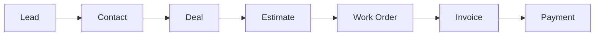

# Codex Continuation Prompt: Beautify New Feature Documentation

## Context

You are working in the ServicePRO repository at `D:\ServiceRepo`. The platform has recently shipped Waves 1–10 of a major feature expansion adding HubSpot/monday.com competitive capabilities. Documentation exists but needs to be polished into professional, user-friendly guides suitable for customer-facing help docs, onboarding flows, and internal training.

## Repository

```
D:\ServiceRepo
```

## Existing Documentation to Beautify

These files contain accurate technical content but need professional formatting, visual hierarchy, clear examples, and user-friendly language:

```
docs/product/SERVICEPRO_COMPETITIVE_FEATURE_GAP_MATRIX.md
docs/product/SERVICEPRO_SUPERCHARGE_ROADMAP.md
docs/architecture/UNIFIED_CUSTOMER_OPERATIONAL_RECORD.md
docs/architecture/CRM_REVENUE_OPERATIONS.md
docs/architecture/WORK_MANAGEMENT_PLATFORM.md
docs/architecture/CUSTOMER_SERVICE_PLATFORM.md
docs/architecture/WORKFLOW_AUTOMATION_ENGINE.md
```

## Task

Transform each document into a polished, professional format following these guidelines:

### Visual & Structural Standards

1. **Add a branded header** to each doc with the ServicePRO product name, document title, version (8.0.0), and last-updated date
2. **Use clear section hierarchy** — H1 for title, H2 for major sections, H3 for subsections. No deeper than H4.
3. **Add a Table of Contents** at the top of each document with anchor links
4. **Use callout blocks** for important notes, warnings, and tips using blockquote formatting:
   - `> 💡 **Tip:**` for helpful hints
   - `> ⚠️ **Important:**` for critical information
   - `> 📋 **Example:**` for usage examples
5. **Add Mermaid diagrams** where data flows, entity relationships, or process flows are described
6. **Use tables consistently** — align columns, add header separators, keep data scannable
7. **Add code examples** showing actual API requests/responses for every endpoint documented
8. **Include screenshots placeholders** as `` where UI documentation would benefit
9. **Cross-link between documents** — when one doc references a concept covered in another, add a relative link

### Content Standards

1. **Write for the user, not the developer** — explain what features DO, not how they're coded
2. **Lead with value** — each section should open with WHY this feature matters to the business
3. **Add real-world examples** using ServicePRO's field service context:
   - Use "Aqua Pro Plumbing" as the example company
   - Use realistic scenarios: HVAC installs, plumbing repairs, maintenance contracts
   - Show how deals flow from lead → estimate → work order → invoice → payment
4. **Include a "Quick Start" section** at the top of each doc showing the 3-step path to using the feature
5. **Add a FAQ section** at the bottom of each doc answering common questions
6. **Define terminology** — add a glossary section or inline definitions for platform-specific terms

### New Documents to Create

In addition to beautifying existing docs, create these new user guides:

```
docs/user-guides/DEALS_PIPELINE_GUIDE.md
docs/user-guides/SERVICE_DESK_GUIDE.md  
docs/user-guides/BOARDS_WORK_MANAGEMENT_GUIDE.md
docs/user-guides/CONTACTS_CRM_GUIDE.md
docs/user-guides/AI_INSIGHTS_GUIDE.md
docs/user-guides/MARKETING_SEGMENTS_FORMS_GUIDE.md
docs/user-guides/SALES_SEQUENCES_MEETINGS_GUIDE.md
docs/user-guides/DASHBOARDS_ANALYTICS_GUIDE.md
```

Each user guide should follow this template:

```markdown
# [Feature Name] — User Guide

> ServicePRO v8.0 | Last updated: 2026-08-04

## Table of Contents
- [Overview](#overview)
- [Quick Start](#quick-start)
- [Key Concepts](#key-concepts)
- [Step-by-Step Walkthrough](#step-by-step-walkthrough)
- [Configuration](#configuration)
- [API Reference](#api-reference)
- [Best Practices](#best-practices)
- [Troubleshooting](#troubleshooting)
- [FAQ](#faq)

## Overview
[1-2 paragraph summary of what this feature does and why it matters]

## Quick Start
1. [First thing to do]
2. [Second thing to do]  
3. [Third thing to do]

## Key Concepts
[Define the 3-5 most important terms/concepts]

## Step-by-Step Walkthrough
### Creating Your First [Thing]
### Managing [Things]
### Advanced: [Power Feature]

## Configuration
[Settings, pipelines, custom fields, permissions]

## API Reference
[Endpoints with request/response examples]

## Best Practices
- [Tip 1]
- [Tip 2]
- [Tip 3]

## Troubleshooting
| Problem | Solution |
|---------|----------|
| ... | ... |

## FAQ
**Q: [Common question]?**
A: [Answer]
```

### API Examples Format

For every API endpoint, show:

```markdown
### Create a Deal

**POST** `/api/v1/deals`

**Request:**
```json
{
  "name": "HVAC System Replacement — Johnson Residence",
  "amount": 12500,
  "stage": "qualified",
  "expected_close_date": "2026-09-15",
  "source": "referral",
  "contact_id": "contact_abc123"
}
```

**Response (201):**
```json
{
  "data": {
    "id": "deal_xyz789",
    "name": "HVAC System Replacement — Johnson Residence",
    "amount": 12500,
    "stage": "qualified",
    "status": "open",
    "createdAt": "2026-08-04T15:30:00Z"
  }
}
```
```

### Diagram Examples

Use Mermaid for flows like:



## File Conventions

- All documentation in Markdown
- Images referenced from `./images/` (create placeholder references)
- Internal links use relative paths
- Keep each document under 500 lines where possible (split if needed)
- Use consistent emoji for callout types throughout all docs

## Quality Checklist

Before considering a document complete:
- [ ] Table of Contents present and linked
- [ ] All API endpoints have request/response examples
- [ ] At least one Mermaid diagram per architecture doc
- [ ] Real-world ServicePRO examples (not generic placeholders)
- [ ] FAQ section with at least 3 questions
- [ ] Cross-links to related documents
- [ ] No broken markdown formatting
- [ ] Spell-checked
- [ ] Consistent heading hierarchy
- [ ] Mobile-readable (no ultra-wide tables)

## Do Not

- Do not change any code files
- Do not modify API behavior or routes
- Do not add features or change functionality
- Do not commit secrets, env files, or sales documentation
- Do not push to remote — leave changes for review
