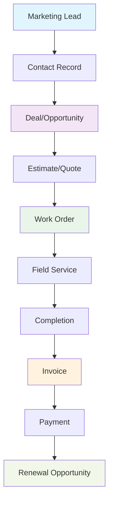

# CRM & Revenue Operations Architecture

> **ServicePRO v8.0** | Last updated: August 4, 2026


## Table of Contents

- [Overview](#overview)
- [Quick Start](#quick-start) 
- [Data Model Architecture](#data-model-architecture)
- [Revenue Lifecycle](#revenue-lifecycle)
- [API Reference](#api-reference)
- [Integration Patterns](#integration-patterns)
- [Best Practices](#best-practices)
- [FAQ](#faq)

## Overview

ServicePRO's CRM and revenue operations layer provides a complete lead-to-revenue pipeline that seamlessly integrates with field service operations, creating a unified customer-to-cash flow.

### Business Value for Field Service

**For Aqua Pro Plumbing:** Track Jennifer Martinez from initial website inquiry → contact record → $12,500 HVAC deal → estimate approval → work order scheduling → technician dispatch → completion → invoice → payment → renewal opportunity identification.

> 💡 **Key Integration:** Unlike standalone CRM systems, ServicePRO's revenue operations integrate natively with dispatch, scheduling, work orders, and field service completion, eliminating data sync issues and duplicate entry.

---

## Quick Start

### Understanding the Revenue Flow



### Core Revenue Operations

1. **Lead Management** — Capture and qualify potential customers
2. **Deal Pipeline** — Track opportunities through sales stages  
3. **Quote-to-Cash** — Seamless estimate → work order → invoice flow
4. **Customer Lifecycle** — Ongoing service and renewal management

---

## Data Model

### Deals (Opportunities)
The primary revenue tracking entity. Deals move through configurable pipeline stages from creation to close (won/lost).

**Key Fields:**
- name, amount, currency, stage, status (open/won/lost)
- pipeline_id (configurable multi-pipeline)
- expected_close_date, probability
- owner_id (assigned sales rep)
- contact_id, company_id (linked CRM records)
- win_reason, loss_reason, competitor
- properties (custom fields via CRM property definitions)

### Deal Pipelines
Configurable stage sequences with probability weighting.

**Default Stages:**
1. New (10%)
2. Qualified (25%)
3. Proposal (50%)
4. Negotiation (75%)
5. Closed Won (100%)
6. Closed Lost (0%)

### Deal Products
Line items on deals linking to the service/product catalog.
- Supports quantity, unit price, discount percentage
- Calculates total automatically
- Supports recurring vs one-time charges

### CRM Contacts
Individual people who may be associated with companies (customers).

**Lifecycle Stages:** subscriber → lead → MQL → SQL → opportunity → customer → evangelist

### Lead Assignment Rules
Automated lead/contact routing using configurable strategies:
- Round-robin (cycles through assignees)
- Territory-based (match by criteria)
- Skill-based (match by expertise)
- Load-balanced (even distribution)

## Revenue Forecasting

The `GET /api/v1/deals/forecast` endpoint provides:
- Count and total amount per stage
- Weighted pipeline (amount × probability)
- Filterable by pipeline and owner

## Integration with Field Service

The unified record graph connects deals to:
- **Estimates** — Deal → Estimate conversion
- **Work Orders** — Estimate → Job/Work Order
- **Invoices** — Work Order completion → Invoice
- **Payments** — Invoice → Payment

This creates a complete revenue lifecycle:
```
Lead → Contact → Deal → Estimate → Work Order → Invoice → Payment
```

## Custom Properties

Tenants can define custom fields on any CRM object type:
- Supported types: text, textarea, number, currency, date, datetime, select, multiselect, checkbox, email, phone, url, user, formula
- Properties stored in JSONB `properties` column on each entity
- Definitions managed per-tenant, per-object-type
- Supports validation rules, required fields, display ordering

## Permissions Matrix

| Role | deals.read | deals.write | deals.delete | crm.read | crm.write |
|------|-----------|-------------|-------------|----------|-----------|
| owner | ✓ | ✓ | ✓ | ✓ | ✓ |
| admin | ✓ | ✓ | ✓ | ✓ | ✓ |
| manager | ✓ | ✓ | ✗ | ✓ | ✓ |
| technician | ✗ | ✗ | ✗ | ✗ | ✗ |
| billing | ✓ | ✗ | ✗ | ✓ | ✗ |
| read_only | ✓ | ✗ | ✗ | ✓ | ✗ |
