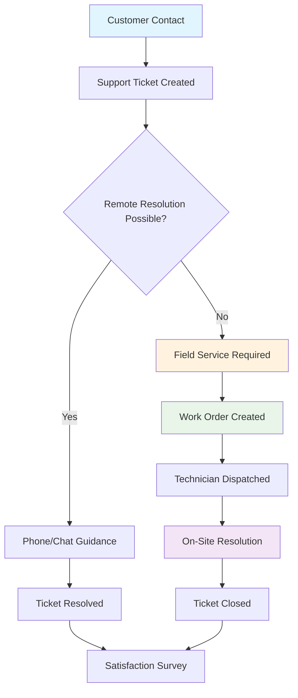
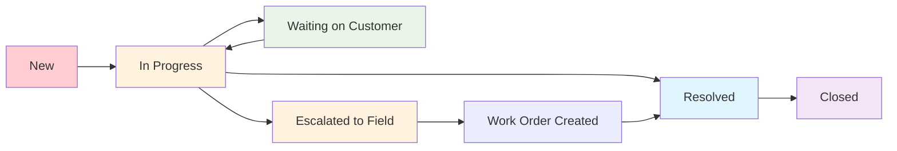

# Customer Service Platform Architecture

> **ServicePRO v8.0** | Last updated: August 4, 2026


## Table of Contents

- [Overview](#overview)
- [Quick Start](#quick-start)
- [Service Hub Architecture](#service-hub-architecture)
- [Ticket Lifecycle Management](#ticket-lifecycle-management)
- [API Reference](#api-reference)
- [Integration Patterns](#integration-patterns)
- [Best Practices](#best-practices)
- [FAQ](#faq)

## Overview

ServicePRO's customer service hub provides HubSpot Service Hub-class ticketing with seamless field service escalation, enabling professional support operations that integrate natively with work orders, equipment history, and technician dispatch.

### Service-to-Field Integration Value

**For Aqua Pro Plumbing:** When Jennifer Martinez calls about her water heater making noise, create a support ticket with equipment context, gather diagnostic information remotely, and either resolve via phone guidance or seamlessly create a field service work order with full issue context for the technician.

> 💡 **Competitive Advantage:** Unlike standalone helpdesk systems, ServicePRO tickets connect directly to customer equipment, service history, technician schedules, and work order creation—eliminating handoff friction and information gaps.

---

## Quick Start

### Service Request to Resolution Flow



### Essential Service Operations

1. **Multi-channel ticket creation** — Portal, phone, email, technician-reported
2. **SLA management with business hours** — Priority-based response targets
3. **Equipment-aware diagnostics** — Link issues to specific customer assets
4. **Seamless field escalation** — Ticket context transfers to work orders

---

## Service Hub Architecture

### Core Service Entities

#### Tickets (Primary Support Record)

| Field | Purpose | Example Value |
|-------|---------|---------------|
| `subject` | Issue summary | "Water heater making loud banging noise" |
| `description` | Detailed problem description | "Started 2 days ago, getting worse, 8-year-old Rheem unit" |
| `status` | Current ticket state | `new`, `in_progress`, `waiting`, `resolved`, `closed` |
| `priority` | Urgency level | `low`, `medium`, `high`, `urgent` |
| `category` | Issue classification | `equipment_issue`, `billing`, `scheduling`, `emergency` |
| `channel` | How ticket was created | `portal`, `phone`, `email`, `technician`, `chat` |
| `sla_policy_id` | Response time targets | Links to SLA configuration |
| `sla_breach_at` | When SLA will be missed | Auto-calculated timestamp |
| `first_response_at` | When agent first replied | Tracks SLA compliance |
| `resolved_at` | When issue was resolved | For resolution time metrics |
| `satisfaction_score` | Customer feedback (1-5) | Post-resolution survey result |

#### Ticket Pipelines & Status Management

**Default Service Pipeline:**


**Status Categories for SLA Timing:**
- **Open Statuses:** `new`, `in_progress`, `escalated` — SLA timers active
- **Pending Statuses:** `waiting_on_customer` — SLA timers paused
- **Closed Statuses:** `resolved`, `closed` — SLA timers stopped

### SLA Policy Engine

#### Priority-Based Response Targets

```json
{
  "sla_policy": {
    "name": "Standard Service SLA",
    "priority_targets": {
      "urgent": {
        "first_response_minutes": 15,
        "resolution_minutes": 240,
        "description": "Safety issues, complete service outage"
      },
      "high": {
        "first_response_minutes": 60, 
        "resolution_minutes": 480,
        "description": "Major equipment malfunction, severe inconvenience"
      },
      "medium": {
        "first_response_minutes": 240,
        "resolution_minutes": 1440,
        "description": "Moderate issues, planned service needs"
      },
      "low": {
        "first_response_minutes": 480,
        "resolution_minutes": 2880, 
        "description": "Questions, minor issues, routine requests"
      }
    }
  }
}
```

#### Business Hours Awareness

```json
{
  "business_hours": {
    "timezone": "America/Los_Angeles",
    "schedule": {
      "monday": { "start": "08:00", "end": "18:00" },
      "tuesday": { "start": "08:00", "end": "18:00" },
      "wednesday": { "start": "08:00", "end": "18:00" },
      "thursday": { "start": "08:00", "end": "18:00" },
      "friday": { "start": "08:00", "end": "18:00" },
      "saturday": { "start": "09:00", "end": "15:00" },
      "sunday": null
    },
    "holidays": [
      "2026-07-04", "2026-11-28", "2026-12-25"
    ]
  }
}
```

---

## Ticket Lifecycle Management

### Automated Ticket Processing

#### SLA Calculation Engine
```javascript
function calculateSLABreach(ticket, slaPolicy) {
  const priorityTarget = slaPolicy.priority_targets[ticket.priority];
  const businessHours = slaPolicy.business_hours;
  
  // Calculate first response deadline
  const firstResponseDeadline = addBusinessMinutes(
    ticket.created_at,
    priorityTarget.first_response_minutes,
    businessHours
  );
  
  // Calculate resolution deadline  
  const resolutionDeadline = addBusinessMinutes(
    ticket.created_at,
    priorityTarget.resolution_minutes,
    businessHours
  );
  
  return {
    first_response_breach_at: firstResponseDeadline,
    resolution_breach_at: resolutionDeadline,
    sla_status: determineSLAStatus(ticket, firstResponseDeadline, resolutionDeadline)
  };
}
```

#### First Response Tracking
```javascript
async function recordFirstResponse(ticketId, commentData) {
  if (commentData.author_type === 'agent' && !commentData.is_internal) {
    await ticketsRepository.update(ticketId, {
      first_response_at: new Date(),
      status: 'in_progress'
    });
    
    // Log SLA compliance achievement
    await activityService.log({
      entity_type: 'ticket',
      entity_id: ticketId,
      activity_type: 'sla_first_response_met',
      title: 'First response SLA achieved',
      performed_by: commentData.author_id
    });
  }
}
```

### Equipment-Aware Diagnostics

#### Linking Tickets to Customer Assets
```javascript
async function createEquipmentTicket(ticketData, equipmentId) {
  // Get equipment context
  const equipment = await equipmentRepository.findById(equipmentId);
  const serviceHistory = await getEquipmentServiceHistory(equipmentId);
  
  // Create ticket with equipment context
  const ticket = await ticketsRepository.create({
    ...ticketData,
    equipment_context: {
      equipment_id: equipmentId,
      model: equipment.model,
      install_date: equipment.install_date,
      last_service: serviceHistory[0],
      warranty_status: equipment.warranty_status
    }
  });
  
  // Create association
  await associationsService.create({
    source_type: 'ticket',
    source_id: ticket.id,
    target_type: 'equipment',
    target_id: equipmentId,
    association_type: 'relates_to'
  });
  
  return ticket;
}
```

### Service-to-Field Escalation

#### Seamless Work Order Creation
```javascript
async function escalateTicketToField(ticketId, escalationData) {
  const ticket = await ticketsRepository.findById(ticketId);
  
  // Create work order with full ticket context
  const workOrder = await jobsRepository.create({
    title: `Service Call: ${ticket.subject}`,
    description: `Support escalation: ${ticket.description}\n\nTroubleshooting attempts: ${escalationData.attempts}`,
    customer_id: ticket.customer_id,
    priority: mapTicketPriorityToJobPriority(ticket.priority),
    equipment_id: ticket.equipment_id,
    ticket_context: {
      ticket_id: ticketId,
      agent_notes: escalationData.agent_notes,
      customer_availability: escalationData.availability,
      parts_suspected: escalationData.suspected_parts
    },
    scheduled_date: escalationData.preferred_date,
    time_window: escalationData.time_window
  });
  
  // Update ticket status
  await ticketsRepository.update(ticketId, {
    status: 'escalated_to_field',
    work_order_id: workOrder.id,
    escalation_notes: escalationData.notes
  });
  
  // Link via associations
  await associationsService.create({
    source_type: 'ticket',
    source_id: ticketId,
    target_type: 'job',
    target_id: workOrder.id,
    association_type: 'escalates_to'
  });
  
  return workOrder;
}
```

---

## API Reference

### Ticket Management

#### Create Support Ticket
**POST** `/api/v1/tickets`

**Request:**
```json
{
  "subject": "Water heater making loud banging noise",
  "description": "Customer reports loud banging sounds from water heater, started 2 days ago, seems to be getting worse. Unit is 8 years old, Rheem model.",
  "priority": "high",
  "category": "equipment_issue",
  "channel": "phone", 
  "customer_id": "customer_martinez",
  "contact_id": "contact_jennifer",
  "equipment_id": "equipment_water_heater_main",
  "assigned_to": "alice@aquapro.com",
  "properties": {
    "equipment_age": 8,
    "warranty_status": "expired",
    "customer_availability": "weekdays after 3pm"
  }
}
```

**Response (201):**
```json
{
  "data": {
    "id": "ticket_abc123",
    "number": "TICK-2026-0423",
    "subject": "Water heater making loud banging noise",
    "status": "new",
    "priority": "high", 
    "category": "equipment_issue",
    "channel": "phone",
    "sla_breach_at": "2026-08-04T16:30:00Z",
    "created_at": "2026-08-04T15:30:00Z",
    "customer": {
      "name": "Jennifer Martinez",
      "email": "jennifer@email.com",
      "phone": "(555) 123-4567"
    },
    "equipment": {
      "type": "water_heater",
      "model": "Rheem Performance 50 Gal",
      "install_date": "2018-03-15"
    }
  }
}
```

#### Add Ticket Comment
**POST** `/api/v1/tickets/:id/comments`

**Agent Response:**
```json
{
  "content": "Hi Jennifer, thank you for calling about the water heater noise. Based on your description and the unit's age, this sounds like it could be sediment buildup or a thermal expansion issue. For safety, I recommend scheduling a technician inspection. I can get someone out today between 2-4 PM. Would that work for you?",
  "author_type": "agent",
  "is_internal": false,
  "next_action": "schedule_field_visit"
}
```

**Customer Reply:**
```json
{
  "content": "Yes, 2-4 PM today works perfectly. I'll be home. Thank you for the quick response!",
  "author_type": "customer", 
  "is_internal": false,
  "source": "portal"
}
```

#### Escalate to Field Service
**POST** `/api/v1/tickets/:id/escalate`

**Request:**
```json
{
  "escalation_type": "field_service",
  "priority": "high",
  "preferred_date": "2026-08-04",
  "time_window": "14:00-16:00",
  "technician_preference": "bob@aquapro.com",
  "agent_notes": "Customer confirmed thermal expansion tank may be the issue. Check expansion tank pressure and condition.",
  "customer_availability": "Home weekdays after 3pm, weekends morning preferred",
  "suspected_parts": ["thermal_expansion_tank", "pressure_relief_valve"]
}
```

**Response (201):**
```json
{
  "data": {
    "work_order": {
      "id": "job_def456",
      "number": "WO-2026-1156", 
      "title": "Service Call: Water heater making loud banging noise",
      "scheduled_date": "2026-08-04",
      "time_window": "14:00-16:00",
      "technician": {
        "name": "Bob Johnson",
        "phone": "(555) 987-1234"
      }
    },
    "ticket_status": "escalated_to_field"
  }
}
```

### SLA Management  

#### Get SLA Performance
**GET** `/api/v1/tickets/sla-performance`

**Query Parameters:**
- `date_range` — Performance period (`this_month`, `last_30_days`, `custom`)
- `priority` — Filter by priority level
- `agent` — Filter by assigned agent
- `category` — Filter by ticket category

**Response (200):**
```json
{
  "data": {
    "overall_compliance": 94.2,
    "first_response_compliance": 96.8,
    "resolution_compliance": 91.5,
    "by_priority": {
      "urgent": {
        "total_tickets": 12,
        "first_response_met": 11,
        "resolution_met": 10,
        "avg_response_minutes": 8,
        "avg_resolution_minutes": 156
      },
      "high": {
        "total_tickets": 45,
        "first_response_met": 43, 
        "resolution_met": 41,
        "avg_response_minutes": 42,
        "avg_resolution_minutes": 387
      }
    },
    "trending": {
      "this_month": 94.2,
      "last_month": 91.8,
      "trend": "improving"
    }
  }
}
```

### Customer Satisfaction

#### Record Satisfaction Survey
**POST** `/api/v1/tickets/:id/satisfaction`

**Request:**
```json
{
  "rating": 5,
  "feedback": "Excellent service! Quick response, professional technician, problem fixed perfectly. The agent was very helpful in diagnosing the issue over the phone first.",
  "would_recommend": true,
  "resolution_rating": 5,
  "communication_rating": 5,
  "timeliness_rating": 4,
  "categories": ["helpful_agent", "professional_technician", "quick_resolution"]
}
```

---

## Integration Patterns

### Equipment Service History Integration

```javascript
async function getTicketEquipmentContext(equipmentId) {
  const equipment = await equipmentRepository.findById(equipmentId);
  const serviceHistory = await jobsRepository.findByEquipment(equipmentId);
  const previousTickets = await ticketsRepository.findByEquipment(equipmentId);
  
  return {
    equipment_details: {
      model: equipment.model,
      serial_number: equipment.serial_number,
      install_date: equipment.install_date,
      warranty_expiry: equipment.warranty_expiry,
      last_service_date: serviceHistory[0]?.completed_at
    },
    service_patterns: {
      total_services: serviceHistory.length,
      common_issues: identifyCommonIssues(serviceHistory),
      last_technician: serviceHistory[0]?.technician,
      recurring_problems: identifyRecurringIssues(previousTickets)
    },
    recommendations: {
      suggested_parts: suggestPartsBasedOnHistory(serviceHistory),
      estimated_service_time: estimateServiceDuration(equipment, serviceHistory),
      technician_specialization: findSpecializedTechnician(equipment.type)
    }
  };
}
```

### Customer Portal Integration

```javascript
// Customer portal ticket submission
async function createPortalTicket(customerPortalRequest) {
  const ticket = await ticketsRepository.create({
    ...customerPortalRequest,
    channel: 'portal',
    status: 'new',
    // Auto-assign based on customer tier and issue category
    assigned_to: await determineAgentAssignment(customerPortalRequest.customer_id, customerPortalRequest.category)
  });
  
  // Send confirmation to customer
  await notificationsService.send({
    template: 'ticket_created_confirmation',
    recipient: customerPortalRequest.customer_email,
    data: {
      ticket_number: ticket.number,
      expected_response: calculateExpectedResponse(ticket.priority),
      portal_link: generatePortalTicketLink(ticket.id)
    }
  });
  
  return ticket;
}
```

---

## Best Practices

### Ticket Classification & Routing

- **Use consistent categories** — Standardize issue classification across all channels
- **Implement smart routing** — Route tickets based on customer tier, issue type, and agent expertise
- **Escalate appropriately** — Clear criteria for when to escalate to field service
- **Document resolution patterns** — Build knowledge base from successful resolutions

### SLA Management Excellence

- **Set realistic targets** — Based on actual team capacity and issue complexity
- **Monitor breach warnings** — Proactive escalation before SLA violations
- **Track root causes** — Identify systemic issues causing SLA breaches  
- **Balance speed with quality** — Don't sacrifice resolution quality for SLA compliance

### Customer Communication

- **Respond empathetically** — Acknowledge customer frustration and urgency
- **Provide specific timelines** — "Technician will arrive between 2-4 PM today"
- **Explain the process** — Set expectations for multi-step resolutions
- **Follow up proactively** — Don't wait for customers to ask for updates

### Field Service Integration

- **Transfer complete context** — Ticket history, troubleshooting attempts, customer preferences
- **Maintain continuity** — Same agent manages ticket through field resolution
- **Update ticket status** — Real-time work order progress updates
- **Close the loop** — Ensure customer satisfaction after field completion

---

## FAQ

**Q: How do support tickets differ from work orders?**
A: Support tickets track customer issues and communication, while work orders are scheduled field service jobs. A ticket might resolve without a work order (phone guidance) or escalate to create a work order for on-site service.

**Q: Can customers create tickets directly?** 
A: Yes, through the customer portal, email integration, or embedded forms. Portal tickets automatically link to customer records and follow the same SLA and routing rules as agent-created tickets.

**Q: What happens when a work order is completed?**
A: The associated ticket automatically updates to "resolved" status. The customer receives a satisfaction survey, and the ticket can be closed after confirmation of satisfaction.

**Q: How do I handle recurring issues with the same equipment?**
A: Use equipment associations to link all related tickets. This provides complete service context and helps identify chronic problems that require equipment replacement rather than repeated repairs.

**Q: Can I customize SLA policies by customer tier?**
A: Yes. Create multiple SLA policies (Standard, Premium, Enterprise) and assign based on customer segments. Premium customers can have faster response requirements.

**Q: How do internal notes differ from customer-visible comments?**
A: Internal notes (`is_internal: true`) are only visible to agents and contain troubleshooting details, part numbers, or internal coordination. Customer comments are visible in the portal and email updates.

---

## Related Documentation

- [Service Desk User Guide](../user-guides/SERVICE_DESK_GUIDE.md)
- [Customer Portal Integration](../user-guides/CUSTOMER_PORTAL_GUIDE.md)
- [Work Order Management](../user-guides/WORK_ORDER_GUIDE.md)
- [Unified Customer Record Architecture](./UNIFIED_CUSTOMER_OPERATIONAL_RECORD.md)
