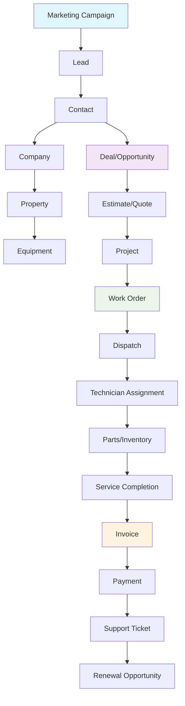

# Unified Customer & Operational Record Architecture

> **ServicePRO v8.0** | Last updated: August 4, 2026


## Table of Contents

- [Overview](#overview)
- [Quick Start](#quick-start)
- [Record Graph Architecture](#record-graph-architecture)
- [API Reference](#api-reference)
- [Implementation Guide](#implementation-guide)
- [Best Practices](#best-practices)
- [FAQ](#faq)

## Overview

ServicePRO's unified record graph connects all business entities through a universal association system, enabling HubSpot-class relationship visibility while maintaining ServicePRO's field-service operational depth.

### Why This Matters

**For Aqua Pro Plumbing:** Track every interaction from Jennifer Martinez's initial website inquiry → contact record → $12,500 HVAC deal → site estimate → work order → technician dispatch → parts usage → completion → invoice → payment → warranty follow-up → maintenance contract renewal.

> 💡 **Business Value:** Complete customer intelligence eliminates data silos and enables cross-selling, upselling, and proactive service opportunities.

---

## Quick Start

### Understanding the Unified Record

1. **Every entity can link to any other entity** — Customers to deals, deals to work orders, work orders to assets
2. **Activity timeline shows complete interaction history** — All touchpoints in chronological order
3. **Tenant-scoped for data security** — No cross-tenant data leakage

### Setting Up Associations

```http
POST /api/v1/associations
{
  "source_type": "deal",
  "source_id": "deal_xyz789",
  "target_type": "job", 
  "target_id": "job_abc123",
  "association_type": "related",
  "label": "HVAC Installation Work Order"
}
```

---

## Record Graph Architecture

The unified record system creates connections between all ServicePRO entities, providing complete operational visibility.



### Core Relationships

| Source Entity | Target Entity | Relationship Type | Business Purpose |
|--------------|---------------|------------------|------------------|
| **Contact** | Company | belongs_to | Person works for organization |
| **Deal** | Contact | primary_contact | Deal owner/decision maker |  
| **Deal** | Estimate | converts_to | Revenue opportunity becomes quote |
| **Estimate** | Work Order | creates | Quote acceptance generates job |
| **Work Order** | Invoice | generates | Completed work creates billing |
| **Invoice** | Payment | receives | Financial transaction tracking |
| **Equipment** | Work Order | services | Asset maintenance history |
| **Ticket** | Work Order | escalates_to | Support issue needs field visit |

---

## Core Tables

### record_associations
Universal many-to-many association table connecting any two records.

| Column | Type | Purpose |
|--------|------|---------|
| source_type | TEXT | Entity type (contact, deal, job, etc.) |
| source_id | UUID | Source entity ID |
| target_type | TEXT | Target entity type |
| target_id | UUID | Target entity ID |
| association_type | TEXT | 'related', 'primary', 'parent', 'child' |
| label | TEXT | Optional custom label |
| is_primary | BOOLEAN | Primary association flag |
| tenant_id | TEXT | Tenant isolation |

### activity_timeline
Unified activity feed for all record types.

| Column | Type | Purpose |
|--------|------|---------|
| entity_type | TEXT | Which entity this activity is on |
| entity_id | UUID | Entity ID |
| activity_type | TEXT | note, email, call, task, meeting, status_change, etc. |
| title | TEXT | Activity summary |
| description | TEXT | Details |
| performed_by | TEXT | User who performed |
| performed_at | TIMESTAMPTZ | When it happened |

## API Reference

### Record Associations

#### List Associations
**GET** `/api/v1/associations?entity_type=deal&entity_id=xxx`

Get all records associated with a specific entity.

**Request:**
```http
GET /api/v1/associations?entity_type=deal&entity_id=deal_xyz789
Authorization: Bearer <jwt_token>
```

**Response (200):**
```json
{
  "data": [
    {
      "id": "assoc_123",
      "source_type": "deal",
      "source_id": "deal_xyz789", 
      "target_type": "job",
      "target_id": "job_abc123",
      "association_type": "related",
      "label": "HVAC Installation Work Order",
      "is_primary": true,
      "created_at": "2026-08-04T15:30:00Z"
    }
  ]
}
```

#### Create Association
**POST** `/api/v1/associations`

Link two entities together.

**Request:**
```json
{
  "source_type": "deal",
  "source_id": "deal_xyz789",
  "target_type": "job",
  "target_id": "job_abc123", 
  "association_type": "related",
  "label": "HVAC Installation Work Order",
  "is_primary": true
}
```

**Response (201):**
```json
{
  "data": {
    "id": "assoc_123",
    "source_type": "deal",
    "source_id": "deal_xyz789",
    "target_type": "job", 
    "target_id": "job_abc123",
    "association_type": "related",
    "label": "HVAC Installation Work Order",
    "is_primary": true,
    "created_at": "2026-08-04T15:30:00Z"
  }
}
```

#### Remove Association  
**DELETE** `/api/v1/associations/:id`

Remove a link between entities (does not delete the entities themselves).

### Activity Timeline

#### Get Entity Activity
**GET** `/api/v1/activity?entity_type=deal&entity_id=xxx`

Retrieve all activities for a specific record.

**Request:**
```http
GET /api/v1/activity?entity_type=deal&entity_id=deal_xyz789&limit=50
```

**Response (200):**
```json
{
  "data": [
    {
      "id": "activity_456",
      "entity_type": "deal",
      "entity_id": "deal_xyz789", 
      "activity_type": "note",
      "title": "Customer requested expedited installation",
      "description": "Jennifer Martinez needs HVAC replacement before next week due to heat wave forecast",
      "performed_by": "alice@aquapro.com",
      "performed_at": "2026-08-04T14:20:00Z"
    },
    {
      "id": "activity_457",
      "entity_type": "deal",
      "entity_id": "deal_xyz789",
      "activity_type": "estimate_sent", 
      "title": "Estimate sent to customer",
      "description": "$12,500 HVAC system replacement estimate",
      "performed_by": "system", 
      "performed_at": "2026-08-04T10:15:00Z"
    }
  ],
  "pagination": {
    "limit": 50,
    "offset": 0,
    "total": 23
  }
}
```

#### Log Activity
**POST** `/api/v1/activity`

Add a new activity entry to the timeline.

**Request:**
```json
{
  "entity_type": "deal",
  "entity_id": "deal_xyz789",
  "activity_type": "call",
  "title": "Follow-up call completed",
  "description": "Discussed timeline and financing options with Jennifer Martinez",
  "performed_by": "bob@aquapro.com"
}
```

---

## Implementation Guide

### Database Schema Details

The `record_associations` table supports these enhanced columns for better relationship management:

| Column | Type | Purpose | Example Value |
|--------|------|---------|--------------|
| `id` | UUID | Primary key | `assoc_123` |
| `source_type` | TEXT | Entity type | `deal`, `contact`, `job` |
| `source_id` | UUID | Source entity ID | `deal_xyz789` |
| `target_type` | TEXT | Target entity type | `job`, `invoice`, `customer` |
| `target_id` | UUID | Target entity ID | `job_abc123` |
| `association_type` | TEXT | Relationship type | `related`, `primary`, `converts_to` |
| `label` | TEXT | Custom relationship label | `"Primary Decision Maker"` |
| `is_primary` | BOOLEAN | Primary association flag | `true` |
| `tenant_id` | TEXT | Tenant isolation | `aquapro_tenant` |
| `created_at` | TIMESTAMPTZ | When created | `2026-08-04T15:30:00Z` |
| `created_by` | TEXT | User who created | `alice@aquapro.com` |

### Integration Patterns

#### Automatic Association Creation

```javascript
// When creating a work order from an estimate
async function createWorkOrderFromEstimate(estimateId, workOrderData) {
  const workOrder = await jobsRepository.create(workOrderData);
  
  // Automatically create the association
  await associationsService.create({
    source_type: 'estimate',
    source_id: estimateId,
    target_type: 'job',
    target_id: workOrder.id,
    association_type: 'creates',
    label: 'Work Order from Estimate',
    is_primary: true
  });
  
  // Log the conversion activity
  await activityService.log({
    entity_type: 'estimate',
    entity_id: estimateId,
    activity_type: 'converted_to_job',
    title: 'Estimate converted to work order',
    description: `Work order ${workOrder.number} created`,
    performed_by: workOrderData.created_by
  });
  
  return workOrder;
}
```

#### Querying Related Data

```javascript
// Get complete customer context
async function getCustomerContext(customerId) {
  // Get all associations for this customer
  const associations = await associationsService.findByEntity('customer', customerId);
  
  // Group by target type
  const context = {
    properties: [],
    equipment: [],
    deals: [],
    workOrders: [],
    invoices: [],
    tickets: []
  };
  
  for (const assoc of associations) {
    switch (assoc.target_type) {
      case 'property':
        context.properties.push(await propertiesRepository.findById(assoc.target_id));
        break;
      case 'equipment':
        context.equipment.push(await equipmentRepository.findById(assoc.target_id));
        break;
      case 'deal':
        context.deals.push(await dealsRepository.findById(assoc.target_id));
        break;
      // ... etc
    }
  }
  
  return context;
}
```

---

## Best Practices

### Association Management

- **Use semantic association types** — `converts_to`, `belongs_to`, `owns` vs generic `related`
- **Include descriptive labels** — Help users understand the relationship purpose
- **Set primary flags appropriately** — Mark the most important relationship of each type
- **Clean up orphaned associations** — Remove associations when entities are deleted

### Activity Timeline Best Practices

- **Log meaningful events automatically** — Status changes, payments, completions
- **Use consistent activity types** — Standardize vocabulary across all modules  
- **Include rich context** — Descriptions should be useful months later
- **Batch timeline queries** — Load multiple entity timelines together for efficiency

### Performance Optimization

- **Index strategically** — `(tenant_id, entity_type, entity_id)` for activity queries
- **Limit result sets** — Use pagination for timeline and association lists
- **Cache relationship counts** — Store frequently accessed counts in entity records
- **Use bulk operations** — Create multiple associations in single transactions

### Data Quality

- **Validate entity existence** — Ensure both source and target exist before creating associations
- **Prevent invalid associations** — Some entity types shouldn't associate with others
- **Monitor relationship health** — Identify and clean up stale or broken associations
- **Audit association changes** — Track who creates and removes relationships

---

## FAQ

**Q: How do I prevent duplicate associations between the same entities?**
A: The database includes unique constraints on `(source_type, source_id, target_type, target_id, tenant_id)` to prevent exact duplicates. Different association types between the same entities are allowed.

**Q: Can I query associations in both directions?**  
A: Yes. Query `source_type=deal&source_id=xyz` to find what a deal is associated with, or `target_type=deal&target_id=xyz` to find what is associated with a deal.

**Q: What happens when I delete an entity that has associations?**
A: All associations where the entity is either source or target are automatically deleted. This prevents orphaned references but means relationship history is lost.

**Q: How do I implement bi-directional associations?**
A: Create two association records: A→B and B→A. Use different labels if needed (`"Owns"` vs `"Owned by"`).

**Q: Can I associate the same entity with itself?**
A: Yes, for hierarchical relationships like parent-child equipment or deal dependencies. Use association types like `parent` and `child` to distinguish direction.

**Q: How do I migrate existing foreign key relationships?**
A: Create migration scripts that read existing FK relationships and create corresponding associations. For example:

```sql
INSERT INTO record_associations (source_type, source_id, target_type, target_id, association_type, tenant_id)
SELECT 'job', id, 'customer', customer_id, 'belongs_to', tenant_id 
FROM jobs WHERE customer_id IS NOT NULL;
```

---

## Related Documentation

- [CRM & Revenue Operations Architecture](./CRM_REVENUE_OPERATIONS.md)
- [Customer Service Platform Architecture](./CUSTOMER_SERVICE_PLATFORM.md)
- [Work Management Platform Architecture](./WORK_MANAGEMENT_PLATFORM.md)
- [ServicePRO API Reference Guide](../user-guides/API_REFERENCE_GUIDE.md)
