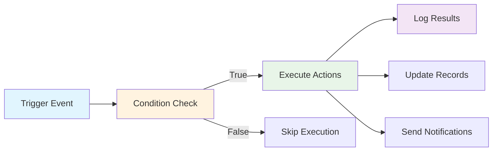

# Workflow Automation Engine

> **ServicePRO v8.0** | Last updated: August 4, 2026


## Table of Contents

- [Overview](#overview)
- [Quick Start](#quick-start)
- [Automation Architecture](#automation-architecture)
- [Trigger System](#trigger-system)
- [Action Orchestration](#action-orchestration)
- [API Reference](#api-reference)
- [Integration Examples](#integration-examples)
- [Best Practices](#best-practices)
- [FAQ](#faq)

## Overview

ServicePRO's workflow automation engine powers both manual workflow rules and automated sequences across field service, CRM, marketing, and service desk operations using a robust Trigger → Condition → Action pattern.

### Field Service Automation Value

**For Aqua Pro Plumbing:** Automatically create follow-up maintenance reminders when HVAC installations complete, send customer satisfaction surveys 24 hours after service, and trigger inventory reorder alerts when parts reach minimum levels.

> 💡 **Integration Advantage:** Unlike standalone automation tools (Zapier, Microsoft Power Automate), ServicePRO's engine has native access to all field service data—work orders, technician status, equipment history, customer interactions—enabling sophisticated operational workflows impossible with external tools.

---

## Quick Start

### Understanding Automation Flow



### Essential Automation Patterns

1. **Event-Driven Actions** — Work order completion → Invoice generation
2. **Time-Based Sequences** — Equipment age → Maintenance reminders  
3. **Conditional Workflows** — Customer tier → Priority routing
4. **Cross-Module Integration** — Deal won → Work order creation

---

## Automation Architecture

### Core Automation Components

#### Workflow Rules Structure
```json
{
  "id": "rule_maintenance_reminder",
  "name": "HVAC Maintenance Reminders",
  "description": "Send maintenance reminders 11 months after installation",
  "is_active": true,
  "trigger": {
    "type": "scheduled",
    "schedule": "monthly",
    "entity_type": "equipment",
    "conditions": [
      {
        "field": "type",
        "operator": "equals", 
        "value": "hvac"
      },
      {
        "field": "install_date",
        "operator": "months_ago",
        "value": 11
      }
    ]
  },
  "actions": [
    {
      "type": "create_deal",
      "template": "maintenance_contract_opportunity"
    },
    {
      "type": "send_notification",
      "template": "maintenance_reminder_email"
    }
  ]
}
```

#### Trigger Categories & Sources

| Category | Trigger Source | Field Service Examples |
|----------|---------------|------------------------|
| **Record Events** | Create, Update, Delete | Work order completed, customer created |
| **Field Changes** | Specific field modifications | Job status → completed, equipment → out of service |
| **Time-Based** | Scheduled intervals | Monthly maintenance checks, annual inspections |
| **Cross-Entity** | Related record changes | Deal won → create work order |
| **Threshold** | Numeric/date conditions | Equipment age > 10 years, parts inventory < 5 |
| **User Actions** | Manual triggers | Technician check-in, customer portal submission |

### Execution Engine

#### Workflow Processing Pipeline
```javascript
async function processWorkflowRule(rule, triggerData) {
  // 1. Validate trigger conditions
  const conditionsMatch = await evaluateConditions(rule.trigger.conditions, triggerData);
  if (!conditionsMatch) return { skipped: true, reason: 'conditions_not_met' };
  
  // 2. Execute actions in sequence
  const actionResults = [];
  for (const action of rule.actions) {
    try {
      const result = await executeAction(action, triggerData);
      actionResults.push({ action: action.type, success: true, result });
      
      // Log action execution
      await auditService.log({
        entity_type: 'workflow_execution',
        entity_id: rule.id,
        action: 'action_executed',
        details: { action_type: action.type, trigger_data: triggerData, result }
      });
      
    } catch (error) {
      actionResults.push({ action: action.type, success: false, error: error.message });
      
      // Dead letter queue for failed actions
      await deadLetterQueue.add(rule.id, action, triggerData, error);
    }
  }
  
  // 3. Record execution history
  await workflowExecutionsRepository.create({
    rule_id: rule.id,
    trigger_data: triggerData,
    action_results: actionResults,
    executed_at: new Date(),
    tenant_id: triggerData.tenant_id
  });
  
  return { executed: true, results: actionResults };
}
```

---

## Trigger System

### Field Service Trigger Sources

#### Work Order Lifecycle Triggers
```javascript
// Trigger: Work order status change
const workOrderTriggers = {
  'job_created': {
    description: 'When new work order is created',
    available_data: ['job', 'customer', 'technician', 'equipment']
  },
  'job_scheduled': {
    description: 'When work order is assigned to technician', 
    available_data: ['job', 'technician', 'schedule_details']
  },
  'job_started': {
    description: 'When technician checks in to job site',
    available_data: ['job', 'technician', 'location', 'start_time']
  },
  'job_completed': {
    description: 'When work order is marked complete',
    available_data: ['job', 'completion_details', 'parts_used', 'labor_hours']
  },
  'job_invoiced': {
    description: 'When invoice is generated from completed job',
    available_data: ['job', 'invoice', 'customer', 'payment_terms']
  }
};
```

#### Equipment & Asset Triggers
```javascript
const equipmentTriggers = {
  'equipment_service_due': {
    description: 'When equipment reaches service interval',
    schedule: 'daily_check',
    conditions: ['last_service_date + service_interval <= today']
  },
  'equipment_failure_predicted': {
    description: 'When AI predicts equipment failure risk',
    source: 'predictive_maintenance_service',
    threshold: 'failure_probability > 0.7'
  },
  'warranty_expiring': {
    description: 'When equipment warranty expires in 30 days',
    schedule: 'daily_check', 
    conditions: ['warranty_expiry <= today + 30 days']
  }
};
```

### CRM & Sales Triggers

#### Deal Pipeline Triggers
```javascript
const dealTriggers = {
  'deal_stage_changed': {
    description: 'When deal moves between pipeline stages',
    available_data: ['deal', 'previous_stage', 'new_stage', 'stage_change_reason']
  },
  'deal_won': {
    description: 'When deal is marked as won',
    available_data: ['deal', 'win_reason', 'products', 'expected_revenue']
  },
  'deal_stalled': {
    description: 'When deal remains in same stage for configured period',
    schedule: 'daily_check',
    conditions: ['days_in_current_stage > stall_threshold']
  }
};
```

#### Lead Management Triggers  
```javascript
const leadTriggers = {
  'lead_created': {
    description: 'When new lead enters system',
    sources: ['website_form', 'referral', 'cold_outreach', 'marketing_campaign']
  },
  'lead_score_threshold': {
    description: 'When lead score reaches qualification threshold',
    conditions: ['lead_score >= qualification_threshold']
  },
  'lead_converted': {
    description: 'When lead is converted to customer',
    available_data: ['lead', 'customer', 'conversion_source', 'first_job']
  }
};
```

---

## Action Orchestration

### Action Types & Capabilities

#### Record Management Actions
```javascript
const recordActions = {
  'create_record': {
    description: 'Create new record in any module',
    examples: [
      'Create work order from won deal',
      'Create maintenance agreement from completed installation', 
      'Create follow-up task after service call'
    ],
    parameters: {
      record_type: 'required',
      field_mappings: 'required',
      template_data: 'optional'
    }
  },
  'update_record': {
    description: 'Update existing record fields',
    examples: [
      'Update customer lifecycle stage after first service',
      'Set equipment status to out-of-service',
      'Update deal probability based on activity'
    ]
  },
  'create_association': {
    description: 'Link records via association system',
    examples: [
      'Associate completed job with customer equipment',
      'Link support ticket to related work order',
      'Connect deal to generated estimate'
    ]
  }
};
```

#### Communication & Notification Actions
```javascript
const communicationActions = {
  'send_email': {
    description: 'Send templated email to contacts',
    template_variables: ['customer', 'technician', 'job', 'equipment', 'custom_fields'],
    examples: [
      'Service confirmation 24 hours before appointment',
      'Maintenance reminder based on equipment age',
      'Satisfaction survey after job completion'
    ]
  },
  'send_sms': {
    description: 'Send SMS notification',
    use_cases: [
      'Technician en-route notification',
      'Appointment reminder to customer',
      'Emergency service alerts'
    ]
  },
  'create_task': {
    description: 'Assign task to team member',
    examples: [
      'Follow-up call task after estimate sent',
      'Equipment inspection task when warranty expires',
      'Customer check-in task after large installation'
    ]
  }
};
```

#### Field Service Integration Actions
```javascript
const fieldServiceActions = {
  'schedule_maintenance': {
    description: 'Create recurring maintenance work orders',
    parameters: {
      equipment_id: 'required',
      maintenance_type: 'required', 
      interval: 'required', // monthly, quarterly, annual
      preferred_technician: 'optional',
      customer_preferences: 'optional'
    }
  },
  'trigger_inventory_reorder': {
    description: 'Create purchase orders when parts reach minimum levels',
    conditions: ['current_stock <= reorder_point'],
    actions: ['create_po', 'notify_purchasing_manager']
  },
  'dispatch_emergency_technician': {
    description: 'Auto-dispatch for urgent issues',
    conditions: ['priority = urgent', 'customer_tier = premium'],
    actions: ['find_available_technician', 'create_emergency_job', 'notify_customer']
  }
};
```

### Conditional Logic Engine

#### Advanced Condition Matching
```javascript
const conditionEvaluator = {
  // Simple field conditions
  field_equals: (value, target) => value === target,
  field_contains: (value, target) => value.includes(target),
  field_greater_than: (value, target) => parseFloat(value) > parseFloat(target),
  
  // Date/time conditions
  days_since: (date, days) => (Date.now() - new Date(date)) > (days * 24 * 60 * 60 * 1000),
  business_days_since: (date, days) => calculateBusinessDays(new Date(date), new Date()) >= days,
  
  // Related record conditions
  has_related_records: async (entityType, entityId, relatedType) => {
    const associations = await associationsService.findByEntity(entityType, entityId);
    return associations.some(a => a.target_type === relatedType);
  },
  
  // Custom formula conditions
  formula_condition: (formula, contextData) => evaluateFormula(formula, contextData)
};
```

---
## API Reference

### Workflow Rules Management

#### Create Workflow Rule
**POST** `/api/v1/workflows`

**Request:**
```json
{
  "name": "HVAC Maintenance Reminders",
  "description": "Automatically create maintenance opportunities for HVAC systems 11 months after installation",
  "is_active": true,
  "trigger": {
    "type": "scheduled",
    "schedule": "monthly",
    "entity_type": "equipment",
    "conditions": [
      {
        "field": "type",
        "operator": "equals",
        "value": "hvac"
      },
      {
        "field": "install_date", 
        "operator": "months_ago",
        "value": 11
      },
      {
        "field": "maintenance_contract_active",
        "operator": "equals",
        "value": false
      }
    ]
  },
  "actions": [
    {
      "type": "create_deal",
      "parameters": {
        "name": "Annual HVAC Maintenance - {{customer.name}}",
        "amount": 480,
        "stage": "qualified",
        "pipeline": "maintenance_contracts",
        "contact_id": "{{equipment.primary_contact_id}}",
        "expected_close_date": "{{today + 30_days}}"
      }
    },
    {
      "type": "send_email",
      "parameters": {
        "template": "maintenance_reminder",
        "to": "{{customer.email}}",
        "variables": {
          "customer_name": "{{customer.name}}",
          "equipment_type": "{{equipment.type}}",
          "install_date": "{{equipment.install_date}}",
          "maintenance_benefits": "Extend equipment life, maintain warranty, prevent breakdowns"
        }
      }
    }
  ]
}
```

**Response (201):**
```json
{
  "data": {
    "id": "workflow_abc123", 
    "name": "HVAC Maintenance Reminders",
    "is_active": true,
    "trigger_count": 0,
    "success_rate": 0,
    "created_at": "2026-08-04T15:30:00Z",
    "next_scheduled_run": "2026-09-01T06:00:00Z"
  }
}
```

#### List Workflow Executions
**GET** `/api/v1/workflows/:id/executions`

**Query Parameters:**
- `status` — Filter by success/failure
- `date_range` — Filter by execution date
- `limit` — Result pagination

**Response (200):**
```json
{
  "data": [
    {
      "id": "execution_def456",
      "workflow_id": "workflow_abc123",
      "trigger_data": {
        "equipment_id": "equipment_hvac_martinez",
        "customer": { "name": "Jennifer Martinez", "email": "jennifer@email.com" },
        "equipment": { "type": "hvac", "install_date": "2025-09-04" }
      },
      "actions_executed": 2,
      "actions_successful": 2, 
      "execution_time_ms": 1247,
      "executed_at": "2026-08-04T06:00:00Z",
      "results": [
        {
          "action": "create_deal",
          "success": true,
          "result": { "deal_id": "deal_xyz789" }
        },
        {
          "action": "send_email", 
          "success": true,
          "result": { "message_id": "email_msg_456" }
        }
      ]
    }
  ]
}
```

### Manual Workflow Triggers

#### Execute Workflow Manually
**POST** `/api/v1/workflows/:id/execute`

**Request:**
```json
{
  "trigger_data": {
    "job_id": "job_abc123",
    "override_conditions": false,
    "test_mode": false
  }
}
```

### Automation Analytics

#### Get Workflow Performance
**GET** `/api/v1/workflows/analytics`

**Response (200):**
```json
{
  "data": {
    "total_workflows": 23,
    "active_workflows": 18,
    "total_executions_this_month": 847,
    "success_rate": 97.2,
    "top_performing": [
      {
        "workflow_id": "workflow_maintenance",
        "name": "HVAC Maintenance Reminders", 
        "executions": 156,
        "success_rate": 99.4,
        "revenue_generated": 74880
      }
    ],
    "failed_executions": [
      {
        "workflow_id": "workflow_inventory", 
        "failure_reason": "API rate limit exceeded",
        "occurrence_count": 3,
        "last_failure": "2026-08-04T14:22:00Z"
      }
    ]
  }
}
```

---

## Integration Examples

### Complete Field Service Automation Workflows

#### Equipment Installation → Maintenance Lifecycle
```javascript
const installationWorkflow = {
  name: "Post-Installation Automation",
  trigger: {
    type: "record_updated",
    entity_type: "job", 
    conditions: [
      { field: "status", operator: "equals", value: "completed" },
      { field: "job_type", operator: "equals", value: "installation" }
    ]
  },
  actions: [
    // 1. Create equipment record
    {
      type: "create_record",
      record_type: "equipment",
      field_mappings: {
        customer_id: "{{job.customer_id}}",
        model: "{{job.equipment_installed}}",
        serial_number: "{{job.equipment_serial}}",
        install_date: "{{job.completed_at}}",
        warranty_expiry: "{{job.completed_at + warranty_period}}",
        installed_by: "{{job.technician_id}}"
      }
    },
    // 2. Schedule first maintenance
    {
      type: "create_record",
      record_type: "job",
      field_mappings: {
        title: "First Year Maintenance - {{job.customer.name}}",
        customer_id: "{{job.customer_id}}",
        job_type: "maintenance", 
        scheduled_date: "{{job.completed_at + 11_months}}",
        equipment_id: "{{created_equipment.id}}",
        priority: "normal"
      }
    },
    // 3. Send customer welcome package
    {
      type: "send_email",
      template: "installation_welcome",
      to: "{{job.customer.email}}",
      variables: {
        equipment_model: "{{job.equipment_installed}}",
        warranty_info: "{{warranty_details}}",
        maintenance_schedule: "{{maintenance_recommendations}}"
      }
    }
  ]
};
```

#### Support Ticket → Field Service Escalation
```javascript
const ticketEscalationWorkflow = {
  name: "Auto-Escalate High Priority Tickets",
  trigger: {
    type: "record_created",
    entity_type: "ticket",
    conditions: [
      { field: "priority", operator: "in", value: ["urgent", "high"] },
      { field: "category", operator: "equals", value: "equipment_failure" },
      { field: "customer.tier", operator: "equals", value: "premium" }
    ]
  },
  actions: [
    // 1. Find available technician
    {
      type: "find_resource",
      resource_type: "technician",
      criteria: {
        skills: "{{ticket.equipment.type}}", 
        availability: "today",
        location: "{{ticket.customer.service_area}}"
      }
    },
    // 2. Create emergency work order
    {
      type: "create_record",
      record_type: "job",
      field_mappings: {
        title: "Emergency: {{ticket.subject}}",
        customer_id: "{{ticket.customer_id}}",
        priority: "urgent",
        scheduled_date: "today",
        technician_id: "{{found_technician.id}}",
        ticket_id: "{{ticket.id}}",
        estimated_duration: 2
      }
    },
    // 3. Notify customer immediately
    {
      type: "send_sms",
      to: "{{ticket.customer.phone}}",
      message: "Your urgent service request has been received. Technician {{found_technician.name}} will contact you within 30 minutes to schedule emergency service."
    },
    // 4. Update ticket status
    {
      type: "update_record",
      record_type: "ticket",
      record_id: "{{ticket.id}}",
      updates: {
        status: "escalated_to_field",
        work_order_id: "{{created_job.id}}",
        escalation_notes: "Auto-escalated due to priority + customer tier"
      }
    }
  ]
};
```

### Revenue Operations Automation

#### Deal Won → Operations Handoff
```javascript
const dealWonWorkflow = {
  name: "Deal Won Operations Handoff",
  trigger: {
    type: "record_updated",
    entity_type: "deal",
    conditions: [
      { field: "status", operator: "equals", value: "won" }
    ]
  },
  actions: [
    // 1. Convert deal products to work order line items
    {
      type: "create_record",
      record_type: "job",
      field_mappings: {
        title: "{{deal.name}} - Installation",
        customer_id: "{{deal.contact.customer_id}}",
        deal_id: "{{deal.id}}",
        services: "{{deal.products}}",
        total_amount: "{{deal.amount}}",
        priority: "{{deal.urgency}}",
        notes: "{{deal.implementation_notes}}"
      }
    },
    // 2. Create project board for complex installations
    {
      type: "conditional_action",
      condition: { field: "deal.amount", operator: "greater_than", value: 10000 },
      action: {
        type: "create_board",
        template: "large_installation_project",
        name: "{{deal.name}} Implementation",
        items: "{{deal.project_phases}}"
      }
    },
    // 3. Schedule customer kickoff call
    {
      type: "create_task",
      assigned_to: "{{deal.owner}}",
      title: "Customer kickoff call - {{deal.customer.name}}",
      due_date: "{{today + 2_business_days}}",
      description: "Review installation timeline and coordinate access requirements"
    },
    // 4. Update customer lifecycle stage
    {
      type: "update_record", 
      record_type: "contact",
      record_id: "{{deal.contact_id}}",
      updates: {
        lifecycle_stage: "customer",
        customer_since: "{{today}}",
        last_deal_amount: "{{deal.amount}}"
      }
    }
  ]
};
```

---

## Best Practices

### Workflow Design Principles

- **Keep rules focused** — One workflow per business process
- **Use descriptive names** — "HVAC Maintenance Reminders" not "Rule 1"
- **Test with small datasets** — Validate logic before activating on full data
- **Monitor execution rates** — Avoid overwhelming users with automated actions

### Performance Optimization

- **Batch similar triggers** — Process multiple records together when possible
- **Use efficient conditions** — Index commonly filtered fields
- **Limit action chains** — Avoid workflows that trigger other workflows excessively
- **Implement circuit breakers** — Stop runaway automation loops

### Error Handling & Reliability

- **Plan for failures** — Actions should be idempotent when possible
- **Use dead letter queues** — Retry failed actions with exponential backoff
- **Log comprehensively** — Track all workflow executions for debugging
- **Validate data** — Check required fields before action execution

### User Experience

- **Provide automation transparency** — Users should understand what automation did
- **Allow manual overrides** — Users can skip or modify automated actions
- **Send meaningful notifications** — Explain what happened and why
- **Maintain audit trails** — Complete history for compliance and debugging

---

## FAQ

**Q: Can workflows trigger other workflows?**
A: Yes, but use carefully to avoid infinite loops. The system includes circuit breakers to detect and stop runaway automation chains.

**Q: How do I test workflows before deploying to production?**
A: Use test mode with sample data, or create inactive workflows and trigger them manually with specific records to validate behavior.

**Q: Can workflows access data from related records?**
A: Yes, through the association system. Use dot notation like `{{customer.properties.equipment.last_service_date}}` to access related data.

**Q: What happens if an action fails partway through a workflow?**
A: Remaining actions are skipped, the failure is logged, and the failed action goes to a dead letter queue for retry. Previous successful actions are not rolled back.

**Q: Can I schedule workflows to run at specific times?**
A: Yes, use scheduled triggers with cron-like syntax for time-based automation like monthly maintenance reminders or weekly reporting.

**Q: How do I handle seasonal or conditional business logic?**
A: Use date-based conditions in triggers or create multiple workflows with different activation periods. For example, separate winter/summer HVAC maintenance workflows.

**Q: Can workflows create records in external systems?**
A: Yes, through webhook actions and API integrations. Common integrations include QuickBooks for accounting, Mailchimp for marketing, and vendor portals for parts ordering.

---

## Related Documentation

- [Unified Customer Record Architecture](./UNIFIED_CUSTOMER_OPERATIONAL_RECORD.md)
- [Automation Builder User Guide](../user-guides/AUTOMATION_BUILDER_GUIDE.md)
- [API Integration Patterns](../integration/API_INTEGRATION_PATTERNS.md)
- [Workflow Templates Library](../templates/WORKFLOW_TEMPLATES.md)