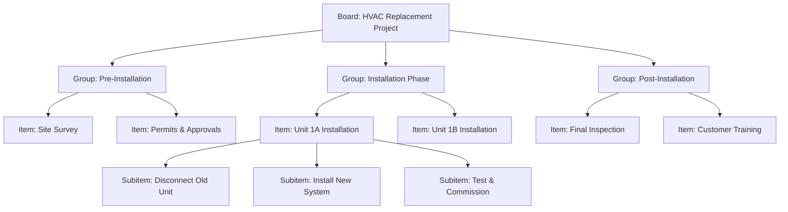
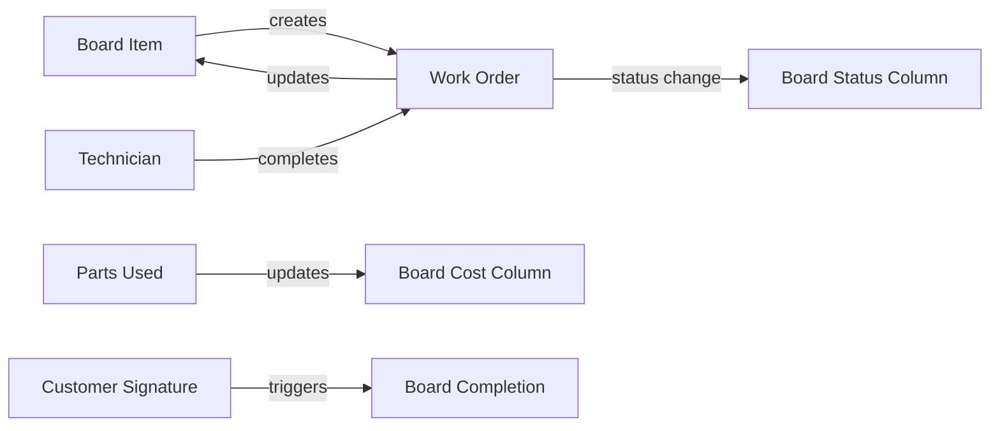

# Work Management Platform Architecture

> **ServicePRO v8.0** | Last updated: August 4, 2026


## Table of Contents

- [Overview](#overview)
- [Quick Start](#quick-start)
- [Board Architecture](#board-architecture) 
- [View Types & Capabilities](#view-types--capabilities)
- [API Reference](#api-reference)
- [Integration Patterns](#integration-patterns)
- [Best Practices](#best-practices)
- [FAQ](#faq)

## Overview

ServicePRO's work management platform provides monday.com-class configurable boards that seamlessly integrate with field service operations, enabling complex project coordination without disrupting core dispatch and work order workflows.

### Why Work Management Matters for Field Service

**For Aqua Pro Plumbing:** Manage a 6-unit apartment complex HVAC replacement project with dependencies, timeline tracking, technician coordination, and real-time progress visibility across multiple work orders.

> 💡 **Competitive Edge:** Unlike standalone project tools, ServicePRO boards integrate natively with work orders, schedules, inventory, and technician assignments, providing unified operational visibility.

---

## Quick Start

### Understanding Board Hierarchy



### Basic Setup

1. **Create project board** for complex multi-job projects
2. **Configure columns** for status, timeline, assignments
3. **Link to work orders** through association system
4. **Track progress** across multiple views (Table, Kanban, Timeline)

---

## Board Architecture

### Data Model Hierarchy

**Board → Groups → Items → Subitems + Column Values**

#### Board Configuration

| Field | Purpose | Example |
|-------|---------|---------|
| `name` | Board identifier | "HVAC Replacement Project - Wilson Apartments" |
| `description` | Project overview | "6-unit residential complex HVAC system replacement" |
| `workspace_id` | Organizational grouping | "residential_projects" |
| `owner_id` | Board manager | "alice@aquapro.com" |
| `template_id` | Source template | "multi_unit_hvac_template" |

#### Column Types & Use Cases

| Column Type | Field Service Application | Settings Example |
|-------------|--------------------------|------------------|
| **Status** | Work order progress tracking | `["Scheduled", "In Progress", "Completed", "On Hold"]` |
| **Priority** | Urgency indicators | `["Emergency", "High", "Normal", "Low"]` |
| **Person** | Technician assignments | Multi-select from technician directory |
| **Date** | Service appointments | Single date picker with time |
| **Timeline** | Project phases | Start/end date range for Gantt view |
| **Number** | Progress percentages, costs | `{"unit": "%", "format": "percentage"}` |
| **Text** | Notes, addresses | `{"max_length": 500}` |
| **Dropdown** | Equipment types, service categories | Custom option lists |
| **Formula** | Calculated fields | `SUM(labor_hours) + SUM(material_cost)` |

### Board Integration with Field Service



---

## View Types & Capabilities

### Table View (Default)
Spreadsheet-style interface showing all board data in rows and columns.

**Best For:**
- Detailed data entry and editing
- Bulk updates across multiple items
- Comprehensive project overview

**API Configuration:**
```http
POST /api/v1/boards/:boardId/views
{
  "name": "Project Overview",
  "type": "table",
  "settings": {
    "columns_visible": ["name", "status", "person", "timeline", "budget"],
    "sort_by": "timeline_start",
    "filter": { "status": { "not_in": ["completed", "cancelled"] } }
  }
}
```

### Kanban View  
Card-based interface grouped by status or priority columns.

**Best For:**
- Visual workflow management
- Quick status updates via drag-and-drop
- Team coordination and workload visibility

**Field Service Example:**
- **Scheduled:** Work orders ready for dispatch
- **In Progress:** Technicians actively working
- **Quality Check:** Awaiting inspection
- **Completed:** Jobs finished and invoiced

### Calendar View
Items plotted by date columns for schedule visualization.

**Best For:**
- Project timeline planning
- Resource scheduling conflicts
- Deadline management

### Timeline/Gantt View
Horizontal bars showing project phases and dependencies.

**Best For:**
- Complex project coordination
- Critical path identification  
- Milestone tracking

**API Configuration:**
```http
POST /api/v1/boards/:boardId/views
{
  "name": "Project Timeline",
  "type": "timeline",
  "settings": {
    "timeline_column": "project_phase",
    "group_by": "technician_team",
    "show_dependencies": true,
    "critical_path": true
  }
}
```

---

## API Reference

### Boards Management

#### Create Board
**POST** `/api/v1/boards`

**Request:**
```json
{
  "name": "HVAC Replacement Project - Wilson Apartments",
  "description": "6-unit residential complex HVAC system replacement",
  "workspace_id": "residential_projects",
  "columns": [
    {
      "name": "status",
      "type": "status", 
      "settings": {
        "labels": [
          { "value": "planned", "label": "Planned", "color": "#c4c4c4" },
          { "value": "scheduled", "label": "Scheduled", "color": "#fdbc64" },
          { "value": "in_progress", "label": "In Progress", "color": "#00c875" },
          { "value": "completed", "label": "Completed", "color": "#0086c0" }
        ]
      }
    },
    {
      "name": "technician",
      "type": "person",
      "settings": { "multiple": false }
    },
    {
      "name": "timeline", 
      "type": "timeline",
      "settings": { "date_format": "MM/DD/YYYY" }
    }
  ]
}
```

**Response (201):**
```json
{
  "data": {
    "id": "board_abc123",
    "name": "HVAC Replacement Project - Wilson Apartments",
    "description": "6-unit residential complex HVAC system replacement",
    "workspace_id": "residential_projects",
    "owner_id": "alice@aquapro.com",
    "created_at": "2026-08-04T15:30:00Z",
    "columns": [
      {
        "id": "status_col",
        "name": "status",
        "type": "status",
        "position": 0
      }
    ]
  }
}
```

#### List Board Items
**GET** `/api/v1/boards/:boardId/items`

**Query Parameters:**
- `group_id` — Filter by group
- `status` — Filter by status column value
- `assigned_to` — Filter by person column assignment
- `limit` — Result pagination (default: 50)

**Response (200):**
```json
{
  "data": [
    {
      "id": "item_456",
      "name": "Unit 1A - HVAC Installation",
      "group_id": "group_installation_phase",
      "column_values": {
        "status": "in_progress",
        "technician": "bob@aquapro.com",
        "timeline": {
          "start": "2026-08-05",
          "end": "2026-08-06"
        },
        "budget": 4500
      },
      "work_order_id": "job_789",
      "created_at": "2026-08-04T15:30:00Z"
    }
  ]
}
```

### Item Management

#### Create Board Item
**POST** `/api/v1/boards/:boardId/items`

**Request:**
```json
{
  "name": "Unit 2B - HVAC Installation", 
  "group_id": "group_installation_phase",
  "column_values": {
    "status": "scheduled",
    "technician": "charlie@aquapro.com",
    "timeline": {
      "start": "2026-08-07",
      "end": "2026-08-08"  
    },
    "priority": "normal",
    "budget": 4500
  }
}
```

#### Update Item Status
**PATCH** `/api/v1/boards/items/:itemId`

**Request:**
```json
{
  "column_values": {
    "status": "completed",
    "completion_notes": "Installation completed successfully. System tested and operational."
  }
}
```

### Views Configuration

#### Create Custom View
**POST** `/api/v1/boards/:boardId/views`

**Request:**
```json
{
  "name": "Technician Workload",
  "type": "kanban",
  "settings": {
    "group_by": "technician",
    "filter": {
      "status": { "in": ["scheduled", "in_progress"] }
    },
    "sort_by": "timeline_start"
  }
}
```

---

## Integration Patterns

### Board Item ↔ Work Order Synchronization

**Automatic Work Order Creation:**
```javascript
async function createWorkOrderFromBoardItem(itemId) {
  const item = await boardsService.getItem(itemId);
  
  // Create work order with board item context
  const workOrder = await jobsRepository.create({
    title: item.name,
    customer_id: item.column_values.customer,
    scheduled_date: item.column_values.timeline.start,
    technician_id: item.column_values.technician,
    priority: item.column_values.priority,
    board_item_id: itemId
  });
  
  // Link via association system
  await associationsService.create({
    source_type: 'board_item',
    source_id: itemId,
    target_type: 'job', 
    target_id: workOrder.id,
    association_type: 'creates'
  });
  
  // Update board item with work order reference
  await boardsService.updateItem(itemId, {
    column_values: {
      work_order_id: workOrder.id,
      status: 'work_order_created'
    }
  });
  
  return workOrder;
}
```

**Status Synchronization:**
```javascript
// When work order status changes, update board item
async function syncWorkOrderStatusToBoard(workOrderId, newStatus) {
  const associations = await associationsService.findByEntity('job', workOrderId);
  const boardAssoc = associations.find(a => a.source_type === 'board_item');
  
  if (boardAssoc) {
    const statusMapping = {
      'scheduled': 'scheduled',
      'in_progress': 'in_progress', 
      'completed': 'completed',
      'cancelled': 'cancelled'
    };
    
    await boardsService.updateItem(boardAssoc.source_id, {
      column_values: {
        status: statusMapping[newStatus] || 'in_progress'
      }
    });
  }
}
```

### Template System Integration

**Project Template Application:**
```javascript
async function createBoardFromTemplate(templateId, projectData) {
  const template = await templatesRepository.findById(templateId);
  
  // Create board with template structure
  const board = await boardsService.create({
    name: projectData.name,
    description: projectData.description,
    columns: template.columns,
    groups: template.groups.map(group => ({
      ...group,
      items: group.items.map(item => ({
        ...item,
        // Apply project-specific data
        column_values: {
          ...item.column_values,
          customer: projectData.customer_id,
          timeline: adjustTimelineForProject(item.column_values.timeline, projectData.start_date)
        }
      }))
    }))
  });
  
  return board;
}
```

---

## Best Practices

### Board Design Principles

- **Keep columns focused** — Limit to 8-10 columns for readability
- **Use semantic column names** — "Installation Phase" not "Column 1"
- **Standardize status labels** — Consistent across all project boards
- **Group logically** — Organize items by phase, location, or team

### Field Service Integration

- **Link every board item to work orders** — Maintain operational connection
- **Sync status bidirectionally** — Board and work order status stay aligned
- **Use person columns for technician assignment** — Leverage existing user directory
- **Track actual vs planned timeline** — Capture real completion dates

### Performance Optimization

- **Limit board size** — Split large projects into multiple boards
- **Index frequently filtered columns** — Status, person, date columns
- **Use views for different audiences** — Technician view vs manager view
- **Cache column value aggregations** — For dashboard and reporting

### Collaboration Workflows

- **Assign board owners** — Clear responsibility for board maintenance
- **Use @mentions in updates** — Notify relevant team members
- **Standardize update cadence** — Daily status updates during active phases
- **Archive completed projects** — Keep active board list manageable

---

## FAQ

**Q: How do boards differ from existing work orders and scheduling?**
A: Boards are a project coordination layer above work orders. A single board item might create multiple work orders (prep, install, inspect). Work orders remain the core field service operational unit.

**Q: Can I use boards for non-project work?**
A: Yes. Boards can track recurring maintenance routes, equipment replacement schedules, or administrative task workflows. The flexible column system adapts to various use cases.

**Q: What happens to board data when work orders are completed?**
A: Board items remain as project history. Completed items can be archived or moved to a "Completed" group. This preserves the full project timeline for future reference.

**Q: Can customers see board information?**
A: Not directly. Board data is internal project management. However, customer-facing project updates can be generated from board status and shared via the customer portal.

**Q: How do I handle dependencies between board items?**
A: Use the timeline view with dependency settings enabled. You can also create custom formula columns that reference other items' dates or status values.

**Q: Can board templates be shared across tenants?**
A: No. Templates are tenant-specific for data isolation. However, standard templates can be deployed to new tenants during onboarding.

---

## Related Documentation

- [Unified Customer Record Architecture](./UNIFIED_CUSTOMER_OPERATIONAL_RECORD.md)
- [Work Order Management Guide](../user-guides/WORK_ORDER_GUIDE.md)
- [Boards & Work Management User Guide](../user-guides/BOARDS_WORK_MANAGEMENT_GUIDE.md)
- [Project Templates Library](../templates/PROJECT_TEMPLATES.md)
