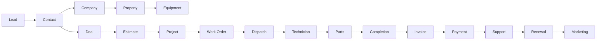
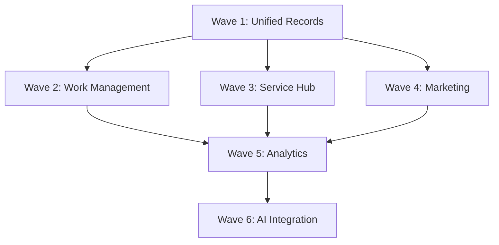

# ServicePRO Supercharge Development Roadmap

> **ServicePRO v8.0** | Last updated: August 4, 2026


## Table of Contents

- [Vision](#vision)  
- [Quick Start](#quick-start)
- [Wave-by-Wave Roadmap](#wave-by-wave-roadmap)
- [Implementation Principles](#implementation-principles)
- [Success Metrics](#success-metrics)
- [FAQ](#faq)

## Vision

Transform ServicePRO from a field-service-first platform into a **unified enterprise operations platform** that combines the best of HubSpot (CRM/Marketing/Service/Commerce) and monday.com (Work Management/Workflows/Dashboards) while maintaining ServicePRO's unmatched field-service depth.

### The Unified Operational Flow

**Target:** One operational record connecting every customer touchpoint:



> 💡 **Business Value:** Every interaction from initial marketing touch to renewal upsell is connected, providing complete customer intelligence and operational visibility.

---

## Quick Start

### Understanding the Roadmap

1. **Review your current position** — ServicePRO excels at field service (Waves 1-2 build on this strength)
2. **Focus on revenue operations** — Wave 1 provides immediate sales pipeline visibility  
3. **Plan for integration** — Each wave builds on previous foundations

### Implementation Philosophy

- **Vertical slices** — Complete features from backend to frontend
- **Progressive enhancement** — New capabilities don't break existing workflows
- **Tenant isolation** — Every feature is multi-tenant from day one

---

## Wave-by-Wave Roadmap

### Wave 1: Unified Record & Revenue Operations 🚀 Current Focus

**Goal:** Create the foundation for complete customer-to-revenue tracking.

> 📋 **Aqua Pro Example:** Track Jennifer Martinez from website inquiry → contact record → $12,500 HVAC deal → estimate → work order completion → invoice payment → maintenance contract renewal.

#### 1.1 Unified Record Associations
**What:** Universal linking system connecting any two records  
**Why:** Foundation for cross-entity reporting and workflows  
**Technical:** `record_associations` table with tenant scoping

**API Endpoints:**
```http
GET /api/v1/associations?entity_type=deal&entity_id=xxx
POST /api/v1/associations
DELETE /api/v1/associations/:id
```

#### 1.2 Deals & Opportunities  
**What:** Revenue pipeline with stages, amounts, and forecasting  
**Why:** Bridge between leads (marketing) and estimates (operations)  
**Business Value:** Accurate revenue forecasting and sales performance tracking

**Example Deal Workflow:**
1. **New** (10%) — Initial inquiry
2. **Qualified** (25%) — Budget and need confirmed  
3. **Proposal** (50%) — Estimate sent
4. **Negotiation** (75%) — Contract discussion
5. **Closed Won** (100%) — Contract signed → Work order created

#### 1.3 Unified Activity Timeline
**What:** Cross-entity activity feed showing all interactions  
**Why:** Complete customer interaction history in one view  
**Includes:** Notes, calls, emails, estimates, work orders, payments

#### 1.4 Lead Management Enhancement
**What:** Automated lead assignment and conversion workflows  
**Why:** Scale sales operations beyond manual assignment  
**Features:** Round-robin assignment, territory-based routing, lead scoring foundations

#### 1.5 Configurable CRM Properties  
**What:** Custom fields per object type with validation  
**Why:** Adapt to unique business requirements  
**Types:** Text, number, date, select, currency, user, formula

**Wave 1 Success Metrics:**
- 90%+ deal forecast accuracy
- 50%+ reduction in manual data entry
- Complete customer interaction visibility

---

### Wave 2: Work Management Platform

**Goal:** Add monday.com-class configurable project tracking for complex, multi-job projects.

> 📋 **Aqua Pro Example:** Manage a 6-unit apartment complex HVAC replacement project with dependencies, timeline tracking, and technician coordination across multiple work orders.

#### 2.1 Configurable Boards
**What:** Flexible project/task boards with customizable columns  
**Why:** Handle complex projects that span multiple work orders  
**Views:** Table, Kanban, Calendar, Timeline (same data, different presentations)

**Board Column Types:**
- **Status** — Color-coded progress indicators
- **Priority** — High/Medium/Low with visual indicators  
- **Person** — Technician/team assignment
- **Date** — Due dates and milestones
- **Timeline** — Start/end date ranges for Gantt view
- **Number** — Progress percentages, quantities, costs

#### 2.2 Project Management
**What:** Project entity linking boards to work orders and teams  
**Why:** Coordinate multi-job projects with dependencies  
**Features:** Milestones, progress tracking, resource allocation

#### 2.3 Board Templates
**What:** Pre-configured boards for common workflows  
**Why:** Accelerate project setup with proven templates  
**Examples:** "HVAC Installation Project", "Maintenance Route Setup", "Emergency Response Workflow"

**Wave 2 Success Metrics:**
- 50%+ multi-job projects use board management
- 25%+ improvement in project completion time
- 90%+ technician adoption for complex jobs

---

### Wave 3: Customer Service Hub  

**Goal:** Formalize support operations with seamless escalation to field service.

> 📋 **Aqua Pro Example:** Customer calls about water heater noise → Support ticket created → Diagnostic questions → Schedule field visit → Work order → Resolution → Follow-up satisfaction survey.

#### 3.1 Ticketing System
**What:** Formal support issue tracking with SLA management  
**Why:** Professional customer service with accountability  
**Integration:** Seamless ticket → work order escalation

**Ticket Lifecycle:**
1. **New** — Customer submission (portal, email, phone)
2. **In Progress** — Agent assigned and working  
3. **Waiting on Customer** — Pending customer response
4. **Resolved** — Solution provided (work completed)
5. **Closed** — Customer confirmed satisfaction

#### 3.2 SLA Enforcement  
**What:** Response and resolution time targets with breach alerts  
**Why:** Consistent service quality and customer expectations  
**Features:** Business hours awareness, priority-based targets

#### 3.3 Customer Portal Enhancement
**What:** Self-service ticket submission and tracking  
**Why:** Reduce support volume and improve customer experience  
**Features:** Ticket history, status updates, knowledge base search

**Wave 3 Success Metrics:**
- 80%+ support issues link to customer records
- 40%+ first-contact resolution rate
- 95%+ SLA compliance

---

### Wave 4: Marketing & Growth Engine

**Goal:** Add HubSpot-class lead capture and nurturing capabilities.

#### 4.1 Audience Segmentation
**What:** Dynamic customer lists based on service history and behavior  
**Why:** Targeted marketing drives higher conversion rates  
**Segments:** Equipment age, service frequency, geographic regions

#### 4.2 Lead Capture & Attribution  
**What:** Forms, landing pages, and source tracking  
**Why:** Measure marketing ROI and optimize spend  
**Flow:** Form submission → Lead → Contact → Deal → Revenue attribution

#### 4.3 Campaign Management
**What:** Multi-channel campaign execution with automation  
**Why:** Scale marketing without proportional staff increase  
**Channels:** Email, SMS, direct mail, digital advertising

**Wave 4 Success Metrics:**
- 25%+ leads originate from marketing campaigns
- 15%+ improvement in lead-to-customer conversion
- Accurate ROI attribution per marketing channel

---

### Wave 5: Analytics & Business Intelligence

**Goal:** Executive dashboards with cross-module insights and configurable KPI tracking.

#### 5.1 Configurable Dashboards
**What:** Drag-and-drop dashboard builder with widget library  
**Why:** Executive visibility into key business metrics  
**Widgets:** KPI cards, charts, funnels, pipeline views, data tables

#### 5.2 Revenue Analytics
**What:** Advanced forecasting and revenue performance analysis  
**Why:** Predictable revenue growth and sales optimization  
**Reports:** Pipeline forecasting, conversion rates, technician revenue performance

#### 5.3 Operational KPIs  
**What:** Field service performance and efficiency metrics  
**Why:** Optimize operations and improve customer satisfaction  
**Metrics:** First-time fix rate, technician utilization, SLA compliance, customer health

**Wave 5 Success Metrics:**
- Executive dashboards actively used for decision-making
- 30%+ improvement in forecast accuracy  
- Real-time operational KPI visibility

---

### Wave 6: AI Integration & Intelligence

**Goal:** AI-powered insights and automation across all platform modules.

#### 6.1 Sales AI
**What:** Deal risk scoring and next-best-action recommendations  
**Why:** Increase deal close rates and sales efficiency  
**Features:** Risk predictions, meeting preparation, opportunity prioritization

#### 6.2 Service AI  
**What:** Intelligent ticket routing and solution recommendations  
**Why:** Faster resolution and consistent service quality  
**Features:** Auto-classification, knowledge suggestions, sentiment analysis

#### 6.3 Operations AI
**What:** Schedule optimization and predictive maintenance insights  
**Why:** Maximize technician productivity and prevent equipment failures  
**Features:** Route optimization, failure predictions, capacity planning

**Wave 6 Success Metrics:**
- 10%+ efficiency improvement from AI recommendations
- 20%+ faster support resolution with AI routing
- Predictive maintenance reduces emergency calls by 30%

---

## Implementation Principles

### Technical Excellence

1. **Vertical slices** — Each feature ships with backend, frontend, migration, tests, and documentation
2. **Reuse existing infrastructure** — Build on current auth, tenancy, audit, notification systems  
3. **Progressive enhancement** — New features integrate without breaking existing workflows
4. **Tenant isolation first** — Every new table/query scoped by tenant_id from day one
5. **Permission gated** — New routes require explicit permission checks before access
6. **Comprehensive testing** — Unit + integration tests for every new module

### Business Principles

- **Customer value first** — Each wave must provide measurable business value
- **Field service excellence preserved** — Never compromise core strength for CRM parity
- **Incremental rollout** — Features can be enabled per tenant as they're ready
- **Training included** — Documentation, videos, and onboarding flows for each wave

### Data Principles

- **Single source of truth** — Unified records eliminate data duplication
- **Audit everything** — Complete change history for compliance and debugging  
- **Performance by design** — Indexes and queries optimized for tenant workloads
- **Migration safety** — Schema changes are backward-compatible with rollback plans

---

## Success Metrics

### Wave 1: Revenue Operations
- **Revenue Visibility:** 90%+ of deals have accurate forecast data
- **Process Efficiency:** 50%+ reduction in manual data entry between sales and operations
- **Sales Performance:** 25%+ improvement in deal close rates through better pipeline management

### Wave 2: Work Management  
- **Project Adoption:** 50%+ of multi-job projects use board management
- **Efficiency Gains:** 25%+ improvement in project completion times
- **Team Collaboration:** 90%+ technician adoption for complex job coordination

### Wave 3: Service Hub
- **Service Quality:** 95%+ SLA compliance across all priority levels  
- **Resolution Efficiency:** 40%+ first-contact resolution rate
- **Customer Satisfaction:** 85%+ satisfaction scores on resolved tickets

### Wave 4: Marketing Engine
- **Lead Generation:** 25%+ of new leads originate from marketing campaigns
- **Conversion Optimization:** 15%+ improvement in lead-to-customer conversion rates
- **ROI Transparency:** Accurate attribution and ROI tracking for all marketing spend

### Wave 5: Analytics & BI
- **Executive Adoption:** Daily dashboard usage by leadership team
- **Forecast Accuracy:** 30%+ improvement in revenue forecast precision
- **Operational Insight:** Real-time KPI monitoring drives operational decisions

### Wave 6: AI Intelligence
- **Productivity Gains:** 10%+ efficiency improvement from AI recommendations  
- **Service Speed:** 20%+ faster support resolution with AI-powered routing
- **Preventive Value:** 30%+ reduction in emergency service calls through predictive maintenance

---

## Timeline Estimates

| Wave | Scope | Est. Effort | Start After | Success Criteria |
|------|-------|-------------|-------------|------------------|
| **Wave 1** | Unified Records + Revenue Ops | 8-12 weeks | Current | 90%+ deal forecast accuracy |
| **Wave 2** | Work Management | 6-8 weeks | Wave 1 validated | 50%+ projects using boards |  
| **Wave 3** | Customer Service | 6-8 weeks | Wave 2 validated | 95%+ SLA compliance |
| **Wave 4** | Marketing & Growth | 4-6 weeks | Wave 3 validated | 25%+ marketing-sourced leads |
| **Wave 5** | Analytics & Dashboards | 4-6 weeks | Wave 4 validated | Executive dashboard adoption |
| **Wave 6** | AI Integration | 6-8 weeks | Core data reliable | 10%+ AI-driven efficiency gains |

### Dependencies



> ⚠️ **Critical Path:** Wave 1 (Unified Records) is prerequisite for all subsequent waves. The association system and activity timeline are foundational to cross-module functionality.

---

## FAQ

**Q: Will these enhancements impact existing field service operations?**
A: No. All enhancements are additive. Existing dispatch, scheduling, work orders, and mobile operations continue unchanged. The new features provide additional visibility and coordination capabilities.

**Q: How does this compare to buying separate CRM and project management tools?**  
A: ServicePRO provides native integration between CRM, project management, and field operations. Separate tools require constant data sync, duplicate entry, and integration maintenance. Native integration eliminates these issues.

**Q: What's the learning curve for existing users?**
A: Minimal. Existing workflows remain the same. New capabilities are opt-in and provide additional value without changing core processes. Training materials guide users through new features as they're ready to adopt them.

**Q: Can waves be implemented out of order?**
A: No. Each wave builds on foundations from previous waves. Wave 1 (Unified Records) is essential for all subsequent functionality. The dependency graph shows the required sequence.

**Q: How will this affect system performance?**
A: Performance is designed-in from the start. New tables include proper indexing, tenant isolation, and query optimization. Each wave includes load testing to ensure performance standards are maintained.

**Q: What happens if a wave doesn't meet success criteria?**
A: Implementation pauses to address issues before proceeding. Success criteria are designed to ensure each wave provides real business value before building additional complexity.

---

## Related Documentation

- [Competitive Feature Analysis](./SERVICEPRO_COMPETITIVE_FEATURE_GAP_MATRIX.md)
- [Unified Customer Record Architecture](../architecture/UNIFIED_CUSTOMER_OPERATIONAL_RECORD.md)
- [CRM & Revenue Operations Guide](../user-guides/CRM_REVENUE_OPERATIONS_GUIDE.md)
- [Work Management Platform Guide](../user-guides/WORK_MANAGEMENT_GUIDE.md)
