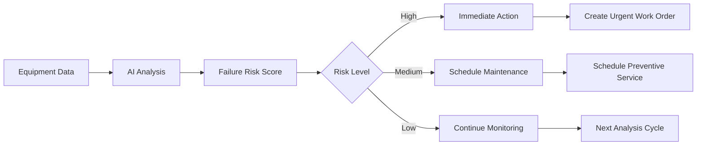

# AI Insights — User Guide

> **ServicePRO v8.0** | Last updated: August 4, 2026


## Table of Contents

- [Overview](#overview)
- [Quick Start](#quick-start)
- [Key AI Capabilities](#key-ai-capabilities)
- [Step-by-Step Walkthrough](#step-by-step-walkthrough)
- [Configuration](#configuration)
- [API Reference](#api-reference)
- [Best Practices](#best-practices)
- [Troubleshooting](#troubleshooting)
- [FAQ](#faq)

## Overview

ServicePRO's AI insights engine provides intelligent recommendations and predictions across field service operations, revenue management, and customer service, helping Aqua Pro Plumbing make data-driven decisions that improve efficiency and profitability.

**AI-Powered Field Service:** Predict equipment failures before they happen, optimize technician routes in real-time, automatically classify support tickets, and identify revenue opportunities from service patterns.

> 💡 **Competitive Advantage:** ServicePRO's AI has deep field service domain knowledge built from thousands of HVAC, plumbing, and electrical service patterns—insights impossible with generic AI tools.

---

## Quick Start

### Accessing AI Insights

1. **Navigate to AI → Insights Dashboard** in ServicePRO
2. **Select insight category** (Operations, Revenue, Customer Service)  
3. **Review recommendations** and take suggested actions
4. **Configure alert thresholds** for proactive notifications

**Essential AI Features:**
- **Predictive Maintenance** — Equipment failure predictions
- **Route Optimization** — Real-time technician routing
- **Deal Risk Scoring** — Revenue pipeline insights
- **Ticket Classification** — Automated support routing

---

## Key AI Capabilities

### Field Service Intelligence

#### Predictive Maintenance Engine


**Risk Factors Analyzed:**
- Equipment age and usage hours
- Historical failure patterns for model/brand
- Recent service history and parts replacements
- Environmental conditions and workload
- Sensor data trends (temperature, pressure, vibration)

#### AI Dispatch Optimization

**Real-time Route Intelligence:**
- Traffic pattern analysis
- Technician skill matching
- Parts inventory at truck/warehouse
- Customer priority and service history
- Emergency call prioritization

### Revenue Intelligence

#### Deal Risk Scoring
```json
{
  "deal_risk_analysis": {
    "deal_id": "deal_hvac_martinez",
    "risk_score": 0.73,
    "risk_level": "medium_high",
    "contributing_factors": [
      {
        "factor": "stalled_in_stage",
        "impact": 0.35,
        "description": "Deal in 'Proposal' stage for 18 days"
      },
      {
        "factor": "price_sensitivity", 
        "impact": 0.22,
        "description": "Customer requested 3 additional quotes"
      },
      {
        "factor": "decision_timeline",
        "impact": 0.16,
        "description": "Customer postponed decision meeting twice"
      }
    ],
    "recommendations": [
      "Schedule follow-up call within 2 days",
      "Offer financing options to address price concerns", 
      "Provide limited-time incentive to encourage decision"
    ]
  }
}
```

#### Revenue Opportunity Detection
- Cross-sell identification from service history
- Maintenance contract opportunities
- Equipment replacement timing predictions
- Customer lifetime value optimization

### Customer Service AI

#### Intelligent Ticket Routing
```javascript
const ticketClassification = {
  "ticket_content": "Water heater making loud banging noise, started yesterday",
  "ai_analysis": {
    "category": "equipment_issue",
    "priority": "high", 
    "equipment_type": "water_heater",
    "urgency_indicators": ["noise", "recent_onset"],
    "resolution_type": "field_service_required",
    "estimated_resolution_time": "2-4 hours",
    "recommended_technician": "bob@aquapro.com",
    "suggested_parts": ["thermal_expansion_tank", "pressure_relief_valve"],
    "confidence_score": 0.89
  }
}
```

**AI Capabilities:**
- Automatic priority assignment based on issue severity
- Equipment type identification from description
- Technician skill matching for optimal assignment
- Predicted resolution time for SLA management
- Suggested troubleshooting steps for agents

---

## Step-by-Step Walkthrough

### Setting Up Predictive Maintenance

**Step 1: Enable AI for Equipment**

```http
POST /api/v1/ai/predictive-maintenance/enable
{
  "equipment_id": "equipment_hvac_martinez",
  "monitoring_level": "enhanced",
  "alert_thresholds": {
    "failure_probability": 0.7,
    "efficiency_decline": 0.15,
    "maintenance_overdue": "30_days"
  }
}
```

**Step 2: Configure Failure Prediction Model**

```http
POST /api/v1/ai/models/equipment-failure
{
  "model_name": "HVAC Failure Prediction v2.1",
  "equipment_types": ["hvac", "heat_pump", "furnace"],
  "training_data_period": "5_years",
  "update_frequency": "weekly",
  "features": [
    "age_months",
    "usage_hours", 
    "maintenance_frequency",
    "environment_conditions",
    "previous_repair_history"
  ]
}
```

**Step 3: Review AI Predictions**

```http
GET /api/v1/ai/insights/equipment-risks?customer_id=customer_martinez
```

**Response:**
```json
{
  "data": [
    {
      "equipment_id": "equipment_hvac_martinez",
      "equipment_type": "hvac",
      "failure_probability": 0.82,
      "risk_level": "high",
      "predicted_failure_timeframe": "2-4_weeks",
      "primary_risk_factors": [
        "compressor_age_10_years",
        "refrigerant_leak_history", 
        "overdue_maintenance_45_days"
      ],
      "recommended_actions": [
        {
          "action": "schedule_inspection",
          "urgency": "immediate",
          "estimated_cost": 150
        },
        {
          "action": "prepare_replacement_quote",
          "urgency": "high",
          "estimated_value": 8500
        }
      ]
    }
  ]
}
```

### Implementing Deal Risk Monitoring

**Step 1: Activate Revenue Intelligence**

```http
POST /api/v1/ai/revenue-intelligence/enable
{
  "deal_risk_scoring": true,
  "opportunity_detection": true,
  "churn_prediction": true,
  "alert_thresholds": {
    "high_risk_deals": 0.75,
    "stalled_deals_days": 14,
    "opportunity_confidence": 0.6
  }
}
```

**Step 2: Configure Risk Alerts**

```http
POST /api/v1/workflows
{
  "name": "High Risk Deal Alert",
  "trigger": {
    "type": "ai_insight_generated",
    "conditions": [
      {
        "field": "insight_type",
        "operator": "equals", 
        "value": "deal_risk_score"
      },
      {
        "field": "risk_level",
        "operator": "greater_than",
        "value": 0.75
      }
    ]
  },
  "actions": [
    {
      "type": "create_task",
      "assigned_to": "{{deal.owner}}",
      "title": "High risk deal requires attention: {{deal.name}}",
      "priority": "high",
      "due_date": "{{today + 1_day}}"
    },
    {
      "type": "send_notification",
      "to": "{{deal.owner}}",
      "template": "deal_risk_alert"
    }
  ]
}
```

### Customer Service AI Setup

**Step 1: Enable Ticket Intelligence**

```http
POST /api/v1/ai/service-intelligence/enable
{
  "auto_classification": true,
  "priority_prediction": true,
  "resolution_suggestions": true,
  "agent_assist": true
}
```

**Step 2: Train Custom Classification Model**

```http
POST /api/v1/ai/models/ticket-classification/train
{
  "model_name": "Aqua Pro Ticket Classifier",
  "training_data": {
    "historical_tickets": 5000,
    "classification_accuracy_target": 0.92,
    "categories": [
      "equipment_issue",
      "scheduling_request", 
      "billing_inquiry",
      "emergency_service",
      "maintenance_question"
    ]
  }
}
```

---

## Configuration

### AI Model Management

#### Predictive Maintenance Configuration

```http
POST /api/v1/ai/config/predictive-maintenance
{
  "global_settings": {
    "analysis_frequency": "daily",
    "prediction_horizon": "90_days",
    "minimum_data_points": 50,
    "confidence_threshold": 0.7
  },
  "equipment_specific": {
    "hvac": {
      "failure_indicators": [
        "refrigerant_pressure_anomalies",
        "compressor_current_spikes", 
        "temperature_differential_decline"
      ],
      "maintenance_triggers": [
        "efficiency_drop_15_percent",
        "error_code_frequency_increase"
      ]
    },
    "water_heater": {
      "failure_indicators": [
        "heating_element_resistance_change",
        "thermostat_cycling_frequency",
        "sediment_buildup_indicators"
      ]
    }
  }
}
```

#### Revenue Intelligence Settings

```http
POST /api/v1/ai/config/revenue-intelligence  
{
  "deal_risk_factors": {
    "stage_duration_weight": 0.3,
    "communication_frequency_weight": 0.25, 
    "price_sensitivity_weight": 0.2,
    "competitor_activity_weight": 0.15,
    "decision_maker_engagement_weight": 0.1
  },
  "opportunity_detection": {
    "cross_sell_confidence": 0.6,
    "upsell_timing_optimization": true,
    "maintenance_contract_scoring": true,
    "equipment_replacement_predictions": true
  },
  "churn_prevention": {
    "early_warning_days": 60,
    "satisfaction_score_threshold": 3.0,
    "service_frequency_decline_alert": true
  }
}
```

### Custom AI Training

#### Upload Training Data

```http
POST /api/v1/ai/training-data/upload
{
  "model_type": "equipment_failure_prediction",
  "data_source": "historical_work_orders",
  "date_range": {
    "start": "2021-01-01",
    "end": "2026-08-01"
  },
  "features": [
    "equipment_age",
    "service_history", 
    "failure_patterns",
    "environmental_data",
    "usage_metrics"
  ]
}
```

---

## API Reference

### AI Insights Dashboard
**GET** `/api/v1/ai/insights/dashboard`

**Response (200):**
```json
{
  "data": {
    "predictive_maintenance": {
      "high_risk_equipment": 8,
      "maintenance_opportunities": 23,
      "potential_revenue": 47500,
      "failure_prevention_savings": 12000
    },
    "revenue_intelligence": {
      "at_risk_deals": 5,
      "revenue_at_risk": 67500,
      "identified_opportunities": 12,
      "opportunity_value": 89000
    },
    "service_intelligence": {
      "auto_classified_tickets": 156,
      "classification_accuracy": 94.2,
      "avg_resolution_time_improvement": "18%",
      "agent_productivity_gain": "23%"
    }
  }
}
```

### Equipment Risk Assessment
**GET** `/api/v1/ai/insights/equipment-risks`

**Query Parameters:**
- `customer_id` — Filter by customer
- `equipment_type` — Filter by equipment type
- `risk_level` — Filter by risk threshold
- `prediction_horizon` — Days ahead to analyze

**Response (200):**
```json
{
  "data": [
    {
      "equipment_id": "equipment_hvac_johnson",
      "customer_name": "Johnson Residence",
      "equipment_type": "hvac",
      "model": "Carrier 58MCA",
      "failure_probability": 0.87,
      "risk_level": "critical",
      "predicted_failure_window": "7-14_days",
      "confidence_score": 0.91,
      "cost_impact": {
        "emergency_repair_estimate": 2500,
        "replacement_estimate": 8500,
        "preventive_maintenance": 350
      },
      "recommendations": [
        {
          "action": "immediate_inspection",
          "priority": "critical", 
          "estimated_cost": 150,
          "potential_savings": 2350
        }
      ]
    }
  ]
}
```

### Deal Risk Analysis
**POST** `/api/v1/ai/insights/deal-risk-analysis`

**Request:**
```json
{
  "deal_id": "deal_hvac_martinez",
  "analysis_depth": "comprehensive",
  "include_recommendations": true
}
```

**Response (200):**
```json
{
  "data": {
    "deal_id": "deal_hvac_martinez",
    "risk_score": 0.78,
    "risk_level": "high",
    "risk_factors": [
      {
        "category": "timeline",
        "factor": "extended_decision_period",
        "impact": 0.35,
        "description": "Deal stalled in proposal stage for 21 days"
      },
      {
        "category": "competition", 
        "factor": "multiple_quotes_requested",
        "impact": 0.28,
        "description": "Customer comparing with 2 other contractors"
      }
    ],
    "recommendations": [
      {
        "priority": "immediate",
        "action": "schedule_follow_up_meeting",
        "reason": "Address competitive concerns and timeline pressure"
      },
      {
        "priority": "high",
        "action": "offer_financing_options", 
        "reason": "Price sensitivity indicated by quote shopping"
      }
    ],
    "probability_of_close": 0.32,
    "suggested_actions_impact": {
      "with_recommendations": 0.58,
      "improvement": 0.26
    }
  }
}
```

---

## Best Practices

### AI Model Performance

- **Maintain data quality** — Clean, complete historical data improves predictions
- **Regular model retraining** — Update models quarterly with new service data
- **Validate predictions** — Track accuracy and adjust thresholds accordingly
- **Start conservatively** — Begin with higher confidence thresholds, lower over time

### Predictive Maintenance

- **Act on high-confidence predictions** — Don't ignore 85%+ failure probability scores
- **Balance proactive vs reactive** — Some preventive maintenance prevents expensive failures
- **Customer communication** — Explain AI recommendations to build trust
- **Track ROI** — Measure prevention savings vs prediction costs

### Revenue Intelligence

- **Use AI to prioritize** — Focus sales effort on highest-probability deals
- **Combine AI with human judgment** — AI provides data, humans make decisions
- **Monitor deal health regularly** — Weekly risk score reviews for active pipeline
- **Test recommendation effectiveness** — Track close rates when following AI suggestions

### Service Intelligence

- **Verify AI classifications** — Review auto-categorized tickets for accuracy
- **Train agents on AI suggestions** — Help team understand and use AI recommendations
- **Measure impact** — Track resolution time and customer satisfaction improvements
- **Provide feedback loops** — Correct AI mistakes to improve future performance

---

## Troubleshooting

| Problem | Solution |
|---------|----------|
| AI predictions seem inaccurate | Check training data quality, increase minimum data points, adjust confidence thresholds |
| Equipment risk scores not updating | Verify data feeds active, check analysis schedule, ensure equipment sensors reporting |
| Deal risk alerts too frequent | Raise risk score threshold, adjust stall detection timeframes |
| Ticket classification errors | Review training categories, add more historical examples, retrain model |
| Slow AI response times | Check system load, verify model optimization, consider model size reduction |

---

## FAQ

**Q: How accurate are the AI predictions?**
A: Accuracy varies by model and data quality. Equipment failure prediction: 85-92%, deal risk scoring: 78-84%, ticket classification: 92-96%. Models improve over time with more data.

**Q: Can I customize the AI models for my specific business?**
A: Yes. Models can be trained on your historical data, and thresholds can be adjusted based on your risk tolerance and business priorities.

**Q: How much historical data is needed for accurate predictions?**
A: Minimum 2 years of complete service history for reliable equipment predictions. Deal risk scoring needs 500+ historical deals. More data = better accuracy.

**Q: Will AI replace human decision-making?**
A: No. AI provides insights and recommendations, but humans make final decisions. AI augments expertise rather than replacing it.

**Q: How often are AI models updated?**
A: Models retrain automatically monthly with new data. Major model updates are released quarterly with platform updates.

**Q: What happens if AI makes wrong predictions?**
A: Track incorrect predictions to improve models. False positives (unnecessary maintenance) are better than false negatives (missed failures) for equipment.

**Q: Can AI insights be integrated with other systems?**
A: Yes, via API. Risk scores and recommendations can feed into external CRM, accounting, or business intelligence systems.

---

## Related Documentation

- [Predictive Maintenance Service Guide](./PREDICTIVE_MAINTENANCE_GUIDE.md)
- [Revenue Operations Architecture](../architecture/CRM_REVENUE_OPERATIONS.md)
- [AI Platform Architecture](../architecture/AI_PLATFORM_ARCHITECTURE.md)
- [ServicePRO API Reference](./API_REFERENCE_GUIDE.md)