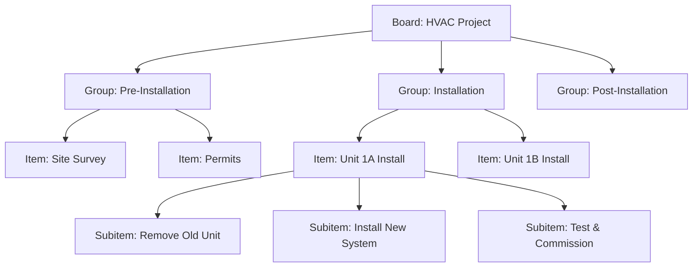

# Boards & Work Management — User Guide

> **ServicePRO v8.0** | Last updated: August 4, 2026


## Table of Contents

- [Overview](#overview)
- [Quick Start](#quick-start)
- [Key Concepts](#key-concepts)
- [Step-by-Step Walkthrough](#step-by-step-walkthrough)
- [Configuration](#configuration)
- [API Reference](#api-reference)
- [Best Practices](#best-practices)
- [Troubleshooting](#troubleshooting)
- [FAQ](#faq)

## Overview

ServicePRO's work management platform provides monday.com-class configurable boards that integrate seamlessly with field service operations, enabling complex project coordination without disrupting core dispatch and work order workflows.

**For Aqua Pro Plumbing:** Coordinate a 6-unit apartment complex HVAC replacement project with timeline dependencies, technician assignments, material coordination, and progress tracking across multiple work orders and customer interactions.

> 💡 **Integration Advantage:** Unlike standalone project management tools, ServicePRO boards connect directly to work orders, technician schedules, inventory levels, and customer communications—providing unified operational visibility impossible with external tools.

---

## Quick Start

### Creating Your First Project Board

1. **Navigate to Projects → Boards** in ServicePRO
2. **Click "Create Board"** and select a template
3. **Configure columns** for your project needs
4. **Add groups and items** to organize work phases

**Essential Board Setup:**
- **Board Name:** "HVAC Replacement - Wilson Apartments"
- **Template:** Multi-Unit Installation Project
- **Columns:** Status, Technician, Timeline, Budget, Progress
- **Groups:** Pre-Installation, Installation Phase, Post-Installation

---

## Key Concepts

### Board Hierarchy



### Column Types for Field Service

| Column Type | Purpose | Field Service Example |
|-------------|---------|----------------------|
| **Status** | Track progress through phases | Scheduled → In Progress → Completed |
| **Person** | Technician assignments | Bob Johnson, Charlie Smith |
| **Timeline** | Project scheduling | Aug 5-6 installation window |
| **Number** | Budget, progress, quantities | $4,500 unit cost, 75% complete |
| **Dropdown** | Categories, priorities | Equipment Type: HVAC, Plumbing, Electrical |
| **Formula** | Calculated values | Total Cost = Labor + Materials |

### View Types

- **Table View** — Spreadsheet interface for detailed data entry
- **Kanban View** — Visual workflow with drag-and-drop status updates
- **Calendar View** — Timeline visualization for scheduling conflicts
- **Timeline/Gantt View** — Project phases with dependencies

---

## Step-by-Step Walkthrough

### Creating a Multi-Unit Installation Board

**Step 1: Create Board from Template**

```http
POST /api/v1/boards
{
  "name": "HVAC Replacement - Wilson Apartments",
  "description": "6-unit residential complex HVAC system replacement project",
  "template_id": "multi_unit_installation",
  "workspace_id": "residential_projects",
  "columns": [
    {
      "name": "status",
      "type": "status",
      "settings": {
        "labels": [
          { "value": "planned", "label": "Planned", "color": "#c4c4c4" },
          { "value": "scheduled", "label": "Scheduled", "color": "#fdbc64" },
          { "value": "in_progress", "label": "In Progress", "color": "#00c875" },
          { "value": "completed", "label": "Completed", "color": "#0086c0" }
        ]
      }
    },
    {
      "name": "technician",
      "type": "person", 
      "settings": { "multiple": false }
    },
    {
      "name": "timeline",
      "type": "timeline",
      "settings": { "date_format": "MM/DD/YYYY" }
    },
    {
      "name": "budget",
      "type": "number",
      "settings": { "unit": "$", "format": "currency" }
    }
  ]
}
```

**Step 2: Create Project Groups**

```http
POST /api/v1/boards/board_abc123/groups
{
  "name": "Pre-Installation Phase",
  "color": "#e1f5fe"
}
```

```http
POST /api/v1/boards/board_abc123/groups
{
  "name": "Installation Phase", 
  "color": "#e8f5e8"
}
```

**Step 3: Add Installation Items**

```http
POST /api/v1/boards/board_abc123/items
{
  "name": "Unit 1A - HVAC Installation",
  "group_id": "group_installation",
  "column_values": {
    "status": "scheduled",
    "technician": "bob@aquapro.com",
    "timeline": {
      "start": "2026-08-05",
      "end": "2026-08-06"
    },
    "budget": 4500
  }
}
```

### Linking Board Items to Work Orders

**Create Work Order from Board Item:**

```http
POST /api/v1/jobs
{
  "title": "Unit 1A - HVAC Installation",
  "customer_id": "customer_wilson_apartments",
  "board_item_id": "item_unit_1a",
  "scheduled_date": "2026-08-05",
  "technician_id": "tech_bob",
  "description": "Install new HVAC system in Unit 1A as part of building-wide replacement project"
}
```

**Create Association:**

```http
POST /api/v1/associations
{
  "source_type": "board_item",
  "source_id": "item_unit_1a",
  "target_type": "job",
  "target_id": "job_unit_1a_install",
  "association_type": "creates",
  "label": "Installation Work Order"
}
```

### Managing Project Progress

**Update Item Status via Kanban Drag-Drop:**

```http
PATCH /api/v1/boards/items/item_unit_1a
{
  "column_values": {
    "status": "in_progress",
    "notes": "Technician arrived on site, beginning system removal"
  }
}
```

**Add Completion Details:**

```http
PATCH /api/v1/boards/items/item_unit_1a
{
  "column_values": {
    "status": "completed",
    "completion_date": "2026-08-06T16:30:00Z",
    "actual_cost": 4350,
    "completion_notes": "Installation completed successfully. System tested and operational. Customer signed completion form."
  }
}
```

### Creating Custom Views

**Technician Workload View:**

```http
POST /api/v1/boards/board_abc123/views
{
  "name": "Technician Workload",
  "type": "kanban", 
  "settings": {
    "group_by": "technician",
    "filter": {
      "status": { "in": ["scheduled", "in_progress"] }
    },
    "sort_by": "timeline_start"
  }
}
```

**Project Timeline View:**

```http
POST /api/v1/boards/board_abc123/views
{
  "name": "Installation Timeline",
  "type": "timeline",
  "settings": {
    "timeline_column": "timeline",
    "group_by": "project_phase",
    "show_dependencies": true,
    "show_critical_path": true
  }
}
```

---

## Configuration

### Custom Column Types

**Create Equipment Type Column:**

```http
POST /api/v1/boards/board_abc123/columns
{
  "name": "equipment_type",
  "type": "dropdown",
  "settings": {
    "options": [
      { "value": "hvac", "label": "HVAC System", "color": "#ff6b6b" },
      { "value": "water_heater", "label": "Water Heater", "color": "#4ecdc4" },
      { "value": "electrical", "label": "Electrical", "color": "#45b7d1" },
      { "value": "plumbing", "label": "Plumbing", "color": "#f7b731" }
    ]
  }
}
```

**Progress Formula Column:**

```http
POST /api/v1/boards/board_abc123/columns
{
  "name": "progress_percent",
  "type": "formula",
  "settings": {
    "formula": "IF(status='completed', 100, IF(status='in_progress', 50, 0))",
    "format": "percentage"
  }
}
```

### Board Templates

**Create Reusable Template:**

```http
POST /api/v1/boards/templates
{
  "name": "Multi-Unit HVAC Installation",
  "description": "Template for apartment/condo complex HVAC replacements",
  "category": "installation_projects",
  "board_structure": {
    "columns": [
      { "name": "status", "type": "status" },
      { "name": "technician", "type": "person" },
      { "name": "timeline", "type": "timeline" },
      { "name": "equipment_type", "type": "dropdown" },
      { "name": "budget", "type": "number" }
    ],
    "groups": [
      {
        "name": "Pre-Installation", 
        "items": [
          { "name": "Site Survey & Assessment" },
          { "name": "Permits & Approvals" },
          { "name": "Material Ordering" }
        ]
      },
      {
        "name": "Installation Phase",
        "items": [
          { "name": "Unit {{unit_number}} Installation" }
        ]
      }
    ]
  }
}
```

### Automation Integration

**Status Sync with Work Orders:**

```http
POST /api/v1/workflows
{
  "name": "Sync Board Item Status to Work Order",
  "trigger": {
    "type": "record_updated",
    "entity_type": "board_item",
    "conditions": [
      { "field": "column_values.status", "operator": "changed" }
    ]
  },
  "actions": [
    {
      "type": "update_related_record",
      "target_type": "job",
      "relationship": "created_from_board_item",
      "updates": {
        "status": "{{board_item.column_values.status_mapped}}"
      }
    }
  ]
}
```

---

## API Reference

### Create Board
**POST** `/api/v1/boards`

**Request:**
```json
{
  "name": "HVAC Replacement - Wilson Apartments",
  "description": "6-unit residential complex HVAC system replacement",
  "workspace_id": "residential_projects",
  "columns": [
    {
      "name": "status",
      "type": "status",
      "settings": {
        "labels": [
          { "value": "planned", "label": "Planned", "color": "#c4c4c4" },
          { "value": "in_progress", "label": "In Progress", "color": "#00c875" }
        ]
      }
    }
  ]
}
```

**Response (201):**
```json
{
  "data": {
    "id": "board_abc123",
    "name": "HVAC Replacement - Wilson Apartments",
    "workspace_id": "residential_projects", 
    "owner_id": "alice@aquapro.com",
    "created_at": "2026-08-04T15:30:00Z",
    "columns": [
      {
        "id": "status_col",
        "name": "status",
        "type": "status",
        "position": 0
      }
    ]
  }
}
```

### Add Board Item
**POST** `/api/v1/boards/:boardId/items`

**Request:**
```json
{
  "name": "Unit 2B - HVAC Installation",
  "group_id": "group_installation_phase", 
  "column_values": {
    "status": "scheduled",
    "technician": "charlie@aquapro.com",
    "timeline": {
      "start": "2026-08-07",
      "end": "2026-08-08"
    },
    "budget": 4500,
    "equipment_type": "hvac"
  }
}
```

### Update Item Progress
**PATCH** `/api/v1/boards/items/:itemId`

**Request:**
```json
{
  "column_values": {
    "status": "completed",
    "completion_notes": "Installation completed successfully. System tested and operational.",
    "actual_hours": 12,
    "parts_used": ["condenser_unit", "evaporator_coil", "refrigerant_lines"]
  }
}
```

### Get Board with Items
**GET** `/api/v1/boards/:id`

**Response (200):**
```json
{
  "data": {
    "id": "board_abc123",
    "name": "HVAC Replacement - Wilson Apartments",
    "groups": [
      {
        "id": "group_installation",
        "name": "Installation Phase",
        "items": [
          {
            "id": "item_unit_1a",
            "name": "Unit 1A - HVAC Installation",
            "column_values": {
              "status": "completed",
              "technician": "bob@aquapro.com",
              "timeline": { "start": "2026-08-05", "end": "2026-08-06" },
              "budget": 4500
            },
            "work_order_id": "job_unit_1a"
          }
        ]
      }
    ]
  }
}
```

---

## Best Practices

### Board Organization

- **Use semantic group names** — "Pre-Installation Phase" not "Group 1"
- **Limit board size** — Split large projects into multiple boards for performance
- **Standardize column order** — Consistent layout across project types
- **Archive completed projects** — Keep active board list manageable

### Field Service Integration

- **Link every item to work orders** — Maintain operational connection
- **Sync status bidirectionally** — Board and work order status alignment
- **Use person columns for assignments** — Leverage technician directory
- **Track actual vs planned** — Capture real completion data

### Project Workflow Design

- **Group by project phase** — Logical progression through work stages
- **Use timeline columns for scheduling** — Visual dependency management
- **Add budget tracking** — Monitor project profitability in real-time
- **Include customer communication** — Track customer approvals and changes

### Performance & Collaboration

- **Create role-specific views** — Technician view vs manager view
- **Use @mentions for notifications** — Tag team members in updates
- **Batch similar updates** — Update multiple items simultaneously
- **Monitor board performance** — Watch for slow-loading large boards

---

## Troubleshooting

| Problem | Solution |
|---------|----------|
| Board loading slowly | Reduce number of items, archive completed work, optimize column count |
| Items not syncing to work orders | Check association creation, verify automation triggers active |
| Technician assignments not showing | Verify person column configured with user directory |
| Timeline view not displaying | Ensure timeline column has valid start/end dates |
| Formula columns showing errors | Check formula syntax and referenced column names |

---

## FAQ

**Q: How do project boards differ from regular work orders?**
A: Boards provide project coordination above individual work orders. One board item might create multiple work orders (prep, install, inspect), but work orders remain the core field service unit.

**Q: Can customers see board information?**
A: Not directly. Boards are internal project management. Customer-facing updates are generated from board status and shared via customer portal or notifications.

**Q: What happens to board data when work orders complete?**
A: Board items remain as project history. Completed items can be archived but are preserved for future reference and project analysis.

**Q: Can I use boards for non-project work?**
A: Yes. Boards work for recurring maintenance routes, equipment replacement schedules, or administrative workflows. The column system adapts to various use cases.

**Q: How do I handle project dependencies?**
A: Use timeline view with dependency settings, or create formula columns that reference other items' dates. You can also use conditional formatting to highlight blocked items.

**Q: Can board templates be shared between teams?**
A: Yes, within the same tenant. Templates can be created by project managers and reused by field teams for consistent project setup.

**Q: How do I track material costs across a project?**
A: Use number columns for budget tracking, and link to inventory records through associations. Formula columns can calculate totals and variances automatically.

---

## Related Documentation

- [Work Management Platform Architecture](../architecture/WORK_MANAGEMENT_PLATFORM.md)
- [Project Templates Library](../templates/PROJECT_TEMPLATES.md)
- [Work Order Management Guide](./WORK_ORDER_GUIDE.md)
- [Technician Mobile App Guide](./TECHNICIAN_MOBILE_GUIDE.md)