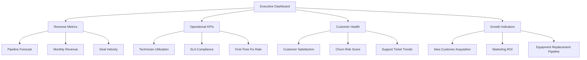

# Dashboards & Analytics — User Guide

> **ServicePRO v8.0** | Last updated: August 4, 2026


## Table of Contents

- [Overview](#overview)
- [Quick Start](#quick-start)
- [Key Dashboard Types](#key-dashboard-types)
- [Step-by-Step Walkthrough](#step-by-step-walkthrough)
- [Configuration](#configuration)
- [API Reference](#api-reference)
- [Best Practices](#best-practices)
- [Troubleshooting](#troubleshooting)
- [FAQ](#faq)

## Overview

ServicePRO's analytics platform provides executive dashboards with cross-module insights, configurable KPI tracking, and real-time operational visibility that combines field service metrics with CRM, marketing, and financial performance.

**For Aqua Pro Plumbing:** Track technician utilization, revenue pipeline health, customer satisfaction trends, equipment failure predictions, and marketing ROI—all in customizable dashboards that provide actionable insights for data-driven decisions.

> 💡 **Unified Intelligence:** Unlike standalone BI tools, ServicePRO dashboards connect field service operations with sales pipeline, customer communications, and financial performance—providing complete business visibility in one platform.

---

## Quick Start

### Creating Your First Executive Dashboard

1. **Navigate to Analytics → Dashboards** in ServicePRO
2. **Click "Create Dashboard"** and select template
3. **Add widgets** for key metrics
4. **Configure filters** and time periods
5. **Share with team** and set refresh schedules

**Essential Executive Metrics:**
- **Revenue Pipeline:** Deal forecast, close rates, sales performance
- **Operational KPIs:** Technician utilization, first-time fix rate, SLA compliance
- **Customer Health:** Satisfaction scores, churn risk, lifetime value
- **Financial Performance:** Monthly recurring revenue, profit margins

---

## Key Dashboard Types

### Executive Summary Dashboard



### Field Service Operations Dashboard

**Key Metrics:**
- **Daily/Weekly Technician Performance** — Jobs completed, revenue generated, customer ratings
- **Territory Performance** — Service density, response times, revenue per territory
- **Equipment Health Monitoring** — Failure predictions, maintenance compliance, warranty status
- **Parts & Inventory Management** — Stock levels, reorder alerts, cost tracking

### Revenue Operations Dashboard

**Sales Pipeline Visibility:**
- **Deal Flow Analysis** — Stage velocity, conversion rates, bottleneck identification
- **Revenue Forecasting** — Weighted pipeline, commit forecast, best-case scenarios
- **Sales Team Performance** — Individual and team quota attainment, activity metrics
- **Customer Lifetime Value** — Retention rates, expansion revenue, churn analysis

### Customer Success Dashboard

**Service Excellence Tracking:**
- **SLA Performance** — Response time compliance, resolution metrics, breach analysis
- **Customer Satisfaction** — Survey scores, feedback trends, improvement areas
- **Support Efficiency** — Ticket volume, agent performance, knowledge base usage
- **Proactive Service** — Preventive maintenance completion, AI-driven insights

---

## Step-by-Step Walkthrough

### Building an Executive Dashboard

**Step 1: Create Dashboard Framework**

```http
POST /api/v1/dashboards
{
  "name": "Executive Summary - Q3 2026",
  "description": "High-level business metrics for executive team",
  "layout": "executive_template",
  "refresh_frequency": "hourly",
  "permissions": {
    "viewers": ["executives", "managers"],
    "editors": ["alice@aquapro.com"]
  }
}
```

**Step 2: Add Revenue Pipeline Widget**

```http
POST /api/v1/dashboards/dash_exec_summary/widgets
{
  "type": "pipeline_forecast",
  "title": "Revenue Pipeline - Next 90 Days",
  "position": { "row": 1, "col": 1, "width": 6, "height": 4 },
  "data_source": "deals",
  "configuration": {
    "time_period": "next_90_days",
    "group_by": "close_month",
    "show_weighted": true,
    "include_pipelines": ["sales_pipeline", "maintenance_contracts"],
    "filters": {
      "status": "open",
      "probability": ">0"
    }
  }
}
```

**Step 3: Add Operational KPIs**

```http
POST /api/v1/dashboards/dash_exec_summary/widgets
{
  "type": "kpi_grid",
  "title": "Key Operational Metrics",
  "position": { "row": 1, "col": 7, "width": 6, "height": 4 },
  "configuration": {
    "metrics": [
      {
        "name": "technician_utilization",
        "label": "Technician Utilization",
        "target": 85,
        "format": "percentage",
        "trend_period": "30_days"
      },
      {
        "name": "first_time_fix_rate",
        "label": "First-Time Fix Rate", 
        "target": 90,
        "format": "percentage",
        "trend_period": "30_days"
      },
      {
        "name": "sla_compliance",
        "label": "SLA Compliance",
        "target": 95,
        "format": "percentage",
        "trend_period": "30_days"
      },
      {
        "name": "customer_satisfaction",
        "label": "Customer Satisfaction",
        "target": 4.5,
        "format": "decimal",
        "scale": 5,
        "trend_period": "30_days"
      }
    ]
  }
}
```

**Step 4: Add Revenue Trend Chart**

```http
POST /api/v1/dashboards/dash_exec_summary/widgets
{
  "type": "line_chart",
  "title": "Monthly Revenue Trend",
  "position": { "row": 5, "col": 1, "width": 12, "height": 6 },
  "data_source": "revenue_analytics",
  "configuration": {
    "time_period": "last_12_months",
    "metrics": [
      {
        "name": "total_revenue",
        "label": "Total Revenue",
        "color": "#00c875"
      },
      {
        "name": "recurring_revenue",
        "label": "Recurring Revenue", 
        "color": "#0086c0"
      },
      {
        "name": "new_customer_revenue",
        "label": "New Customer Revenue",
        "color": "#fdbc64"
      }
    ],
    "show_trend_lines": true,
    "include_projections": true
  }
}
```

### Creating Technician Performance Dashboard

**Step 1: Individual Performance Metrics**

```http
POST /api/v1/dashboards/dash_technician_performance/widgets
{
  "type": "technician_scorecard",
  "title": "Technician Performance Scorecard",
  "position": { "row": 1, "col": 1, "width": 12, "height": 8 },
  "configuration": {
    "time_period": "current_month",
    "technicians": "all_active",
    "metrics": [
      {
        "name": "jobs_completed",
        "label": "Jobs Completed",
        "format": "number"
      },
      {
        "name": "revenue_generated",
        "label": "Revenue Generated",
        "format": "currency"
      },
      {
        "name": "customer_rating",
        "label": "Avg Customer Rating",
        "format": "decimal",
        "scale": 5
      },
      {
        "name": "first_time_fix_rate",
        "label": "First-Time Fix %",
        "format": "percentage"
      },
      {
        "name": "utilization_rate", 
        "label": "Utilization %",
        "format": "percentage"
      }
    ],
    "sort_by": "revenue_generated",
    "show_rankings": true
  }
}
```

### Building Financial Performance Dashboard

**Step 1: Revenue Analysis Widget**

```http
POST /api/v1/dashboards/dash_financial/widgets
{
  "type": "revenue_breakdown",
  "title": "Revenue Analysis - Current Month",
  "configuration": {
    "breakdown_by": ["service_type", "customer_segment", "technician"],
    "show_comparisons": {
      "previous_month": true,
      "same_month_last_year": true
    },
    "include_margins": true,
    "filters": {
      "date_range": "current_month",
      "exclude_cancelled": true
    }
  }
}
```

---

## Configuration

### Custom Widget Development

#### Revenue Forecast Widget

```http
POST /api/v1/dashboards/widget-templates
{
  "name": "field_service_revenue_forecast",
  "title": "Field Service Revenue Forecast",
  "type": "custom_chart",
  "data_sources": ["deals", "jobs", "recurring_services"],
  "query": {
    "base_query": "SELECT close_month, SUM(amount * probability) as weighted_revenue FROM deals WHERE status = 'open'",
    "additional_data": [
      {
        "source": "recurring_services",
        "query": "SELECT service_month, SUM(monthly_value) as recurring_revenue FROM service_agreements WHERE status = 'active'"
      }
    ]
  },
  "visualization": {
    "chart_type": "combination",
    "primary_series": "weighted_revenue",
    "secondary_series": "recurring_revenue",
    "show_targets": true,
    "confidence_bands": true
  }
}
```

### Dashboard Automation

#### Automated Reporting

```http
POST /api/v1/dashboards/dash_exec_summary/schedules
{
  "name": "Weekly Executive Report",
  "frequency": "weekly",
  "day_of_week": "monday",
  "time": "08:00",
  "format": "pdf",
  "recipients": [
    "ceo@aquapro.com",
    "coo@aquapro.com", 
    "sales-manager@aquapro.com"
  ],
  "include_commentary": true,
  "highlight_exceptions": {
    "kpi_variance_threshold": 0.1,
    "trend_change_threshold": 0.15
  }
}
```

### Alert Configuration

```http
POST /api/v1/dashboards/alerts
{
  "name": "SLA Breach Warning",
  "trigger": {
    "metric": "sla_compliance",
    "condition": "less_than",
    "threshold": 0.9,
    "time_window": "24_hours"
  },
  "notifications": [
    {
      "type": "email",
      "recipients": ["operations@aquapro.com"],
      "template": "sla_breach_alert"
    },
    {
      "type": "dashboard_banner",
      "message": "SLA compliance below target - immediate action required"
    }
  ]
}
```

---

## API Reference

### Create Dashboard
**POST** `/api/v1/dashboards`

**Request:**
```json
{
  "name": "Operations Dashboard",
  "description": "Real-time operational metrics and KPIs",
  "layout": "grid_12_column",
  "refresh_frequency": "every_15_minutes",
  "time_zone": "America/Los_Angeles"
}
```

**Response (201):**
```json
{
  "data": {
    "id": "dash_operations",
    "name": "Operations Dashboard", 
    "created_at": "2026-08-04T15:30:00Z",
    "owner": "alice@aquapro.com",
    "url": "/dashboards/dash_operations"
  }
}
```

### Add Widget
**POST** `/api/v1/dashboards/:dashboardId/widgets`

**Request:**
```json
{
  "type": "kpi_metric",
  "title": "Customer Satisfaction Score",
  "position": { "row": 1, "col": 1, "width": 3, "height": 2 },
  "configuration": {
    "metric": "customer_satisfaction_avg",
    "time_period": "last_30_days",
    "target": 4.5,
    "format": "decimal",
    "show_trend": true,
    "comparison_period": "previous_30_days"
  }
}
```

### Get Dashboard Data
**GET** `/api/v1/dashboards/:id/data`

**Response (200):**
```json
{
  "data": {
    "dashboard_id": "dash_operations",
    "generated_at": "2026-08-04T15:30:00Z",
    "widgets": [
      {
        "widget_id": "widget_customer_satisfaction",
        "current_value": 4.7,
        "target": 4.5,
        "trend": "+0.3",
        "trend_direction": "up",
        "status": "above_target"
      }
    ],
    "summary": {
      "widgets_above_target": 8,
      "widgets_below_target": 2,
      "overall_health_score": 87
    }
  }
}
```

### Dashboard Analytics
**GET** `/api/v1/dashboards/:id/analytics`

**Response (200):**
```json
{
  "data": {
    "usage_stats": {
      "views_this_month": 847,
      "unique_viewers": 23,
      "avg_time_on_dashboard": "4m 32s",
      "most_viewed_widget": "revenue_pipeline"
    },
    "performance_stats": {
      "avg_load_time": "1.2s",
      "data_refresh_rate": "99.4%",
      "uptime": "99.8%"
    }
  }
}
```

---

## Best Practices

### Dashboard Design Principles

- **Start with business objectives** — What decisions need this data?
- **Follow the 5-second rule** — Key insights visible in 5 seconds
- **Use visual hierarchy** — Most important metrics get prominent placement
- **Limit cognitive load** — 5-7 widgets maximum per view

### Performance Optimization

- **Cache expensive queries** — Pre-calculate complex metrics
- **Use appropriate refresh rates** — Real-time for operations, hourly for trends
- **Optimize widget count** — Too many widgets slow dashboard loading
- **Pre-aggregate data** — Store rolled-up metrics for faster display

### Data Accuracy & Quality

- **Validate data sources** — Ensure underlying data is clean and complete
- **Document metric calculations** — Clear definitions prevent misinterpretation  
- **Monitor data freshness** — Alert when data isn't updating as expected
- **Cross-reference metrics** — Validate numbers across different reports

### User Experience

- **Design for mobile** — Executives often view dashboards on mobile devices
- **Use consistent colors** — Green for positive, red for negative trends
- **Provide drill-down capability** — Let users explore underlying data
- **Include explanatory text** — Help users understand what metrics mean

---

## Troubleshooting

| Problem | Solution |
|---------|----------|
| Dashboard loading slowly | Reduce widget count, optimize queries, increase cache duration |
| Metrics showing incorrect values | Verify data source connections, check metric calculations |
| Widgets not refreshing | Check data source health, verify refresh schedules |
| Mobile display issues | Adjust widget sizes, simplify layouts for mobile |
| Export/PDF generation failing | Check server resources, reduce dashboard complexity |

---

## FAQ

**Q: How often should dashboards refresh?**
A: Depends on use case. Operations dashboards: every 15 minutes, Executive summaries: hourly, Trend analysis: daily. Real-time updates consume more resources.

**Q: Can I share dashboards with customers?**
A: Yes, create customer-specific dashboards with filtered data showing only their service history, equipment status, and project progress.

**Q: What's the maximum number of widgets per dashboard?**
A: No hard limit, but performance degrades with 20+ widgets. Consider multiple focused dashboards instead of one comprehensive view.

**Q: Can dashboards send automated reports?**
A: Yes, schedule PDF/email reports daily, weekly, or monthly. Include commentary and exception highlighting for executive distribution.

**Q: How do I ensure data accuracy across widgets?**
A: Use consistent data sources and calculation methods. Document metric definitions and validate totals across related widgets.

**Q: Can I embed dashboards in other applications?**
A: Yes, use iframe embedding or API integration to display dashboard widgets in external systems like intranets or customer portals.

**Q: What happens if a data source goes offline?**
A: Widgets display cached data with timestamps and error indicators. Set up monitoring alerts for data source health issues.

---

## Related Documentation

- [Field Service Analytics Guide](./FIELD_SERVICE_ANALYTICS_GUIDE.md)
- [Revenue Reporting & Forecasting](./REVENUE_REPORTING_GUIDE.md)
- [KPI Management Best Practices](../best-practices/KPI_MANAGEMENT.md)
- [Dashboard Template Library](../templates/DASHBOARD_TEMPLATES.md)