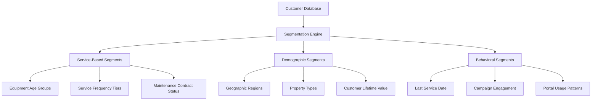

# Marketing Segments & Forms — User Guide

> **ServicePRO v8.0** | Last updated: August 4, 2026


## Table of Contents

- [Overview](#overview)
- [Quick Start](#quick-start)
- [Key Concepts](#key-concepts)
- [Step-by-Step Walkthrough](#step-by-step-walkthrough)
- [Configuration](#configuration)
- [API Reference](#api-reference)
- [Best Practices](#best-practices)
- [Troubleshooting](#troubleshooting)
- [FAQ](#faq)

## Overview

ServicePRO's marketing platform provides HubSpot-class lead capture and customer segmentation, integrated with field service data to create targeted campaigns based on equipment age, service history, and customer behavior.

**For Aqua Pro Plumbing:** Create targeted campaigns for customers with 8+ year old HVAC systems, capture leads through website forms, and automatically nurture prospects through email sequences until they're ready for sales contact.

> 💡 **Field Service Advantage:** Unlike generic marketing tools, ServicePRO segments customers by equipment age, service frequency, and technician recommendations—enabling highly targeted maintenance and replacement campaigns.

---

## Quick Start

### Creating Your First Segment

1. **Navigate to Marketing → Segments** in ServicePRO
2. **Click "Create Segment"** and select criteria
3. **Define target audience** based on service data
4. **Launch marketing campaign** to segment

**Essential Segment Example:**
- **Segment Name:** "HVAC Replacement Prospects"
- **Criteria:** Equipment age > 8 years, no service in 18 months
- **Size:** 247 customers
- **Campaign:** Equipment replacement promotions

---

## Key Concepts

### Customer Segmentation



### Segment Types for Field Service

| Segment Type | Use Case | Example Criteria |
|--------------|----------|------------------|
| **Equipment Age** | Replacement campaigns | HVAC systems 10+ years old |
| **Service Frequency** | Maintenance contracts | Customers with 3+ calls/year |
| **Geographic** | Local promotions | Customers within 15 miles |
| **Seasonal** | Preventive campaigns | AC tune-ups before summer |
| **Value-Based** | Premium offerings | Customers with $5K+ annual spend |
| **Engagement** | Re-activation campaigns | No service in 2+ years |

### Lead Capture Forms

#### Form Types & Applications

| Form Type | Purpose | Placement |
|-----------|---------|-----------|
| **Contact Form** | General inquiries | Website contact page |
| **Service Request** | Immediate service needs | Emergency service page |
| **Quote Request** | Installation estimates | Equipment replacement pages |
| **Newsletter Signup** | Content marketing | Blog posts, resource pages |
| **Maintenance Reminder** | Seasonal campaigns | Email campaigns, portal |

---

## Step-by-Step Walkthrough

### Creating Customer Segments

**Step 1: Define Equipment-Based Segment**

```http
POST /api/v1/marketing/segments
{
  "name": "HVAC Replacement Prospects",
  "description": "Customers with aging HVAC systems needing replacement",
  "criteria": {
    "conditions": [
      {
        "entity": "equipment",
        "field": "type",
        "operator": "equals",
        "value": "hvac"
      },
      {
        "entity": "equipment", 
        "field": "install_date",
        "operator": "older_than",
        "value": "8_years"
      },
      {
        "entity": "customer",
        "field": "last_service_date",
        "operator": "older_than", 
        "value": "12_months"
      },
      {
        "entity": "customer",
        "field": "property_type",
        "operator": "equals",
        "value": "residential"
      }
    ],
    "operator": "AND"
  },
  "refresh_frequency": "weekly"
}
```

**Step 2: Service History-Based Segment**

```http
POST /api/v1/marketing/segments
{
  "name": "High-Value Maintenance Customers",
  "description": "Customers who schedule regular maintenance and have premium equipment",
  "criteria": {
    "conditions": [
      {
        "entity": "customer",
        "field": "annual_service_spend",
        "operator": "greater_than",
        "value": 2500
      },
      {
        "entity": "service_history",
        "field": "maintenance_frequency",
        "operator": "greater_than_equal",
        "value": 2
      },
      {
        "entity": "customer",
        "field": "service_contract_status",
        "operator": "equals",
        "value": "active"
      }
    ]
  }
}
```

**Step 3: Geographic & Seasonal Segment**

```http
POST /api/v1/marketing/segments  
{
  "name": "Summer AC Prep - North County",
  "description": "North county customers needing AC maintenance before summer",
  "criteria": {
    "conditions": [
      {
        "entity": "customer",
        "field": "service_area",
        "operator": "equals",
        "value": "north_county"
      },
      {
        "entity": "equipment",
        "field": "type",
        "operator": "in",
        "value": ["hvac", "ac_unit"]
      },
      {
        "entity": "equipment",
        "field": "last_maintenance_date", 
        "operator": "older_than",
        "value": "10_months"
      }
    ]
  },
  "active_period": {
    "start": "03-01",
    "end": "05-31"
  }
}
```

### Creating Lead Capture Forms

**Step 1: Service Request Form**

```http
POST /api/v1/marketing/forms
{
  "name": "Emergency Service Request",
  "description": "Urgent service needs form",
  "type": "service_request",
  "fields": [
    {
      "name": "customer_name",
      "label": "Full Name",
      "type": "text",
      "required": true
    },
    {
      "name": "phone",
      "label": "Phone Number", 
      "type": "phone",
      "required": true
    },
    {
      "name": "email",
      "label": "Email Address",
      "type": "email", 
      "required": false
    },
    {
      "name": "service_address",
      "label": "Service Address",
      "type": "address",
      "required": true
    },
    {
      "name": "issue_description",
      "label": "Describe the Problem",
      "type": "textarea",
      "required": true
    },
    {
      "name": "urgency_level",
      "label": "How Urgent?",
      "type": "select",
      "options": [
        { "value": "emergency", "label": "Emergency (No heat/AC, water leak)" },
        { "value": "urgent", "label": "Urgent (Equipment not working)" },
        { "value": "normal", "label": "Schedule within a few days" }
      ],
      "required": true
    }
  ],
  "submission_actions": [
    {
      "type": "create_lead",
      "source": "emergency_form"
    },
    {
      "type": "create_ticket",
      "priority_mapping": {
        "emergency": "urgent",
        "urgent": "high", 
        "normal": "medium"
      }
    },
    {
      "type": "send_notification",
      "template": "emergency_service_alert",
      "recipients": ["dispatch@aquapro.com"]
    }
  ]
}
```

**Step 2: HVAC Replacement Quote Form**

```http
POST /api/v1/marketing/forms
{
  "name": "HVAC Replacement Quote Request",
  "type": "quote_request",
  "fields": [
    {
      "name": "homeowner_name",
      "label": "Homeowner Name",
      "type": "text",
      "required": true
    },
    {
      "name": "home_address", 
      "label": "Home Address",
      "type": "address",
      "required": true
    },
    {
      "name": "current_system_age",
      "label": "Age of Current HVAC System",
      "type": "select",
      "options": [
        { "value": "0-5", "label": "0-5 years" },
        { "value": "6-10", "label": "6-10 years" },
        { "value": "11-15", "label": "11-15 years" },
        { "value": "15+", "label": "15+ years" },
        { "value": "unknown", "label": "Not sure" }
      ]
    },
    {
      "name": "home_square_footage",
      "label": "Home Size (Square Feet)",
      "type": "number"
    },
    {
      "name": "timeline",
      "label": "When do you need this installed?",
      "type": "select",
      "options": [
        { "value": "asap", "label": "As soon as possible" },
        { "value": "1_month", "label": "Within 1 month" },
        { "value": "3_months", "label": "Within 3 months" },
        { "value": "planning", "label": "Just planning ahead" }
      ]
    }
  ],
  "submission_actions": [
    {
      "type": "create_deal",
      "pipeline": "hvac_replacements",
      "stage": "qualified"
    },
    {
      "type": "assign_sales_rep",
      "assignment_type": "territory_based"
    },
    {
      "type": "send_email",
      "template": "quote_request_confirmation"
    }
  ]
}
```

### Campaign Integration

**Step 3: Segment-to-Campaign Workflow**

```http
POST /api/v1/marketing/campaigns
{
  "name": "HVAC Replacement - Spring 2026",
  "type": "email_sequence",
  "segment_id": "segment_hvac_replacement",
  "sequence": [
    {
      "delay": "0_days",
      "template": "hvac_replacement_intro",
      "subject": "Is Your HVAC System Ready for Summer?",
      "call_to_action": "Schedule Free Assessment"
    },
    {
      "delay": "3_days",
      "template": "hvac_efficiency_tips",
      "subject": "5 Signs Your HVAC System Needs Replacement",
      "call_to_action": "Get Replacement Quote"
    },
    {
      "delay": "7_days", 
      "template": "customer_testimonials",
      "subject": "See What Your Neighbors Are Saying",
      "call_to_action": "View Case Studies"
    },
    {
      "delay": "14_days",
      "template": "limited_time_offer",
      "subject": "Limited Time: $500 Off HVAC Replacement",
      "call_to_action": "Claim Your Discount"
    }
  ],
  "automation_rules": [
    {
      "trigger": "email_opened",
      "action": "increase_lead_score",
      "value": 10
    },
    {
      "trigger": "form_submitted",
      "action": "move_to_sales_qualified",
      "notify": "assigned_sales_rep"
    }
  ]
}
```

---

## Configuration

### Advanced Segmentation Rules

#### Dynamic Segment Updates

```http
POST /api/v1/marketing/segments/segment_abc123/rules
{
  "auto_add_criteria": [
    {
      "trigger": "equipment_service_completed",
      "conditions": [
        {
          "field": "service_type",
          "operator": "equals",
          "value": "installation"
        },
        {
          "field": "equipment_age_at_service", 
          "operator": "greater_than",
          "value": 0
        }
      ],
      "action": "add_to_segment",
      "segment": "new_equipment_owners"
    }
  ],
  "auto_remove_criteria": [
    {
      "trigger": "service_contract_purchased",
      "action": "remove_from_segment", 
      "segment": "maintenance_prospects"
    }
  ]
}
```

### Lead Scoring Integration

```http
POST /api/v1/marketing/lead-scoring/rules
{
  "name": "Field Service Lead Scoring",
  "rules": [
    {
      "category": "engagement",
      "points": 15,
      "trigger": "emergency_form_submitted"
    },
    {
      "category": "intent",
      "points": 25,
      "trigger": "quote_request_submitted"
    },
    {
      "category": "qualification",
      "points": 20,
      "criteria": {
        "property_type": "residential",
        "home_size": ">2000_sqft"
      }
    },
    {
      "category": "timing",
      "points": 30,
      "criteria": {
        "timeline": ["asap", "1_month"]
      }
    },
    {
      "category": "equipment_age",
      "points": 10,
      "criteria": {
        "current_system_age": "15+"
      }
    }
  ],
  "qualification_threshold": 75,
  "auto_actions": [
    {
      "threshold": 75,
      "action": "create_deal",
      "notify_sales": true
    }
  ]
}
```

---

## API Reference

### Create Customer Segment
**POST** `/api/v1/marketing/segments`

**Request:**
```json
{
  "name": "HVAC Maintenance Prospects",
  "description": "Customers with HVAC systems due for maintenance",
  "criteria": {
    "conditions": [
      {
        "entity": "equipment",
        "field": "type", 
        "operator": "equals",
        "value": "hvac"
      },
      {
        "entity": "equipment",
        "field": "last_maintenance_date",
        "operator": "older_than",
        "value": "11_months"
      }
    ],
    "operator": "AND"
  },
  "refresh_frequency": "daily"
}
```

### Get Segment Members
**GET** `/api/v1/marketing/segments/:id/members`

**Response (200):**
```json
{
  "data": [
    {
      "customer_id": "customer_martinez",
      "name": "Jennifer Martinez",
      "email": "jennifer@email.com",
      "phone": "(555) 123-4567",
      "added_to_segment": "2026-08-04T15:30:00Z",
      "qualifying_criteria": [
        "hvac_age_12_years",
        "no_maintenance_14_months"
      ],
      "equipment": [
        {
          "type": "hvac",
          "model": "Carrier 58MCA",
          "install_date": "2014-03-15",
          "last_service": "2025-06-20"
        }
      ]
    }
  ],
  "segment_stats": {
    "total_members": 247,
    "added_this_week": 12,
    "removed_this_week": 3
  }
}
```

### Create Lead Capture Form
**POST** `/api/v1/marketing/forms`

**Request:**
```json
{
  "name": "Maintenance Reminder Signup",
  "type": "newsletter_signup",
  "fields": [
    {
      "name": "email",
      "label": "Email Address",
      "type": "email",
      "required": true
    },
    {
      "name": "equipment_types",
      "label": "What equipment do you have?",
      "type": "checkbox",
      "options": [
        { "value": "hvac", "label": "Heating & Air Conditioning" },
        { "value": "water_heater", "label": "Water Heater" },
        { "value": "plumbing", "label": "Plumbing Systems" }
      ]
    }
  ],
  "submission_actions": [
    {
      "type": "add_to_segment",
      "segment": "maintenance_newsletter_subscribers"
    }
  ]
}
```

### Campaign Performance Analytics
**GET** `/api/v1/marketing/campaigns/:id/analytics`

**Response (200):**
```json
{
  "data": {
    "campaign_id": "campaign_hvac_spring",
    "segment_size": 247,
    "emails_sent": 247,
    "emails_delivered": 243,
    "emails_opened": 167,
    "clicks": 89,
    "form_submissions": 23,
    "deals_created": 8,
    "revenue_attributed": 34500,
    "performance_metrics": {
      "delivery_rate": 0.984,
      "open_rate": 0.687,
      "click_rate": 0.533,
      "conversion_rate": 0.093,
      "revenue_per_recipient": 139.68
    }
  }
}
```

---

## Best Practices

### Segmentation Strategy

- **Start with service data** — Equipment age and service history are powerful predictors
- **Combine multiple criteria** — Geography + equipment age + service frequency
- **Keep segments focused** — Specific segments perform better than broad audiences
- **Update segments regularly** — Weekly refresh for equipment-based segments

### Form Design & Optimization

- **Keep forms short** — Limit to essential fields for higher completion rates
- **Use progressive profiling** — Gather more data over multiple interactions
- **Mobile-optimize forms** — Many customers will complete on mobile devices
- **Test form placement** — A/B test form location and timing

### Campaign Integration

- **Align campaigns with seasonality** — AC maintenance before summer, heating before winter
- **Personalize messaging** — Reference specific equipment types and service history
- **Time campaigns strategically** — Send maintenance reminders 11 months after service
- **Track attribution** — Connect marketing leads to closed deals and revenue

### Lead Management

- **Score leads consistently** — Use service history and equipment data for scoring
- **Route qualified leads quickly** — Hot leads should reach sales within 1 hour
- **Nurture unqualified leads** — Not ready now doesn't mean not ready later
- **Track lead lifecycle** — Measure time from form submission to closed deal

---

## Troubleshooting

| Problem | Solution |
|---------|----------|
| Segment size not updating | Check refresh frequency settings, verify data sources active |
| Forms not capturing submissions | Verify API endpoints, check form validation rules |
| Low campaign open rates | Review subject lines, check sender reputation, verify email deliverability |
| Leads not scoring properly | Review scoring rules, check for data mapping issues |
| Segments showing wrong customers | Verify segment criteria logic, check AND/OR operators |

---

## FAQ

**Q: How often do segments update with new customers?**
A: Segments refresh based on their configured frequency (daily, weekly, or real-time). Equipment-based segments typically update daily, while behavior-based segments can update in real-time.

**Q: Can I exclude existing customers from lead capture campaigns?**
A: Yes, use exclusion criteria in segments to filter out customers with active service contracts or recent purchases.

**Q: What's the difference between segments and lists?**
A: Segments are dynamic and update automatically based on criteria. Lists are static collections that require manual management.

**Q: How do I prevent over-messaging customers?**
A: Use frequency capping rules and suppression lists. Customers can also be in multiple segments but receive communications based on priority rules.

**Q: Can forms integrate with external systems?**
A: Yes, forms can send data to external CRMs, marketing platforms, or analytics tools via webhooks and API integrations.

**Q: How do I measure marketing ROI?**
A: Track leads from segment → form submission → deal creation → closed revenue. ServicePRO provides attribution reporting from marketing touch to final payment.

**Q: Can I import customer lists from other systems?**
A: Yes, use the bulk import API to add customers to segments, or upload CSV files through the interface with field mapping.

---

## Related Documentation

- [CRM & Revenue Operations Guide](./CRM_REVENUE_OPERATIONS_GUIDE.md)
- [Customer Communications Guide](./CUSTOMER_COMMUNICATIONS_GUIDE.md)
- [Lead Management Best Practices](../best-practices/LEAD_MANAGEMENT.md)
- [Marketing Campaign Templates](../templates/MARKETING_CAMPAIGNS.md)