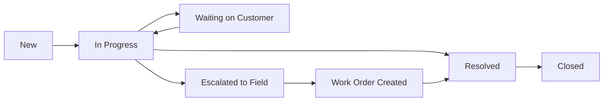

# Service Desk — User Guide

> **ServicePRO v8.0** | Last updated: August 4, 2026


## Table of Contents

- [Overview](#overview)
- [Quick Start](#quick-start)
- [Key Concepts](#key-concepts)
- [Step-by-Step Walkthrough](#step-by-step-walkthrough)
- [Configuration](#configuration)
- [API Reference](#api-reference)
- [Best Practices](#best-practices)
- [Troubleshooting](#troubleshooting)
- [FAQ](#faq)

## Overview

ServicePRO's Service Desk provides professional customer support with seamless escalation to field service operations. Track support issues from initial contact through resolution, with SLA management and customer satisfaction measurement.

**Why Service Desk Matters for Aqua Pro Plumbing:** When Jennifer Martinez calls about her water heater making noise, create a support ticket, gather diagnostic info, and either resolve by phone or seamlessly create a field service work order for on-site repair.

> 💡 **Business Value:** Consistent service quality, SLA compliance tracking, and complete customer issue resolution history.

---

## Quick Start

### Creating Your First Support Ticket

1. **Navigate to Service → Tickets** in ServicePRO
2. **Click "New Ticket"** and select the customer
3. **Enter issue details** and set priority

**Essential Ticket Information:**
- **Customer:** Jennifer Martinez (123 Main St)
- **Subject:** "Water heater making loud banging noise"
- **Priority:** High (potential safety issue)
- **Category:** Equipment Issue
- **Channel:** Phone Call

---

## Key Concepts

### Ticket Lifecycle



### Priority Levels & SLA Targets

| Priority | Description | First Response | Resolution Target |
|----------|-------------|----------------|------------------|
| **Urgent** | Safety issue, no service | 15 minutes | 4 hours |
| **High** | Major inconvenience | 1 hour | 8 hours |
| **Medium** | Moderate issue | 4 hours | 24 hours |
| **Low** | Minor question | 8 hours | 48 hours |

### Ticket Categories

- **Equipment Issue** — Problems with installed equipment
- **Service Question** — How-to questions, maintenance advice
- **Billing Inquiry** — Invoice questions, payment issues  
- **Scheduling** — Appointment changes, availability requests
- **Emergency** — Urgent safety or property damage situations

### Support Channels

- **Portal** — Customer self-service submission
- **Phone** — Direct call to support line
- **Email** — Support email forwarding
- **Chat** — Live chat integration (future)
- **Technician** — Reported during field visit

---

## Step-by-Step Walkthrough

### Creating a Support Ticket

**Step 1: Ticket Creation**

```http
POST /api/v1/tickets
{
  "subject": "Water heater making loud banging noise",
  "description": "Customer reports loud banging sounds from water heater, started 2 days ago, seems to be getting worse. Unit is 8 years old, Rheem model.",
  "priority": "high",
  "category": "equipment_issue", 
  "channel": "phone",
  "customer_id": "customer_martinez",
  "contact_id": "contact_jennifer_martinez",
  "assigned_to": "alice@aquapro.com"
}
```

**Step 2: Link to Equipment (if applicable)**

```http
POST /api/v1/associations
{
  "source_type": "ticket",
  "source_id": "ticket_123",
  "target_type": "equipment",
  "target_id": "equipment_water_heater_martinez",
  "association_type": "relates_to",
  "label": "Water Heater Issue"
}
```

**Step 3: SLA Timer Starts Automatically**

The system automatically calculates SLA breach times based on priority:
- High priority = 1 hour first response, 8 hour resolution
- Business hours: Mon-Fri 8AM-6PM
- Breach warnings sent to supervisors

### Managing Ticket Conversations

**Add Agent Response:**

```http
POST /api/v1/tickets/ticket_123/comments
{
  "content": "Hi Jennifer, thank you for calling about the water heater noise. This sounds like it could be sediment buildup or thermal expansion. For safety, I recommend scheduling a technician inspection. I can get someone out today between 2-4 PM. Would that work for you?",
  "author_type": "agent",
  "is_internal": false
}
```

This automatically records the first response time for SLA tracking.

**Add Internal Note:**

```http
POST /api/v1/tickets/ticket_123/comments
{
  "content": "Customer mentioned noise started after recent city water pressure increase in the area. Likely thermal expansion tank issue. Recommend technician check expansion tank and pressure relief valve.",
  "author_type": "agent", 
  "is_internal": true
}
```

**Customer Reply (via portal):**

```http
POST /api/v1/tickets/ticket_123/comments
{
  "content": "Yes, 2-4 PM today works perfectly. I'll be home. Thank you for the quick response!",
  "author_type": "customer",
  "is_internal": false
}
```

### Escalating to Field Service

**Create Work Order from Ticket:**

```http
POST /api/v1/jobs
{
  "title": "Water Heater Inspection — Loud Banging Noise",
  "customer_id": "customer_martinez",
  "priority": "high",
  "description": "Support ticket escalation: Customer reports loud banging from 8-year-old Rheem water heater. Suspected thermal expansion or sediment issue.",
  "ticket_id": "ticket_123",
  "scheduled_date": "2026-08-04",
  "time_window": "14:00-16:00",
  "technician_id": "tech_bob"
}
```

**Update Ticket Status:**

```http
PATCH /api/v1/tickets/ticket_123
{
  "status": "escalated",
  "work_order_id": "job_work_456",
  "notes": "Escalated to field service - Work order WO-456 scheduled for today 2-4 PM with Bob"
}
```

### Resolving Tickets

**After Work Order Completion:**

```http
PATCH /api/v1/tickets/ticket_123
{
  "status": "resolved",
  "resolution_notes": "Technician replaced faulty thermal expansion tank. Customer confirmed noise eliminated. Work order WO-456 completed, invoice INV-789 sent.",
  "root_cause": "faulty_equipment",
  "resolution_category": "field_service_repair"
}
```

**Customer Satisfaction Survey:**

```http
POST /api/v1/tickets/ticket_123/satisfaction
{
  "rating": 5,
  "feedback": "Excellent service! Quick response, professional technician, problem fixed perfectly. Thank you!",
  "would_recommend": true
}
```

---

## Configuration

### SLA Policies

**Create Custom SLA Policy:**

```http
POST /api/v1/tickets/sla-policies
{
  "name": "Premium Customer SLA",
  "description": "Enhanced response times for premium service customers",
  "priority_targets": {
    "urgent": { 
      "first_response_minutes": 10, 
      "resolution_minutes": 120 
    },
    "high": { 
      "first_response_minutes": 30, 
      "resolution_minutes": 240 
    },
    "medium": { 
      "first_response_minutes": 120, 
      "resolution_minutes": 480 
    }
  },
  "business_hours": {
    "monday": { "start": "07:00", "end": "19:00" },
    "tuesday": { "start": "07:00", "end": "19:00" },
    "wednesday": { "start": "07:00", "end": "19:00" },
    "thursday": { "start": "07:00", "end": "19:00" },
    "friday": { "start": "07:00", "end": "19:00" },
    "saturday": { "start": "08:00", "end": "17:00" },
    "sunday": null
  }
}
```

### Ticket Routing Rules

**Route by Customer Type:**

```http
POST /api/v1/tickets/routing-rules
{
  "name": "Premium Customer Routing",
  "criteria": {
    "customer_tier": "premium"
  },
  "action": {
    "assign_to": "senior_support_team",
    "priority_boost": true,
    "sla_policy": "premium_customer_sla"
  }
}
```

### Custom Ticket Fields

```http
POST /api/v1/crm/properties
{
  "object_type": "ticket",
  "name": "equipment_warranty_status",
  "label": "Equipment Warranty Status",
  "type": "select",
  "options": [
    { "value": "under_warranty", "label": "Under Warranty" },
    { "value": "expired", "label": "Warranty Expired" },
    { "value": "extended", "label": "Extended Warranty" }
  ]
}
```

---

## API Reference

### Create Ticket
**POST** `/api/v1/tickets`

**Request:**
```json
{
  "subject": "Water heater making loud banging noise",
  "description": "Customer reports loud banging sounds from water heater",
  "priority": "high",
  "category": "equipment_issue",
  "channel": "phone", 
  "customer_id": "customer_martinez"
}
```

**Response (201):**
```json
{
  "data": {
    "id": "ticket_123",
    "number": "TICK-2026-0423",
    "subject": "Water heater making loud banging noise",
    "status": "new",
    "priority": "high",
    "sla_breach_at": "2026-08-04T16:30:00Z",
    "created_at": "2026-08-04T15:30:00Z",
    "customer": {
      "name": "Jennifer Martinez",
      "email": "jennifer@email.com"
    }
  }
}
```

### List Tickets
**GET** `/api/v1/tickets`

**Query Parameters:**
- `status` — Filter by ticket status
- `priority` — Filter by priority level
- `assigned_to` — Filter by agent
- `category` — Filter by issue category
- `sla_status` — Filter by SLA compliance (on_time, at_risk, breached)

**Response (200):**
```json
{
  "data": [
    {
      "id": "ticket_123",
      "number": "TICK-2026-0423", 
      "subject": "Water heater making loud banging noise",
      "status": "in_progress",
      "priority": "high",
      "customer_name": "Jennifer Martinez",
      "assigned_to": "Alice Johnson",
      "sla_status": "on_time",
      "created_at": "2026-08-04T15:30:00Z"
    }
  ]
}
```

### Ticket Metrics
**GET** `/api/v1/tickets/metrics`

**Response (200):**
```json
{
  "data": {
    "total_tickets": 147,
    "open_tickets": 23,
    "sla_compliance": 94.2,
    "avg_first_response_time": 28,
    "avg_resolution_time": 4.3,
    "satisfaction_score": 4.7,
    "by_priority": {
      "urgent": 2,
      "high": 8, 
      "medium": 13,
      "low": 124
    },
    "by_status": {
      "new": 5,
      "in_progress": 12,
      "waiting": 6,
      "resolved": 118,
      "closed": 6
    }
  }
}
```

---

## Best Practices

### Ticket Management

- **Respond within SLA targets** — Use priority levels appropriately
- **Update customers proactively** — Don't wait for customers to ask for status
- **Document resolution steps** — Help future agents with similar issues
- **Link to related records** — Associate tickets with equipment, work orders, invoices

### Customer Communication

- **Use professional, empathetic tone** — Acknowledge customer frustration
- **Provide specific timelines** — "Technician will arrive between 2-4 PM"
- **Explain next steps clearly** — Set expectations for resolution process
- **Follow up after resolution** — Ensure customer satisfaction

### SLA Management

- **Set realistic SLA targets** — Based on actual team capacity and capabilities
- **Monitor breach warnings** — Escalate tickets approaching SLA deadlines
- **Track root causes of breaches** — Identify process improvements
- **Report SLA performance regularly** — Use data to optimize operations

### Knowledge Management

- **Create solutions for common issues** — Build searchable knowledge base
- **Update equipment troubleshooting guides** — Based on field service feedback
- **Share successful resolution patterns** — Help agents learn from each other
- **Document escalation criteria** — Clear guidelines for field service handoff

---

## Troubleshooting

| Problem | Solution |
|---------|----------|
| Ticket not showing in queue | Check assigned agent filters and status filters |
| SLA timer not starting | Verify SLA policy is assigned and business hours configured |
| Unable to escalate to work order | Check user permissions for job creation |
| Customer not receiving email updates | Verify customer email address and notification settings |
| First response time not recording | Ensure comment is marked as agent response (not internal) |

---

## FAQ

**Q: When should I create a ticket vs just taking a phone message?**
A: Create a ticket for any customer issue that requires follow-up, tracking, or potential field service. Take messages for simple appointment requests or quick informational calls.

**Q: Can customers create tickets themselves?**  
A: Yes, through the customer portal. Portal tickets automatically link to the customer record and follow the same SLA and routing rules.

**Q: What's the difference between "Resolved" and "Closed" status?**
A: "Resolved" means the issue is fixed but awaiting customer confirmation. "Closed" means the customer has confirmed satisfaction and no further action is needed.

**Q: How do I handle tickets that require multiple technician visits?**
A: Keep the original ticket open and link multiple work orders to it. Update the ticket status as each visit is completed, closing only when the customer confirms complete resolution.

**Q: Can I assign tickets to teams instead of individual agents?**
A: Yes, use team assignment with automatic distribution rules. Tickets assigned to teams can be claimed by available team members.

**Q: How do I track recurring issues with the same equipment?**
A: Use the equipment association feature to link all related tickets. This provides complete service history and helps identify chronic problems that need equipment replacement.

**Q: What happens to ticket data when a customer is deleted?**
A: Ticket records are preserved for audit purposes but customer details are anonymized. This maintains service history while complying with data privacy requirements.

---

## Related Documentation

- [Customer Portal Guide](./CUSTOMER_PORTAL_GUIDE.md)
- [Customer Service Platform Architecture](../architecture/CUSTOMER_SERVICE_PLATFORM.md)
- [Work Order Management Guide](./WORK_ORDER_GUIDE.md)
- [SLA Management Guide](./SLA_MANAGEMENT_GUIDE.md)