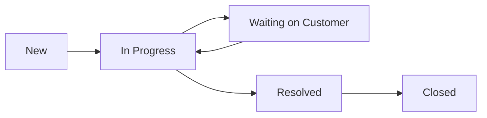

# Service Desk — User Guide

> ServicePRO v8.0 | Last updated: 2026-08-04

## Table of Contents

- [Overview](#overview)
- [Quick Start](#quick-start)
- [Key Concepts](#key-concepts)
- [Step-by-Step Walkthrough](#step-by-step-walkthrough)
  - [Creating Tickets](#creating-tickets)
  - [Working on Tickets](#working-on-tickets)
  - [Resolving and Closing](#resolving-and-closing)
- [SLA Policies](#sla-policies)
- [Ticket Pipelines](#ticket-pipelines)
- [Customer Portal Access](#customer-portal-access)
- [Internal Notes vs Public Replies](#internal-notes-vs-public-replies)
- [Linking Tickets to Work Orders](#linking-tickets-to-work-orders)
- [API Reference](#api-reference)
- [Best Practices](#best-practices)
- [Troubleshooting](#troubleshooting)
- [FAQ](#faq)

---

## Overview

ServicePRO's Service Desk is a full-featured ticketing system built for field service companies. Unlike generic help desk tools, it connects support tickets directly to equipment, properties, work orders, and technician dispatch — so a customer calling about a broken AC unit becomes a dispatched repair job in one seamless flow.

**Why this matters:**
- Customers expect fast responses — SLA policies hold your team accountable
- Every ticket has full context: which customer, which property, which equipment
- Internal notes keep team coordination private while customers see public replies
- Ticket → Work Order conversion means support issues become revenue

---

## Quick Start

1. **Create a ticket** — When a customer calls/emails with an issue, create a ticket with subject, priority, and category
2. **Respond** — Add a public reply so the customer knows you're on it (this records your first response time for SLA)
3. **Resolve** — Fix the issue, set status to "Resolved", or convert to a work order if a field visit is needed

---

## Key Concepts

| Term | Definition |
|------|-----------|
| **Ticket** | A support request from a customer, tracked from creation through resolution |
| **SLA** | Service Level Agreement — defines how quickly you must respond and resolve by priority |
| **Pipeline** | A set of statuses a ticket moves through (New → In Progress → Waiting → Resolved → Closed) |
| **First Response Time** | Time between ticket creation and the first agent reply — key SLA metric |
| **Internal Note** | A comment visible only to agents, never shown to the customer in the portal |
| **Channel** | How the ticket was submitted: portal, email, phone, chat, form, or API |

---

## Step-by-Step Walkthrough

### Creating Tickets

> 📋 **Example:** A homeowner calls Aqua Pro Plumbing because their tankless water heater is showing an error code. The receptionist creates a ticket.

```json
POST /api/v1/tickets

{
  "subject": "Tankless water heater error code E3",
  "description": "Customer reports Rinnai RU199 displaying E3 error. No hot water. Unit is 2 years old, under warranty.",
  "priority": "high",
  "category": "plumbing",
  "channel": "phone",
  "customer_id": "cust_johnson_residence",
  "equipment_id": "equip_rinnai_ru199_001"
}
```

**Response (201):**
```json
{
  "data": {
    "id": "ticket_abc123",
    "ticketNumber": 1042,
    "subject": "Tankless water heater error code E3",
    "status": "new",
    "priority": "high",
    "channel": "phone",
    "createdAt": "2026-08-04T14:30:00Z"
  }
}
```

> 💡 **Tip:** Always set `equipment_id` when the issue is about a specific piece of equipment. This links the ticket to the equipment's full service history.

### Working on Tickets

**Assign the ticket:**
```json
PATCH /api/v1/tickets/ticket_abc123

{
  "status": "in_progress",
  "assigned_to": "tech-mike",
  "assigned_team": "plumbing-team"
}
```

**Add a public reply (records first response):**
```json
POST /api/v1/tickets/ticket_abc123/comments

{
  "content": "Hi! We've assigned this to our plumbing team. Mike will call you within the hour to schedule a visit.",
  "author_type": "agent",
  "author_id": "receptionist-sarah",
  "is_internal": false
}
```

**Add an internal note (team-only):**
```json
POST /api/v1/tickets/ticket_abc123/comments

{
  "content": "Checked warranty — this unit is covered. Need to order replacement flow sensor before dispatch.",
  "author_type": "agent",
  "author_id": "tech-mike",
  "is_internal": true
}
```

### Resolving and Closing

```json
PATCH /api/v1/tickets/ticket_abc123

{
  "status": "resolved",
  "resolution_notes": "Replaced flow sensor under warranty. Unit tested and operating normally.",
  "root_cause": "Failed flow sensor causing E3 error"
}
```

> ⚠️ **Important:** Resolving a ticket automatically records `resolvedAt` timestamp. This is used for SLA resolution-time calculations.

---

## SLA Policies

SLA policies define response and resolution time targets by priority level.

### Default SLA Targets

| Priority | First Response | Resolution |
|----------|---------------|------------|
| 🔴 Urgent | 15 minutes | 4 hours |
| 🟠 High | 1 hour | 8 hours |
| 🔵 Medium | 4 hours | 24 hours |
| ⚪ Low | 8 hours | 48 hours |

### Creating an SLA Policy

```json
POST /api/v1/tickets/sla-policies

{
  "name": "Premium Service Agreement",
  "priority_targets": {
    "urgent": { "first_response_minutes": 10, "resolution_minutes": 120 },
    "high": { "first_response_minutes": 30, "resolution_minutes": 240 },
    "medium": { "first_response_minutes": 120, "resolution_minutes": 720 },
    "low": { "first_response_minutes": 240, "resolution_minutes": 1440 }
  },
  "business_hours": {
    "monday": { "start": "07:00", "end": "18:00" },
    "tuesday": { "start": "07:00", "end": "18:00" },
    "wednesday": { "start": "07:00", "end": "18:00" },
    "thursday": { "start": "07:00", "end": "18:00" },
    "friday": { "start": "07:00", "end": "18:00" },
    "saturday": { "start": "08:00", "end": "12:00" }
  },
  "is_default": true
}
```

> 💡 **Tip:** Create multiple SLA policies — one for standard customers, one for premium service contract holders, and one for emergency-only coverage.

---

## Ticket Pipelines

Pipelines define the statuses tickets move through. Different issue types can use different pipelines.

### Default Pipeline



### Creating a Custom Pipeline

```json
POST /api/v1/tickets/pipelines

{
  "name": "Equipment Warranty Claims",
  "statuses": [
    { "id": "submitted", "name": "Submitted", "category": "open", "color": "#579bfc", "order": 0 },
    { "id": "reviewing", "name": "Under Review", "category": "open", "color": "#fdab3d", "order": 1 },
    { "id": "approved", "name": "Warranty Approved", "category": "open", "color": "#00c875", "order": 2 },
    { "id": "parts_ordered", "name": "Parts Ordered", "category": "pending", "color": "#a25ddc", "order": 3 },
    { "id": "scheduled", "name": "Repair Scheduled", "category": "open", "color": "#579bfc", "order": 4 },
    { "id": "completed", "name": "Completed", "category": "closed", "color": "#00c875", "order": 5 },
    { "id": "denied", "name": "Warranty Denied", "category": "closed", "color": "#e2445c", "order": 6 }
  ]
}
```

---

## Customer Portal Access

Customers with portal accounts can:
- **View their tickets** — `GET /portal/api/tickets`
- **Submit new tickets** — `POST /portal/api/tickets`
- **Read conversation** — `GET /portal/api/tickets/{id}/comments` (internal notes hidden)
- **Reply** — `POST /portal/api/tickets/{id}/comments`

> ⚠️ **Important:** Internal notes (where `is_internal: true`) are NEVER shown to customers in the portal. Use them freely for team coordination.

---

## Internal Notes vs Public Replies

| | Public Reply | Internal Note |
|--|---|---|
| Customer sees it | ✅ Yes | ❌ No |
| Counts as first response | ✅ Yes | ❌ No |
| Visible in portal | ✅ Yes | ❌ No |
| Use for | Customer communication | Team coordination, parts notes, scheduling |

---

## Linking Tickets to Work Orders

When a support ticket needs a field visit:

```json
PATCH /api/v1/tickets/ticket_abc123

{
  "work_order_id": "job_dispatch_456",
  "status": "in_progress"
}
```

This creates a traceable link: **Ticket → Work Order → Dispatch → Completion → Resolution**

The record association system also allows linking via:
```json
POST /api/v1/associations

{
  "source_type": "ticket",
  "source_id": "ticket_abc123",
  "target_type": "job",
  "target_id": "job_dispatch_456",
  "association_type": "related"
}
```

---

## API Reference

### Tickets

| Method | Endpoint | Description |
|--------|----------|-------------|
| GET | `/api/v1/tickets` | List tickets (filter by status, priority, assignee, customer, category, channel) |
| POST | `/api/v1/tickets` | Create ticket |
| GET | `/api/v1/tickets/{id}` | Get ticket detail |
| PATCH | `/api/v1/tickets/{id}` | Update ticket |
| DELETE | `/api/v1/tickets/{id}` | Delete ticket |
| GET | `/api/v1/tickets/metrics` | Aggregate metrics |
| GET | `/api/v1/tickets/{id}/comments` | List comments |
| POST | `/api/v1/tickets/{id}/comments` | Add comment |

### Configuration

| Method | Endpoint | Description |
|--------|----------|-------------|
| GET | `/api/v1/tickets/pipelines` | List pipelines |
| POST | `/api/v1/tickets/pipelines` | Create pipeline |
| GET | `/api/v1/tickets/sla-policies` | List SLA policies |
| POST | `/api/v1/tickets/sla-policies` | Create SLA policy |

### Portal (Customer-facing)

| Method | Endpoint | Description |
|--------|----------|-------------|
| GET | `/portal/api/tickets` | Customer's tickets |
| POST | `/portal/api/tickets` | Submit ticket |
| GET | `/portal/api/tickets/{id}` | Ticket detail |
| GET | `/portal/api/tickets/{id}/comments` | Public comments only |
| POST | `/portal/api/tickets/{id}/comments` | Customer reply |

---

## Best Practices

- **Respond within the SLA window** — Even a quick "We're looking into this" counts as first response and stops the SLA clock
- **Use categories consistently** — Pick 5–8 categories (plumbing, hvac, electrical, general, warranty, billing) and stick to them for reporting
- **Set priority based on impact** — Urgent = no service/safety risk. High = degraded service. Medium = inconvenience. Low = question/enhancement.
- **Link equipment** — Always attach `equipment_id` so technicians have model, serial, and service history before they arrive
- **Convert, don't duplicate** — When a ticket needs a field visit, link it to a work order rather than creating a separate job manually

---

## Troubleshooting

| Problem | Solution |
|---------|----------|
| Customer can't see their ticket in portal | Verify `customer_id` on the ticket matches the portal account's `customerId` |
| First response time not recording | Only non-internal agent comments trigger first response. Check `is_internal` isn't `true` |
| SLA showing as breached immediately | Check business hours config — resolution time only counts during defined hours |
| Can't change status to resolved | Ensure the pipeline's status with `category: "closed"` includes "resolved" |
| Ticket metrics not updating | Metrics are computed on read — create a few test tickets to see counts appear |

---

## FAQ

**Q: Can customers create tickets without a portal account?**
A: Yes — tickets can come through lead capture forms (channel: 'form'), or an agent can create one on their behalf (channel: 'phone'). Portal submission requires a portal account.

**Q: How do I escalate a ticket?**
A: Change the priority to `urgent` and reassign to a senior technician or manager. The SLA policy will adjust expected resolution time based on the new priority.

**Q: What's the difference between "Resolved" and "Closed"?**
A: Resolved means the issue is fixed but the ticket stays open for customer confirmation. Closed is the final state — no further action expected. Both record timestamps for SLA reporting.

**Q: Can I reopen a closed ticket?**
A: Yes — update the status back to any open category (`new`, `in_progress`). The `resolvedAt` and `closedAt` timestamps remain for audit purposes.

**Q: How many tickets can a customer have open?**
A: No limit. Each ticket is independent and tracks its own SLA.

**Q: Does resolving a ticket automatically notify the customer?**
A: Not yet automatically — but you can add a public comment with the resolution notes before changing status. The automation rules engine can be configured to send a notification on status change to "resolved".
